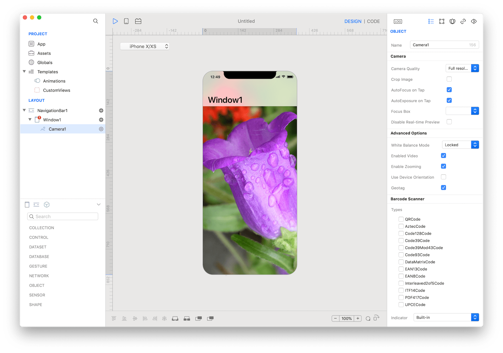

A Camera object represents a physical capture device and the properties associated with that device. You use a capture device to configure the properties of the underlying hardware. A capture device also provides input data, such as audio or video.



### How to use
1. Drop a `Camera` control from the object panel to a `Window`
2. Use the `Camera Inspector` to customize its properties like `Crop Image`, `AutoFocus on Tap`, and `AutoExposure on Tap`

If you need to write code for Camera:

3. Open the `Code Editor`
4. Select the `NewImage` or `NewVideo` item inside the `Events` area and write your custom code in the `Code Editor`


The inspector where the `Camera` class can be configured.

### Example
1. Drop a `Button` control from the object panel to a `Window`
2. Open the `Code Editor`
3. Select the `Action` item inside the `Events` area and write your custom code in the `Code Editor`
```
Camera1.capture()
```

### Most important properties
Several UI aspects can be configured in the `Camera` class but the `whiteBalance`, `mirror`, and `maxScale` are the most commons to be configured.
- `whiteBalance`: White balance mode.
- `mirror`: Camera mirror mode.
- `maxScale`: Maximum scaling factor.

### References
[Camera class reference](../classes/Camera.html) contains a complete list of properties and methods that can be used to customize a `Camera` object.
