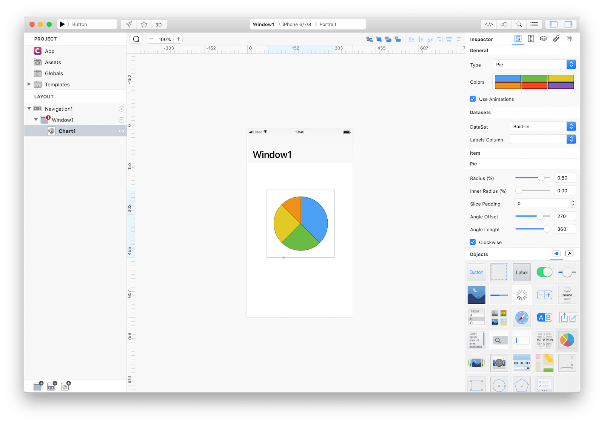

The Chart class offers a built-in and ready to use control to easily display a graphical representation of data. Chart supports five type of graphs representation: Bar, Pie, Line, Area and Scatter.



### Best practices
* **Select the chart type that represents better your data.** You can change a chart from one type to another—for example, from a pie chart to a bar chart, or from a line chart to an area chart.

### How to use
1. Drop a `Chart` control from the object panel to a `Window`
2. Use the `Chart Inspector` to customize its properties like `Type`, `Colors`, and `DataSet`


The inspector where the `Chart` class can be configured.


The  `Chart` types.

### Example
1. Drop a `Button` control from the object panel to a `Window`
2. Open the `Code Editor` (cmd + 6)
3. Select the `Action` item inside the `Events` area and write your custom code in the `Code Editor`
```
Chart1.chartType = ChartType.Area
```

### Most important properties
Several UI aspects can be configured in the `Chart` class but the `chartType` and `dataSet` are the most commons to be configured.
- `chartType`:  The graphical representation type
- `dataSet`: The `DataSet` object provides information that Chart needs to construct its content.

### References
[Chart class reference](../classes/Chart.html) contains a complete list of properties and methods that can be used to customize a `Chart` object.
