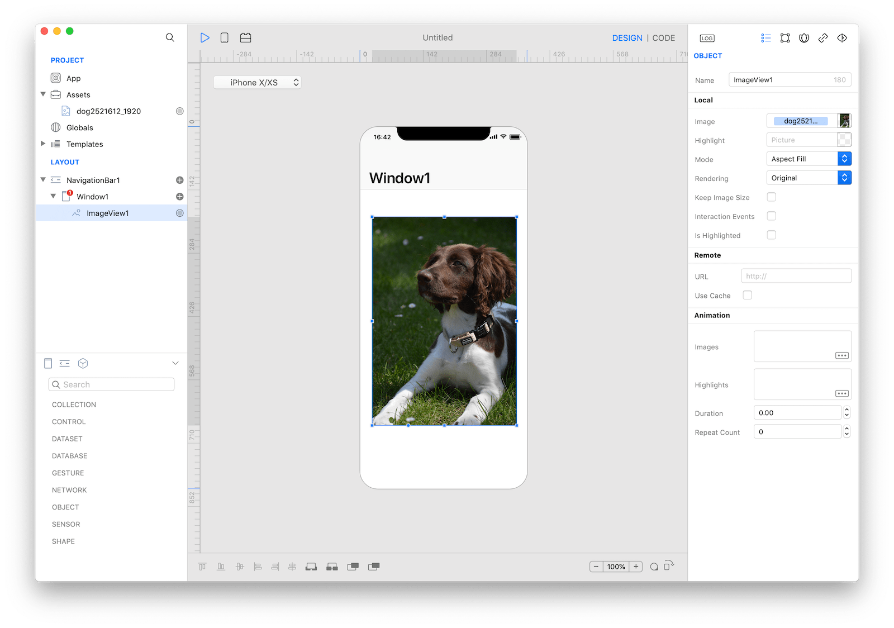

An image view displays a single image or an animated sequence of images over a transparent or opaque background. Within an image view, images may be stretched, scaled, sized to fit, or pinned to a specific location. Image views are non-interactive by default.



### Best practices
* **If possible, make sure all images in an animated sequence are consistently sized.** Ideally, images should be rescaled to fit the view so the system doesn't have to do any scaling. If the system must perform scaling, it's easiest to achieve the desired results when all images are the same size and shape.

### How to use
1. Drop an `ImageView` control from the object panel to a `Window`
2. Use the `ImageView Inspector` to customize its properties like `Image`, `Highlight`, and `Mode`


The inspector where the `ImageView` class can be configured.

### Example
1. Drop a desired image to the `Assets` area and name it as `Image1`
2. Drop a `Button` control from the object panel to a `Window`
3. Open the `Code Editor`
4. Select the `Action` item inside the `Events` area and write your custom code in the `Code Editor`
```
ImageView1.image = Image("Image1")
```

### Most important properties
Several UI aspects can be configured in the `ImageView` class but the `image`, `highlightedImage`, and `contentMode` are the most commons to be configured.
- `image`: The image displayed in the image view.
- `highlightedImage`: The highlighted image displayed in the image view.
- `contentMode`: Options to specify how a view adjusts its content when its size changes.

### References
[ImageView class reference](../classes/ImageView.html) contains a complete list of properties and methods that can be used to customize a `ImageView` object.
