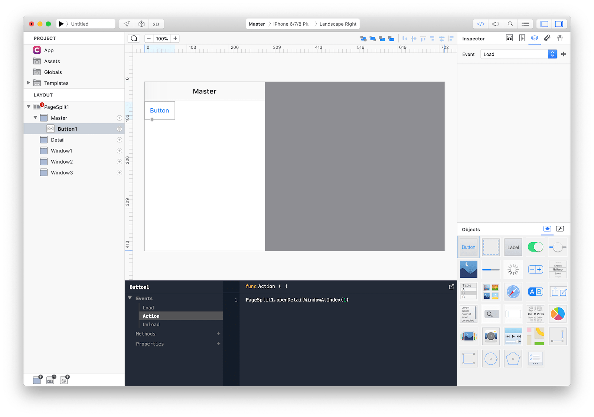

A `PageSplit` manages the presentation of two side-by-side panes of content, with persistent content in the primary pane and related information in the secondary pane. Each pane can contain any variety of elements, including navigation bars, toolbars, tab bars, tables, collections, images, maps, and custom views.


### Best practices
Split views are often used with filterable content; a list of filter categories appears in the primary pane, and the filtered results for the selected category are shown in the secondary pane. If your app requires it, the primary pane can overlay the secondary pane and can be hidden offscreen when not in use. This is particularly useful when the device is in portrait orientation, as it allows more room for viewing content in the secondary pane.

**Note:** when building your app’s user interface, the split view controller is typically the root screen of your app’s window.

* **Choose a split-view layout that works well with your content.** By default, a split view devotes a third of the screen to the primary pane and two-thirds to the secondary pane.
* **Persistently highlight the active selection in the primary pane.** Although the secondary pane’s content can change, it should always correspond to a clearly identifiable selection in the primary pane.
* **In general, restrict navigation to one side of a split view**. Placing navigation in both panes of a split view makes it hard for people to stay oriented and discern the relationship between the two panes.
* **Provide multiple ways to access a hidden primary pane**. On layouts where the primary pane may be offscreen, be sure to provide a button—typically in a navigation bar—to reveal the pane.

### How to use
There are 2 ways to use `PageSplit`:
1. using the default template by dropping `PageSplit` as the layout root screen and using the provided `MasterTable`. The table populates the master pane with all children `Window` and you just need to tap the cells to open the selected window on the detail pane.

1. Dropping `PageSplit` as the layout root screen and replacing the whole `MasterTable` with any custom control or by just replacing its _dataset_.

### Default `PageSplit`
1. Drop `PageSplit` as the root screen
1. Use the `PageSplit Inspector` to customize its appearance and `Display Mode`
1. Drop one or more `Window` as `PageSplit` child screens; each of them will be presented in the master pane table
1. Configure _MasterTable_ and _Cell_ to reflect your UI.
1. tap _Play_ and test many simulators to understand how `Display Mode` influences the layout with different device's family and orientations.


**Note:** the *default* `PageSplit` template works using 2 Creo concepts, _datasets_ and _events_:
1. the table is configured to use `PageSplit` as a _dataset_
1. the table event `DidSelectCell` opens the proper detail pane by calling:
```
PageSplit1.openDetailWindowAtIndex(index)
```
where index zero is the first `Window` below `Master` (in the default template is called _Detail_)

### `PageSplit` with custom master/detail logic
1. Drop `PageSplit` as the root screen
1. Use the `PageSplit Inspector` to customize its appearance and `Display Mode`
1. Replace _MasterTable_ with any other control or select a different _dataset_.
1. Drop one or more `Window` as `PageSplit` child screens
1. Anytime you need to present a proper detail pane call `PageSplit1.openDetailWindowAtIndex(index)` where index zero is the first `Window` below `Master`.
1. tap _Play_ and test many simulators to understand how `Display Mode` influences the layout with different device's family and orientations.



### Most important properties
Several UI aspects can be configured in the `PageSplit` class but the `Display Mode` and `Bar Color` are the most popular to be configured.
- `Display Mode`: The visual configuration of a `PageSplit`, its behavior changes with each device orientation and family (ie _iPad_ and _iPhone_).
- `Bar Color`: The bar tint color


The inspector where the `PageSplit` class can be configured.

### References
[PageSplit class reference](../classes/PageSplit.html) contains a complete list of properties and methods that can be used to customize a `PageSplit` object.
