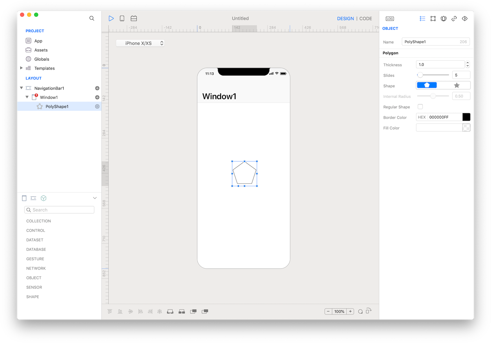

Represents a polygon shape (or a star shape).



### How to use
1. Drop a `PolyShape` control from the object panel to a `Window`
2. Use the `PolyShape Inspector` to customize its properties like `Thickness`, `Slides`, `Shape` and `Border Color`


The inspector where the `PolyShape` class can be configured.

### Example
1. Drop a `Button` control from the object panel to a `Window`
2. Open the `Code Editor`
3. Select the `Action` item inside the `Events` area and write your custom code in the `Code Editor`
```
PolyShape1.sides = 6
PolyShape1.internalRadius = 20
PolyShape1.strokeThickness = 2
```

### Most important properties
Several UI aspects can be configured in the `PolyShape` class but the `sides`, `internalRadius`, and `strokeThickness` are the most commons to be configured.
- `sides`: Number of sides of the polygon.
- `internalRadius`: Polygon internal radius value.
- `strokeThickness`: Border thickness.

### References
[PolyShape class reference](../classes/PolyShape.html) contains a complete list of properties and methods that can be used to customize a `PolyShape` object.
