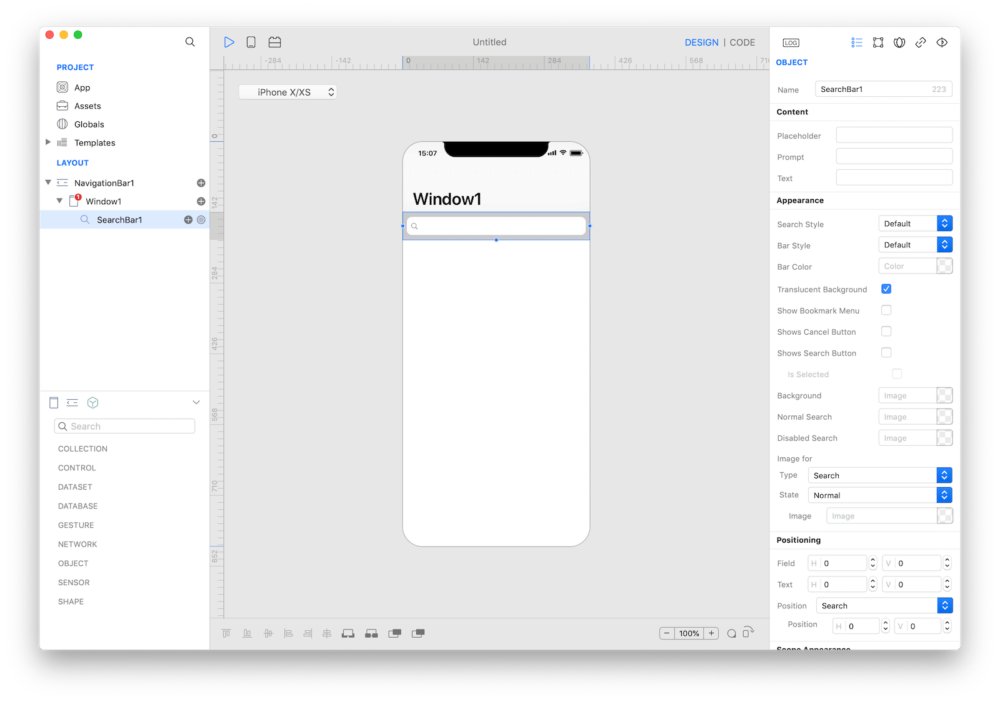

A search bar allows people to search through a large collection of values by typing text into a field. A search bar can be displayed alone, or in a navigation bar or content view. When displayed in a navigation bar, a search bar can be pinned to the navigation bar so it's always accessible, or it can be collapsed until the user swipes down to reveal it.



### Best practices
* **Use a search bar instead of a text field to implement search.** A text field doesn’t have the standard search bar appearance that people expect.
* **Enable the Clear button.** Most search bars include a Clear button that erases the contents of the field.
* **Enable the Cancel button when appropriate.** Most dedicated search bars include a Cancel button that immediately terminates the search.
* **If necessary, provide hints and context in a search bar.** A search bar's field can contain placeholder text—like “Search Clothing, Shoes and Accessories” or simply “Search”—as a reminder of the context being searched. A succinct, one-line prompt with appropriate punctuation can also appear directly above a search bar to provide guidance. Stocks uses a prompt to let people know they can enter a company name or stock symbol.
* **Consider providing helpful shortcuts and other content below a search bar.** Use the area under a search bar to help people get to content faster. Safari, for example, shows your bookmarks as soon as you tap the search field. Select one to go right to it without entering any search terms. Stocks shows a list of results as you type into the search field. Tap one at any time without typing any more characters.

### How to use
1. Drop a `SearchBar` control from the object panel to a `Window`
2. Use the `SearchBar Inspector` to customize its properties like `Placeholder`, `Prompt`, and `Text`

If you need to write code for SearchBar:

3. Open the `Code Editor`
4. Select the `Changed` item inside the `Events` area and write your custom code in the `Code Editor`


The inspector where the `SearchBar` class can be configured.

### How to customize
The `SearchBar` can be customized by tapping the subnode icons (+).


The `SearchBar` customizations.

### Keyboard Accessory View
The custom accessory view to display when the search bar becomes active. The user can drop one or more controls in order to extend the default keyboard.


The `SearchBar` keyboard accessory view customization.

### Example
1. Open the `Code Editor`
2. Select the `Changed` item inside the `Events` area and write your custom code in the `Code Editor`
```
Console.write("SearchBar searchText: \(searchText)")
```

### Most important properties
Several UI aspects can be configured in the `SearchBar` class but the `text`, `prompt`, `placeholder` and `showsCancelButton` are the most commons to be configured.
- `text`: The current or starting search text.
- `prompt`: A single line of text displayed at the top of the search bar.
- `placeholder`: The string that is displayed when there is no other text in the text field.
- `showsCancelButton`: A Boolean value indicating whether the cancel button is displayed.

### References
[SearchBar class reference](../classes/SearchBar.html) contains a complete list of properties and methods that can be used to customize a `SearchBar` object.
