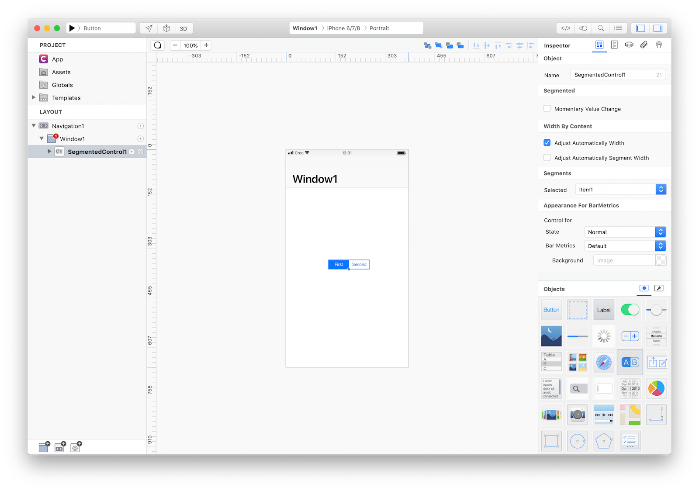

A segmented control is a linear set of two or more segments, each of which functions as a mutually exclusive button. Within the control, all segments are equal in width. Like buttons, segments can contain text or images. Segmented controls are often used to display different views. In Maps, for example, a segmented control lets you switch between Map, Transit, and Satellite views.



### Best practices
* **Limit the number of segments to improve usability.** Wider segments are easier to tap. On iPhone, a segmented control should have five or fewer segments.
* **Try to keep segment content size consistent.** Because all segments have equal width, it doesn’t look great if content fills some segments but not others.
* **Avoid mixing text and images in a segmented control.** Although individual segments can contain text or images, mixing the two in a single control can lead to a disconnected and confusing interface.
* **Position content appropriately in a custom segmented control.** If you change the background appearance of a segmented control, make sure content still looks good and doesn’t appear misaligned.

### How to use
1. Drop a `SegmentedControl` control from the object panel to a `Window`
2. Use the `SegmentedControlItem Inspector` to customize its properties like `Title` and `Image`


The inspector where the `SegmentedControl` can be configured.


The inspector where the `SegmentedControlItem` can be configured.

### How to customize
The `SegmentdControl` can be customized by tapping the subnode icons (+) in order to add one or more `SegmentedControlItem` objects.


The `SegmentedControl` customizations.

### Example
1. Open the `Code Editor`
2. Select the `SegmentedControl` item named `Item1`
3. Select the `Action` item inside the `Events` area and write your custom code in the `Code Editor`
```
Console.write("SegmentedControl title: \(self.title)")
```
4. Select the `SegmentedControl` item named `Item2`
5. Select the `Action` item inside the `Events` area and write your custom code in the `Code Editor`
```
Console.write("SegmentedControl title: \(self.title)")
```

### Most important properties
Several UI aspects can be configured in the `SegmentedControl` class but the `Momentary` is the most common to be configured.
- `Momentary`: A Boolean value that determines whether segments in the receiver show selected state.

### References
[SegmentedControl class reference](../classes/SegmentedControl.html) contains a complete list of properties and methods that can be used to customize a `SegmentedControl` object.
