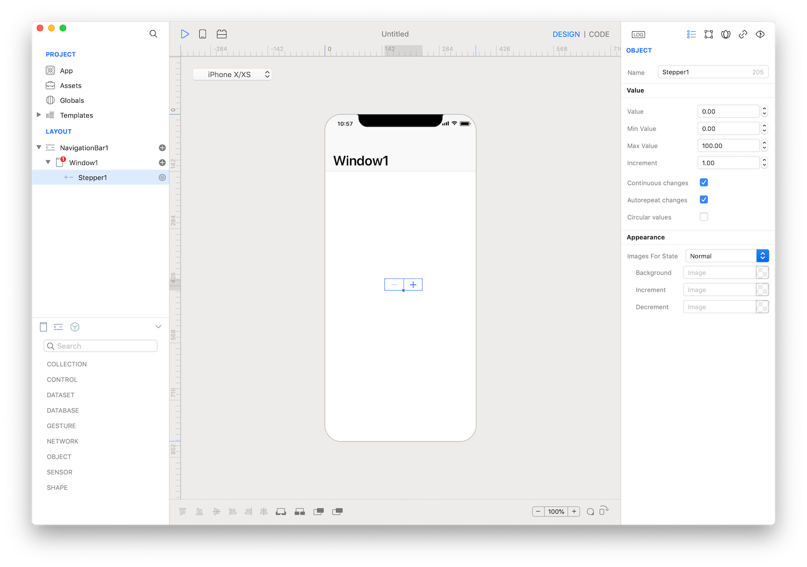

A stepper is a two-segment control used to increase or decrease an incremental value. By default, one segment of a stepper displays a plus symbol and the other displays a minus symbol. These symbols can be replaced with custom images, if desired.



### Best practices
* **Make the value affected by the stepper obvious.** A stepper itself doesn’t display any values, so make sure people know which value they’re changing when they use a stepper.
* **Don’t use a stepper when large value changes are likely.** Steppers work well for making small changes that require a few taps. On a printing screen, for example, it makes sense to use a stepper to set the number of copies because people rarely change this setting by much. On the other hand, it doesn’t make sense to use a stepper to choose a page range because even a reasonable page range would require lots of taps.

### How to use
1. Drop a `Stepper` control from the object panel to a `Window`
2. Use the `Stepper Inspector` to customize its properties like `Value`, `Min Value`, `Max Value` and `Increment`

If you need to write code for Stepper:

3. Open the `Code Editor`
4. Select the `Action` item inside the `Events` area and write your custom code in the `Code Editor`


The inspector where the `Stepper` class can be configured.

### Example
1. Open the `Code Editor`
2. Select the `Changed` item inside the `Events` area and write your custom code in the `Code Editor`
```
Console.write("Stepper value: \(self.value)")
```

### Most important properties
Several UI aspects can be configured in the `Stepper` class but the `Value`, `Min Value`, `Max Value` and `Increment` are the most commons to be configured.
- `Value`: The numeric value of the stepper.
- `Min Value`: The lowest possible numeric value for the stepper.
- `Max Value`: The highest possible numeric value for the stepper.
- `Increment`: The step, or increment, value for the stepper.

### References
[Stepper class reference](../classes/Stepper.html) contains a complete list of properties and methods that can be used to customize a `Stepper` object.
