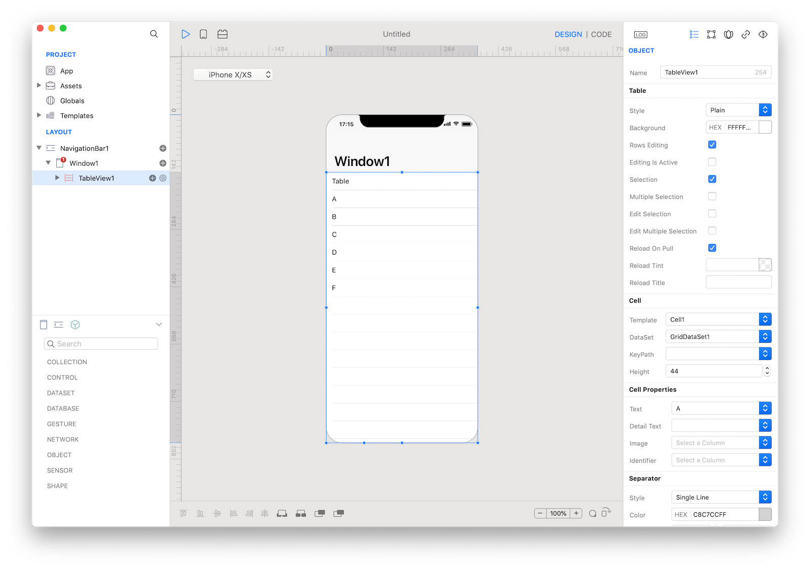

A table presents data as a scrolling, single-column list of rows. Use a table to display large or small amounts of information cleanly and efficiently in the form of a list. Generally speaking, tables are ideal for text-based content.



### How to use
1. Drop a `TableView` control from the object panel to a `Window`
2. Use the `TableView Inspector` to customize its properties.

If you need to write code for TableView:

3. Open the `Code Editor`
4. Select the `DidSelectCell` item inside the `Events` area and write your custom code in the `Code Editor`


The inspector where the `TableView` class can be configured.

Several UI aspects can be configured in the `TableView` class but  `Template`, `DataSet`, and the Cell Properties (`Text`, `Detail Text`, `Image`) are the most commons to be configured.
- `Template`: The `TableViewCell` used as the template that will be duplicated to create every single row of the `TableView`.
- `DataSet`: The source of the data presented by the `TableView`. It must be an object that implements the [DataSet](./dataset.html) specs, for example Assets, Databases, HTTPClient (REST), BTCentral, Location, Motion and many others.
- `KeyPath`: The `TableView` can present only lists of data, so the `DataSet` must return an object of type [List](../gravity/list.html) or a `RecordSet`.  If the `DataSet` is representing complex hierarchical data (see the `treeData` property of the `DataSet` class), for example a JSON object returned by an `HTTPRequest`, the `KeyPath` property defines the base keypath used to extract a `List` object from the `self.value` property of the `DataSet`.
- `Text`,`Detail Text`, `Image` and custom properties exposed by the configured `CustomView` (if any): The database column or the keypath, depending on the type of the `DataSet`, used to retrieve the data for each property of the cell from the value of the `DataSet` at a specific index.

### Customization
The appearance of the content of a `TableView` can be customized by tapping the subnode icon (+).


Available subnodes in a `TableView`.

The available types of subnodes are:
- _Header_: An accessory `CustomView` that is displayed above the table.
- _Footer_: An accessory `CustomView` that is displayed below the table.
- _Cell_: The template used to create one `TableViewCell` instance for each row (the number of rows and the data for each row is provided by the `DataSet`). You can add more than one _Cell_ subnodes, but only the _Cell_ set in the `Template` property of the `TableView` is used.

### TableViewCell
A `TableViewCell` defines the attributes and behavior of the cells that appear in a TableView. Use the `TableViewCell` inspector to customize its properties like

- `Style`: choose between four built-in styles:
    - _Basic_: An optional image on the left side of the row, followed by a left-aligned title. It’s a good option for displaying items that don’t require supplementary information.
    - _Subtitle_: A left-aligned title on one line and a left-aligned subtitle on the next. This style works well in a table where rows are visually similar. The additional subtitle helps distinguish rows from one another.
    - _Right Detail_: A left-aligned title with a right-aligned subtitle on the same line.
    - _Left Detail_: A right-aligned title, followed by a left-aligned subtitle on the same line.
    - _None_: Don't use any built-in field, the content must be presented by a `CustomView` subnode.
- `Background`: Background color of the cells.
- `Alternate`: Background color of the cells at odd indexes. If not set, the `Background` is used.
- `Custom View` (optional): A `CustomView` added to the `TableViewCell`. The `CustomView` is resized with the size of the `TableViewCell`. You can use a global `CustomView` from the `Templates` folder or the `CustomView` subnode of the `TableViewCell`. The exposed properties of the `CustomView` are presented in the _Cell CustomView Properties_ section of the `TableView`'s inspector, use the inspectors to configure the `DataSet`'s column/keypath for each property.


A `TableViewCell`.

The content of a `TableViewCell` can be customized by tapping the subnode icon (+).
The available subnode types are:
- `Left Action`: Add a `TableViewRowAction` object. When the user swipes horizontally to the right in a row, the table view moves the row content aside to reveal your left actions. Tapping one of the action buttons executes the action of the `TableViewRowAction`.
- `Right Action`: Add a `TableViewRowAction` object. When the user swipes horizontally to the left in a row, the table view moves the row content aside to reveal your right actions. Tapping one of the action buttons executes the action of the `TableViewRowAction`.
_ `Custom View`: Add a `CustomView` that can be used for the `Custom View` property of the `TableViewCell`.


An example of a `TableViewCell` with two right `TableViewRowAction`.

### Example
1. Drop a `TableView` control from the object panel to a `Window`
2. Drop some images from the system Finder to the `Assets` folder.
3. Set the _Assets_ value in the `DataSet` property from the inspector of the _TableView1_.
4. Set the _Name_ value in the `Text` property from the inspector of the _TableView1_.
3. Open the `Code Editor`
4. Select the `DidSelectCell` item inside the `Events` area and write your custom code in the `Code Editor`
```
Console.write("Selected Cell \(cell.text) at index \(index)")
```

### References
- [TableView class reference](../classes/TableView.html) contains a complete list of properties and methods that can be used to customize a `TableView` object.
- [TableViewCell class reference](../classes/TableViewCell.html) contains a complete list of properties and methods that can be used to customize a `TableViewCell` object.
- [TableViewRowAction class reference](../classes/TableViewRowAction.html) contains a complete list of properties and methods that can be used to customize a `TableViewRowAction` object.
- [ToDo tutorial](../tutorials/todo.html) contains an example on how to configure a `TableView` object and how to open a detail `Window` for the selected row.
- [Lets Cook Navigation tutorial](../tutorials/lets-cook-nav.html) contains an example on how to configure a `TableView` object and how to open a detail `Window` for the selected row.
- [Expose events from a CustomView techNote](../technotes/exposed-events.html)
