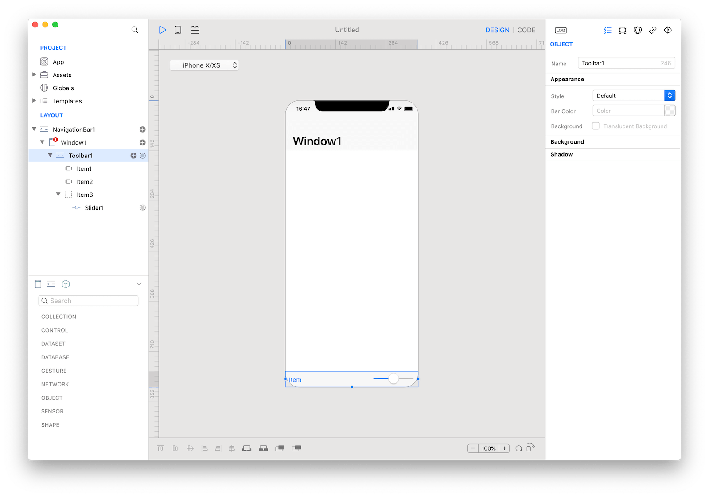

A toolbar appears at the bottom of an app screen and contains buttons for performing actions relevant to the current view or content within it. Toolbars are translucent, may have a background tint, and often hide when people are unlikely to need them. For example, in Safari, the toolbar hides when you begin scrolling the page since you are likely reading. You can show it again by tapping the bottom of the screen. Toolbars are also hidden when a keyboard is onscreen.



### Best practices
* **Provide relevant toolbar buttons.** A toolbar should contain frequently used commands that make sense in the current context.
* **Consider whether icons or text-titled buttons are right for your app.** Icons work well when you need more than three toolbar buttons. When you have three buttons or fewer, text can sometimes be clearer. In Calendar, for example, text is used because icons would be confusing. The use of text also allows the Inbox button to show a count of calendar and event invitations.
* **Avoid using a segmented control in a toolbar.** Segmented controls let people switch contexts, whereas a toolbar is specific to the current screen. If you need to provide a way to switch contexts, consider using a tab bar instead
* **Give text-titled buttons enough room.** If your toolbar includes multiple buttons, the text of those buttons may appear to run together, making the buttons indistinguishable. Add separation by inserting fixed space between the buttons.

### How to use
1. Drop a `Toolbar` control from the object panel to a `Window`
2. Use the `Toolbar Inspector` to customize its properties like `Style` and `Bar Color`


The inspector where the `Toolbar` class can be configured.

### How to customize
The `Toolbar` can be customized by tapping the subnode icons (+).


The `Toolbar` customizations.

### System Item
A standard item for placement on a `Toolbar` that can be configured with a system style.


The `Toolbar` system item.

### How to use
1. Use the `Toolbar System Item Inspector` to customize its properties like `System Item`, `Title` and `Image`.


The `Toolbar` item customizations.


The `Toolbar` item system styles.

### Custom Item
A custom item for placement on a `Toolbar` that can be configured for different purposes exposing and configuring a custom `View`.


The `Toolbar` custom item.

### How to use
1. Select the `Toolbar Custom Item` item from the layout panel
2. Drop a control from the object panel to the custom `View`


The `Toolbar Custom Item` item custom view.

### Example
1. Open the `Code Editor`
2. Select the `Toolbar` item named `Item1`
3. Select the `Action` item inside the `Events` area and write your custom code in the `Code Editor`
```
Console.write("Toolbar item title: \(self.title)")
```
4. Select the `Toolbar` item named `Item2`
5. Select the `Action` item inside the `Events` area and write your custom code in the `Code Editor`
```
Console.write("Toolbar item title: \(self.title)")
```

### Most important properties
Several UI aspects can be configured in the `Toolbar` class but the `barStyle`, `barTintColor`, and `items` are the most commons to be configured.
- `barStyle`: The toolbar style that specifies its appearance.
- `barTintColor`: The tint color to apply to the toolbar background. This color is made translucent by default unless you set the translucent property to false.
- `items`: The items displayed on the toolbar.

### References
[Toolbar class reference](../classes/Toolbar.html) contains a complete list of properties and methods that can be used to customize a `Toolbar` object.
