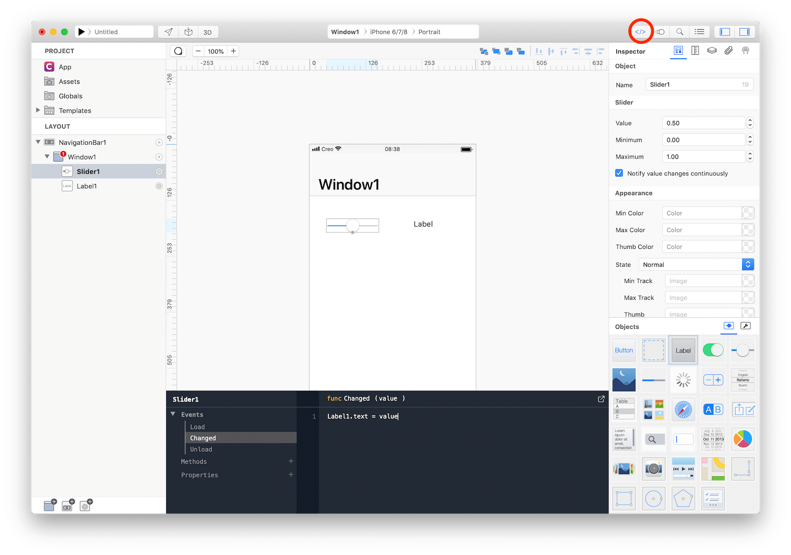

Creo greatly reduces app development time by automating the most common tasks with a simple drag and drop interface but there are times where you need to write Gravity code in order to customize or enhance behaviors.


Gravity is a dynamically typed programming language developed from scratch for Creo. Its main advantages are:
* The language is simple and easy to learn.
* Most code can be written and changed quickly and without hassle.
* Less code written means less errors & mistakes to fix.
* Easier to read the code (less clutter).
* No compilation is required to test.
* Runtime is tiny.
* Duck-typing and polymorphism by nature. 


You can get more information about Gravity in its dedicated documentation [section](https://docs.creolabs.com/gravity/).
Gravity is an open source project and you can find its complete source code on [GitHub](https://github.com/marcobambini/gravity).


In Creo **everything is an object**. That means that every object can be selected and modified using both the Inspector or the Code Editor. Use the Code Editor to modify values that can change at runtime and the Inspector to modify values that change at design time.


Each object comes with a predefined set of events and a customizable set of methods and properties. Events notify object about important changes that require interactions. For example, a Slider uses the Changed event to notify that its value has changed, while a Button notifies that it has been touched using the Action event. Use the appropriate events to customize an object’s behaviors to better fit your needs. Every object can be further customized by adding methods and properties.

Consult the [Classes](https://docs.creolabs.com/classes/) section of the documentation for an object's built-in methods and properties. Objects will will also respond to all the methods and properties of its superclasses.

### Computed Properties

Transforming a property into a computed property can hide implementation details and can be used to add power to custom classes.  Right click on the property and select **Convert to Computed Property**.

For example, if you add a ```state``` property to a Slider1 object then it will represent a static information that you can use later in your programming logic but if you transform the property to computed property then you can add logic for setting (writing) and getting (reading) the property.


The ```get``` section holds the code that is executed when your property is read or accessed (for example in ```var myState = Slider1.state```). The ```set``` section holds the code that is executed when your property is written or set (for example in ```Slider1.state = myState```).


