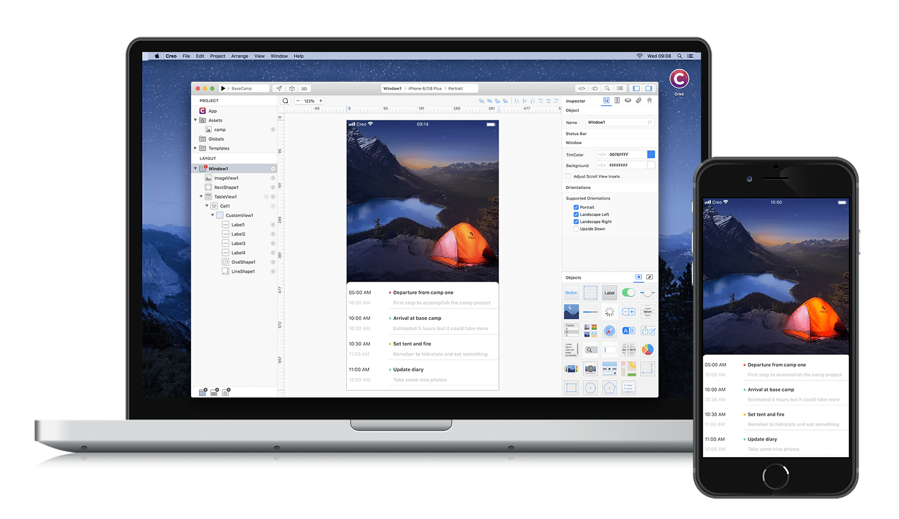

**Creo** is the next generation tool that lets you combine design and development in order to build better applications in a fraction of time compared to traditional tools.

### How to develop a mobile application

Every mobile application requires three basic fundamental ingredients:

1. a way to display and navigate between different parts of your application
2. a way to present information to the end user
3. a way to retrieve and transform data from very different sources

**Creo** lets you: 

1. compose complex navigation hierarchy in the [Layout](layout.md) section
2. build fully featured and rich interface in the [Design Board](design-board.md) section
3. connect data to the user interface using [DataSet](data-set.md) like databases, HTTP requests, files, sensors and much more

### MVC pattern, the right way

Model–view–controller is an architectural pattern commonly used for developing user interfaces that divides an application into three interconnected parts. There is a Model where your data structure resides, View which represents how data is visualized to end user and Controller which is the logic code between the input data (from the Model) and the output data (to the View).
**Creo** adopts this common pattern in a way that lets you visualize in real time both the Model and the View parts and greatly reduce the amount of code required in the Controller step. With **Creo** you'll be able to develop mobile applications much faster than with any other tool.

1. The Model can be visually built and tested using [DataSet](dataset.md)
2. Views can be visually constructed using drag'n drop operations in the [Layout](layout.md) or in the [DesignBoard](design-board.md)
3. Thanks to the [Events](code.md) subsystem, the Controller is much easier to write