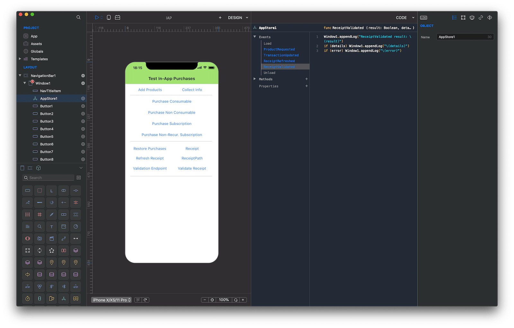
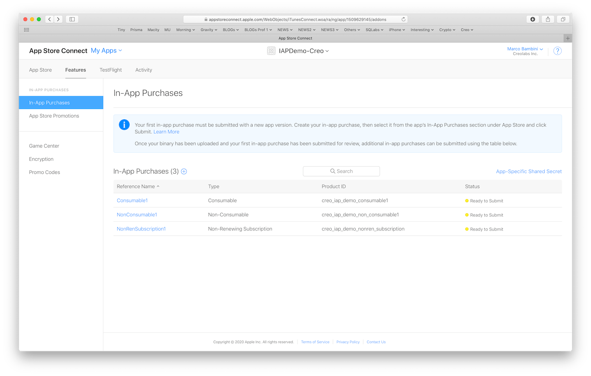

An in-app purchase (or IAP) allows developers to charge users for specific functionality or content while using an app. To be able to process in-app purchases you should correctly setup your Apple Account and then manually add products and subscriptions to your app via the App Store Connect website.

Please follow the [In-App Purchase Tutorial: Getting Started](https://www.raywenderlich.com/5456-in-app-purchase-tutorial-getting-started) tutorial from the Ray Wenderlich website to setup all the required settings for your app. You should follow all the tutorial from the beginning to the "Project Configuration" part excluded.

### Demo application

We created a small test application in Creo that shows you how to use all the IAP related API. This example is bound to our bundleID and its related products. The certificate we used to sign this application has been setup by following the previous external tutorial.

The best way to use this demo project is to create your own bundleID and bound the same productID we used in this demo. By changing the bundleID of this demo and using your correct developer certificate you'll be able to install the app on your device and test all its functionalities.

In the IAP demo application, we use some non-existing productIDs just to trigger a condition error to shows you all the code flow. The following productIDs are the only ones configured in the App Store:

**Project**
* [IAP.creoproject]({{github_raw_link}}/assets/IAP.zip) (22KB)
