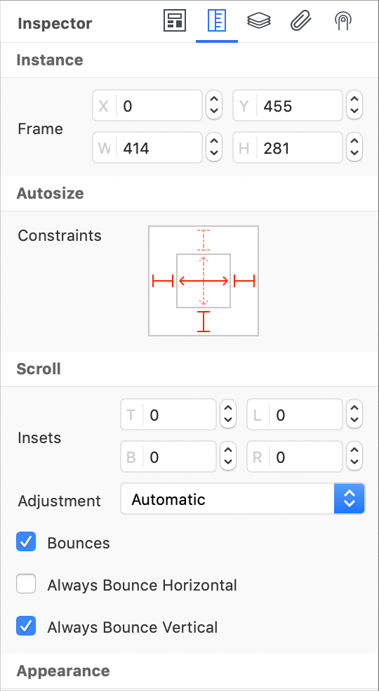

The Inspector on the right lets you adjust the settings for the currently selected object, it will be probably one of the most used ways to set initial properties for an object. It is important to realize that all the settings set in the Inspector will be the initial properties of the object once it will be allocated at runtime. Inspector is then divided into sections.

### Object section
This section represents the properties of the selected object. Every object has this section active, even if not all properties that are available at runtime are listed here. For a complete list of available properties, the [class](../classes/) for the selected object should be examined. This section is dynamic and its content changes based on the class of the selected object.

### Geometry section
The Geometry section is available only for objects with a user interface (technically speaking for each object that inherits from UIView or UIControl). This section let you specify size, autoresizing behavior and other common properties like appearance and transformation.

### Actions section
The Actions section gives you the ability to automate some common operations like opening a window or playing an animation. It is important to realize that the Actions section represents just a shortcut, at compile time every action is translated to the appropriate Gravity code.

### Binding section
The Binding section is available only for binding objects and gives you the ability to build complex binding with just drag and drop operations. Objects on top represent the source of data while objects on the bottom are the destination of the source of data. More information is available in the [Bindings](bindings) documentation.

### Gestures section
The Gestures section is available only for objects with a user interface (technically speaking for each object that inherits from UIView). This section gives you the ability to specify user interaction behavior and to attach special gestures objects to the selected control.

