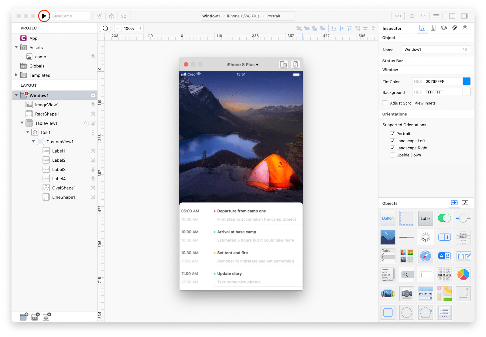

Much of the time **Creo** will show runtime data directly into the Design Board without requiring any further interaction from your side. If you want to start executing your app inside the built-in Creo simulator just press the Play button on the toolbar.

Once pressed a new simulator instance will be created and all your runtime code will be executed immediately. Simulator size and orientation will automatically reflect device type and orientation currently selected into the Design Board.

### Technical note
Most of the tools out there use a web view to emulate the mobile operating system while others force you to install Xcode and then use Apple iOS Simulator to execute iOS code launched as a separate process. CreoKit is an ObjC/Swift native framework that enables us to **execute any iOS code on MacOS**. That means that what you see on your screen is not emulated in any way but it is real iOS code.