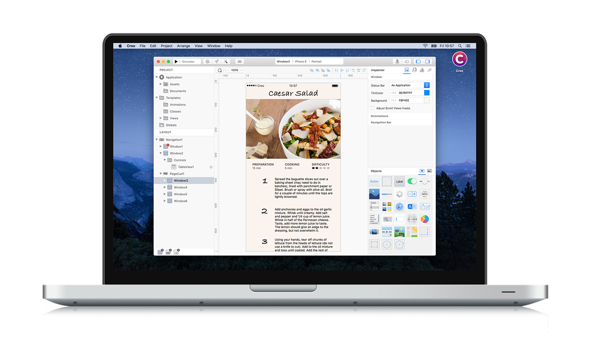

**Creo** is a modern design and development tool for Mac which combines both phases of the development process into one easy-to-use tool. App creation is normally split into two phases - with designers using a prototyping layout tool to create the interface, and developers using native development tools to create the code that powers the designer's interface. **Creo** merges those two worlds into a single tool that allows users to focus on what makes their app unique instead of spending time on non functional prototypes or writing repetitive code only to setup common operations.

**Creo** offers drag-and-drop controls, classes, and objects that allow anyone to build their app's navigation and features with few clicks. While building the app's interface, the user is also effectively building a native app. **Creo** uses Creolabs CreoKit Objective-C/Swift native framework that enables **Creo** to execute any iOS code on the Mac. This method offers a way to preview your running code directly in the **Creo** app.

**Creo** is much more than a new generation IDE, we rewrote from scratch Apple UIKit™ so we can execute any iOS code natively on Mac without needing to install a third party tool and without the compromise of not being able to show all your changes in real time inside the Creo UI. Thanks to our CreoKit we always use native components and classes, no simulated or web based code is used.