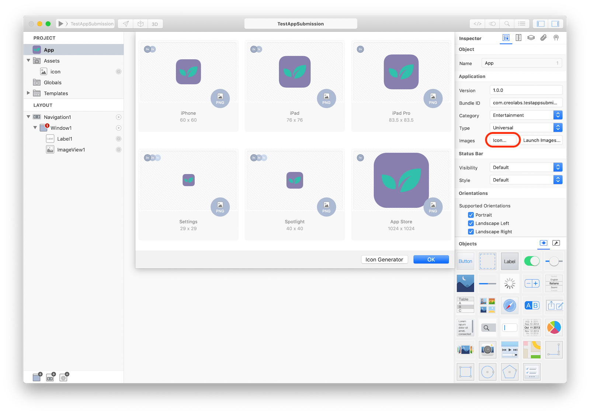
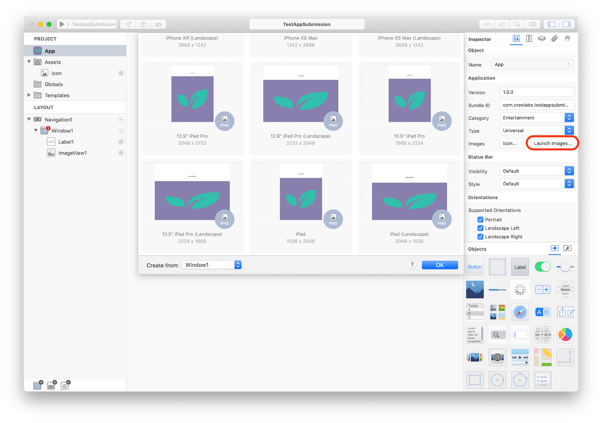

The App object is a centralized point of control and coordination between your code and the underline operating system and frameworks. The App object is responsible to notify you important information about the state of your application like when it starts, when it will terminate, when it will enter/exit background mode and much more.

 

### Icons
Every app needs a beautiful and memorable icon that attracts attention in the App Store and stands out on the Home screen. Your icon is the first opportunity to communicate, at a glance, your app’s purpose. It also appears throughout the system, such as in Settings and search results. You can manually provide each required image at each required resolution (12 images are required at the time of writing) or you can use the built-in icon generator to let Creo automatically creates all required icons for you. Please note that you should use your higher resolution image in this case.

### Launch Images
A launch screen appears instantly when your app starts up. The launch screen is quickly replaced with the first screen of your app, giving the impression that your app is fast and responsive. The launch screen isn’t an opportunity for artistic expression. It’s solely intended to enhance the perception of your app as quick to launch and immediately ready for use. Every app must supply a launch screen.

