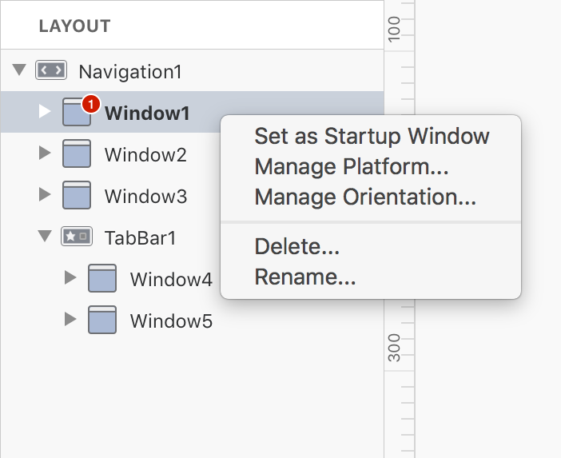

Setting up the main navigation hierarchy using a traditional system involves a considerable amount of time because it requires you to know the underline architecture of such components. With **Creo** the entire process is greatly simplified and you just need to use drag and drop to setup your navigation hierarchy that will be ready to use as soon as you'll release the mouse button.

#### Setting up navigation hierarchy
To setup the navigation hierarchy add new windows and navigations into the **LAYOUT** panel. Everything is explicit and really intuitive. Navigations are containers for Windows and Windows are containers for objects. Navigations and Windows can be moved or rearranged inside the Layout panel enabling you to perform test and experiments without writing a single line of code. A Window can contain controls (UI objects) and objects (objects without an UI like databases, classes, HTTP connections and so on).

You add Navigations and Windows using the containers panel located below the Layout section:

#### Startup Window
Startup Window is important because it instructs your app about what is the first window to display at startup. A Startup Window can be set using a contextual menu, if you do not set a Startup Window then you’ll need to setup it using the code. The appropriate way to setup a Startup Window is inside the DidStart Application event.

