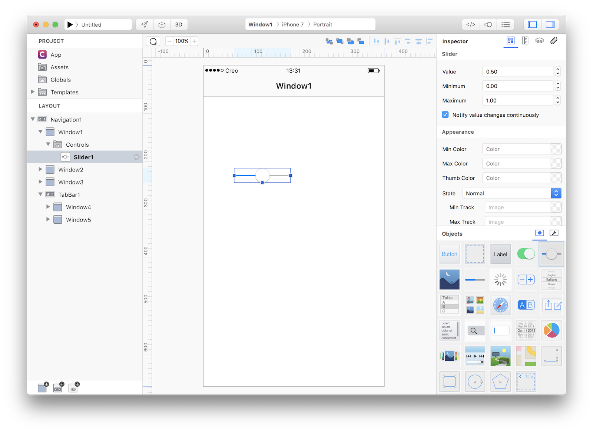

Setting up a user interface for a mobile application usually involves the creation of a navigation hierarchy and then the creation of controls that can interact with the end user. Using a traditional design tool you are usually forced to use static objects that can simulate an UI and then the developers should translate these static representations into objects and other software components. With **Creo** there are no differences between design and development and so once you created a user interface you'll end up having a ready to use system without any further development.

### Adding controls and objects
A Window is a container for controls and objects and in order to create objects you just need to use drag and drop from the Objects panel to the currently selected Window displayed in the Design Board.

Once a control has been instantiated using drag and drop, you can customize its appearance and behaviour using the Inspector Panel. The same inspector can be used to configure navigations, windows and more generally every object listed in the Layout panel.

