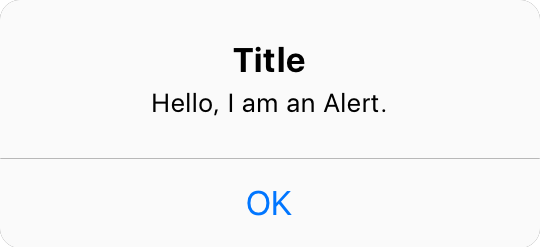
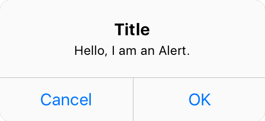
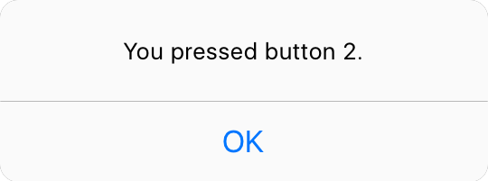

### Examples

#### A simple Alert:
```
var alert = Alert("Title", "Hello, I am an Alert.");
alert.show();
```
Result:


#### A two buttons Alert:
```
var alert = Alert("Title", "Hello, I am an Alert.", ["Cancel", "OK"]);
alert.show();
```
Result:


#### A three buttons Alert:
```
var alert = Alert("Title", "Hello, I am an Alert. Are you ready?", ["Maybe", "Yes", "No"]);
alert.show();
```
Result:


#### Use a callback to check for button pressed:
```
var callback = func (index) {
	var alert = Alert("", "You pressed button \(index).")
	alert.show();
}

var alert = Alert("Title", "Hello, I am an Alert. Are you ready?", ["Maybe", "Yes", "No"], callback);
alert.show();
```
Result:

