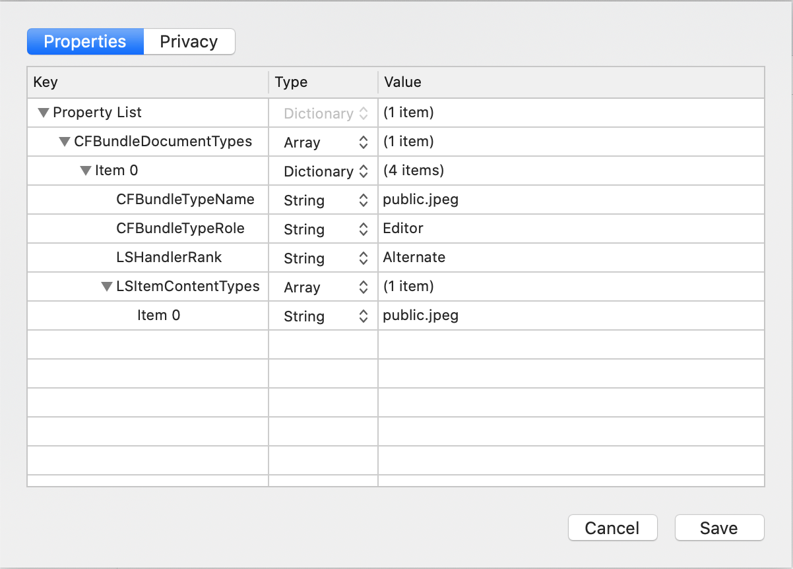

#### Share an Image:
```
var image = MyGreatImage;
OSSharing.shareImage(image);
```

#### Share a String:
```
var s = "Hello World";
OSSharing.shareString(s);
```

#### Share an Image and a String:
```
var image = MyGreatImage;
var s = "Hello World";
var share: OSSharing = OSSharing();
share.items = [image, s];
share.show();
```

#### Share a URL:
```
var url= "https://creolabs.com";
OSSharing.shareURL(url);
```

#### Add my app to the sharing menu to receive shared URLs:
If you want to see your App in the sharing dialog, you need to register the document types that your application can open with iOS. To do this you need to add a document type to your app’s Property List (Main Menu > Project > Properties...) for each document type that your app can open. Additionally, if any of the document types are not known by iOS, you will need to provide an Uniform Type Identifier (UTI) for that document type.

Each document type item should contain a value for the following keys:
- `CFBundleTypeName` (String: the abstract name for the document type).
- `CFBundleTypeRole` (String: The app's role with respect to the document type. Possible values: `Editor`, `Viewer`, `Shell`, `QLGenerator` or `None`).
- `LSHandlerRank` (String: The ranking of this app among apps that declare themselves as editors or viewers of the given file type. Possible values: `Owner`, `Default`, `Alternate`, `None`)
- `LSItemContentTypes` (Array: The document file types the app supports. Each item of the Array must be a String representing an UTI. For example, `public.jpeg`).

Example of the configuration to receive URLs of JPEG images:


Then add your code to process the received URLs in the `OpenUrl` event of the `App` object, for example:
```
Window1.ImageView1.url = url
```

#### Share a file URL with the JPEG representation of an Image:
```
// Create the JPEG representation of the image
var jpgImage = image.JPEGRepresentation(0.7);

// Save the JPEG representation to the file system using a FileManager
var fileName = "unique-filename.jpg";
FileManager1.createFile(fileName, jpgImage);

// Get the full path of the created file
var url : String = FileManager1.path(fileName);

// Share the file URL
OSSharing.shareURL(url)
```

#### Printing examples
For your convenience we create a simple printing test application
* [PrintTest.zip]({{github_raw_link}}/assets/PrintTest.zip) (4.2MB)
