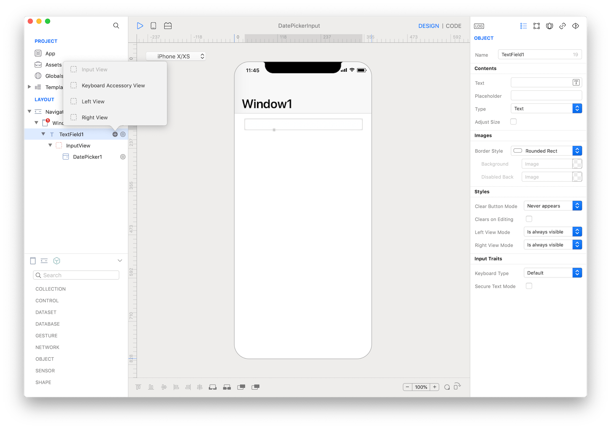
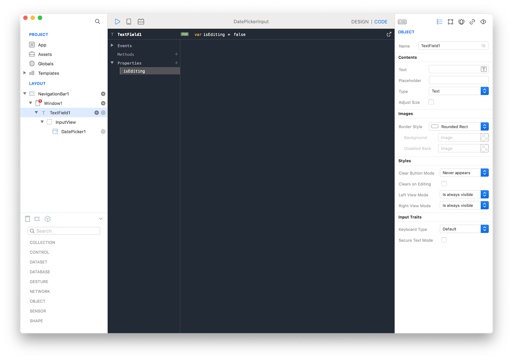

There are times when you need to force user to enter data in a fixed format. Dates are a perfect example because user could enter them in different ways, forcing us to add a lot of logic just to check the validity of the input.

One way to easily solve this problem is to use a DatePicker and a TextField inputView. An inputView is a view that is displayed and used instead of the standard Keyboard each time user press inside an input field.

There are some subtle details that need to addressed in order to have a working solution. For example, we want the TextField to receive the user touches but user should not be able to enter text on it (we'll use the ShouldChangeText for that).

Start by dragging a TextField into the Window1 and the add an inputView via its subnodes menu. In the inputView add a DatePicker.



We now need to prevent user input when TextField is not in editing mode (when the DatePicker is not visible). So start by adding a new isEditing property to the newly created TextField1 (initialized to false).



Then in the `DidBeginEditing` event set this property to `true`:
```
self.isEditing = true
```

When TextField is in editing mode we want to prevent user from entering text, so in the `ShouldChangeText` event write the following code:
```
return !(self.isEditing)
```

Just one final step is now required, we need to reset the editing flag and we need to set the TextField1 value to the value entered in the DatePicker. We'll use the `DidEndditing` event:

```
var datePicker = self.InputView.DatePicker1
var date = datePicker.date
var timeZone = TimeZone.system;

self.isEditing = false
self.text = date.format("yyyy-MM-dd HH:mm", timeZone.abbreviation);
```

You can customize the format using a variety of options from the [Date](https://docs.creolabs.com/classes/Date.html) class.

**Project**
* [DatePickerInput.creoproject]({{github_raw_link}}/assets/datepicker-input.creoproject.zip) (13KB)
