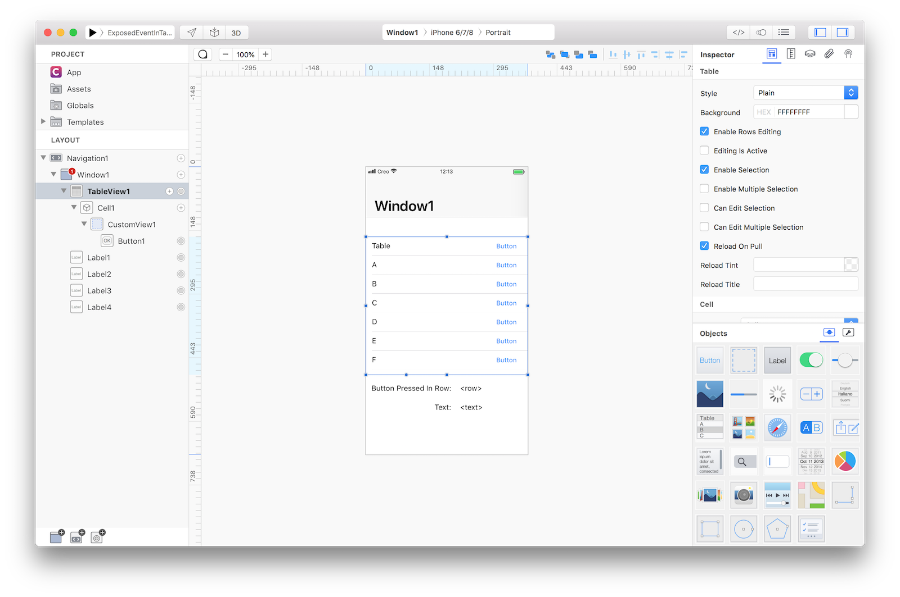
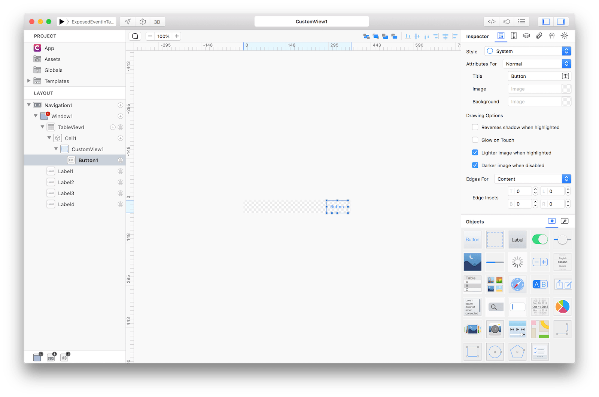
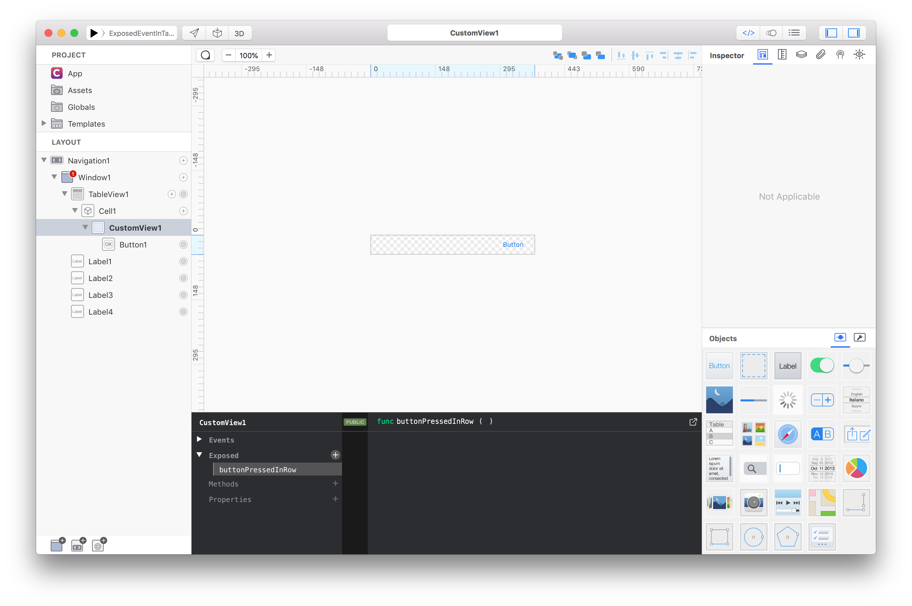
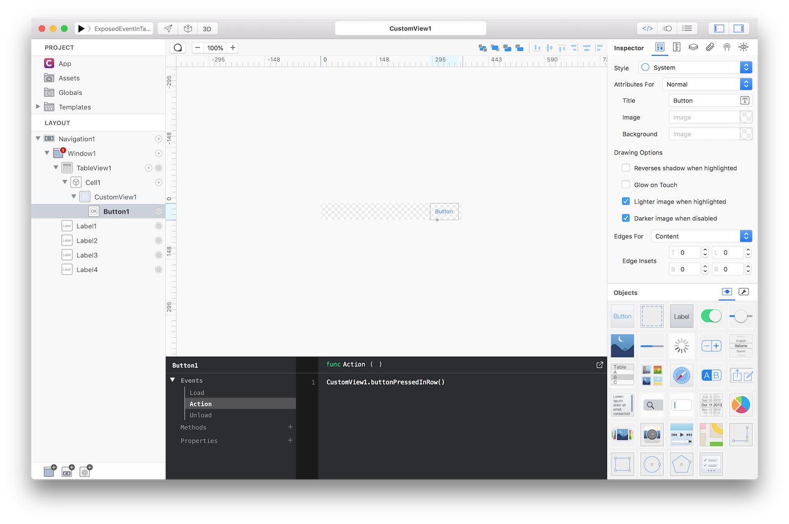
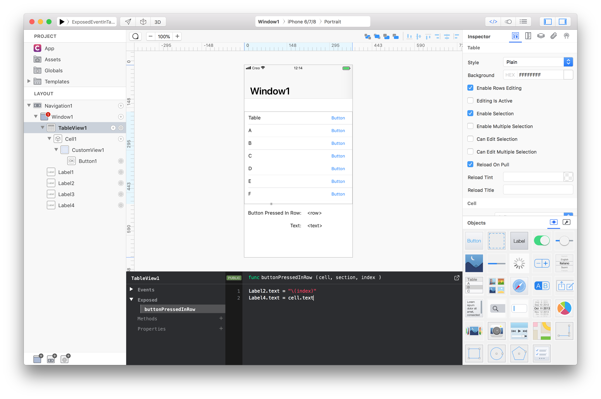

Exposed events from a control inside a CustomView. 
If you want to fire an action from a control inside a CustomView and to know which cell - for example which cell of the TableView - has fired that action then you should use the CustomView's `exposed` events.

Add a TableView:



Create a CustomView subnode in the TableView `Cell1` and add a Button to the CustomView:



Open to the Code Editor for the `CustomView1` and add an exposed event with a click on the + button near the `Exposed` node, then rename it to `buttonPressedInRow` by editing the name in the func definition:



Go to the `action` event of the `Button1` in the Code Editor and add the following code to invoke the `buttonPressedInRow` event of the current instance of the `CustomView1`:
```
CustomView1.buttonPressedInRow()
```



Now the `TableView1` show the `buttonPressedInRow` event in its `Exposed` events in the Code Editor. Creo automatically pass three arguments to this event, the cell instance where the exposed event was invoked and its section and index values. We add the following code to show the index and the text of the involved cell (you can also get the `cell.identifier` property, if needed):
```
Label2.text = "\(index)"
Label4.text = cell.text
```



**Project**
* [ExposedEventInTable.creoproject]({{github_raw_link}}/assets/exposed_events.creoproject.zip) (14KB)
