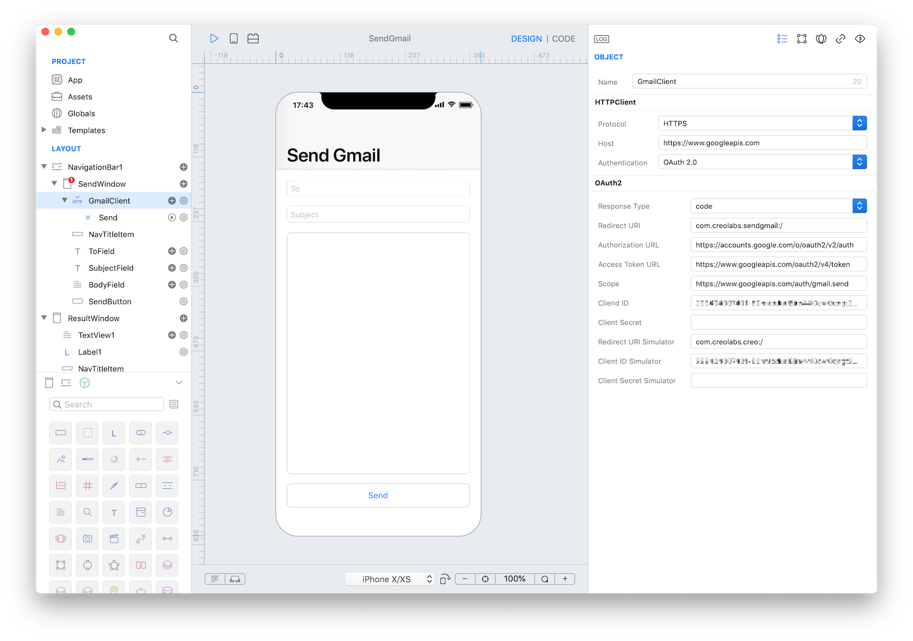
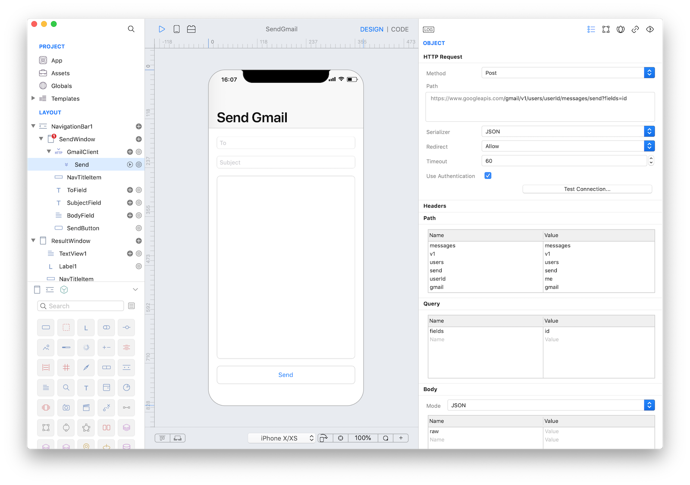
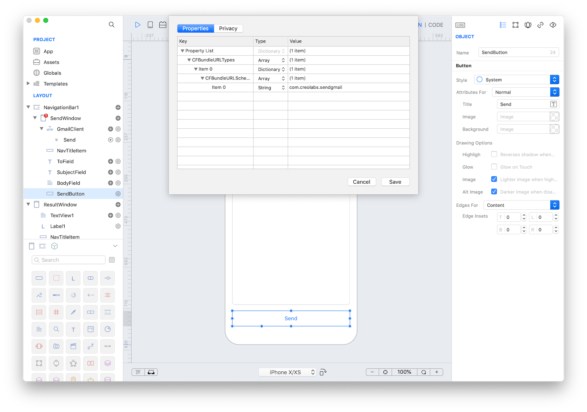

The Gmail API lets you view and manage Gmail mailbox data like threads, messages, and labels.

You can use HTTPClient and HTTPRequest objects to interact with Google API.
The HTTPClient class offers an easy interface to setup the [authentication and authorization](https://developers.google.com/identity/protocols/OAuth2) step required by Google API.

First of all, you have to enable the Gmail API in [gmail_api-console](https://console.cloud.google.com/apis/library/gmail.googleapis.com), then create a new "ID client OAuth" credential on [google-developers-console](https://console.developers.google.com/apis/credentials) with type "iOS" and your App name and bundle ID.
Two different Client ID are needed:
* one Client ID for the bundle ID of your App, used when the App runs in a real device
* one Client ID with the "com.creolabs.creo" bundle ID, needed to test the App in the Creo degin board and simulator within the Mac IDE and in the CreoPlayer.
*Note:* You have to set these Cliend ID values in the inspector of the `SendGmail` (HTTPClient) object of the attached project to make it work.

The list of Gmail API is available at [gmail-api-explorer](https://developers.google.com/apis-explorer/?hl=it#p/gmail/v1/).

In our sample Creo project, we setup an HTTPClient with the following properties as required by the Gmail API:
* **Redirect URI:** `com.creolabs.sendgmail:/` (the schema of the URI should be the App's bundleID. The path is an optional path component, such as /oauth2redirect. Note that the path should begin with a single slash, which is different from regular HTTP URLs. Ref: [request-parameter-redirect_uri](https://developers.google.com/identity/protocols/OAuth2InstalledApp#request-parameter-redirect_uri))
* **Authorization URL:** https://accounts.google.com/o/oauth2/v2/auth
* **Access Token URL:** https://www.googleapis.com/oauth2/v4/token
* **Scope:** https://www.googleapis.com/auth/gmail.send (for the list of scopes, refer to [googlescopes](https://developers.google.com/identity/protocols/googlescopes) )
* **Client ID:** <The client ID obtained from the [API Console](https://console.developers.google.com/apis/credentials)>
* **Client Secret:** <This value is not needed for clients registered as Android, iOS, or Chrome applications.>
* **Redirect URI Simulator:** `com.creolabs.creo:/` (this client ID is needed to test your App in Creo for Mac and CreoPlayer)
* **Client ID Simulator:** <the client ID of the credential for bundle "com.creolabs.creo" obtained from the [API Console](https://console.developers.google.com/apis/credentials)>
* **Client Secret Simulator:** <This value is not needed for clients registered as Android, iOS, or Chrome applications.>



The HTTPRequest named Send in configured with the following properties:
* **Path:** `gmail/v1/users/userId/messages/send?fields=id`
* **Path Parameters:** set the value of the `userId` path parameter to the `me` value (The special value me can be used to indicate the authenticated user.)
* **Body:**
	* **Mode:** `JSON`
	* **Parameters:** Name:`raw`, Value:<empty> (the value will be programmatically added with the content of the Email)



The following code is used in the `Action` event of the `SendButton` to prepare the Email message, set it to the `raw` body parameter and send the HTTPRequest:

```
var to : String = ToField.text
var subject : String = SubjectField.text
var body : String = BodyField.text

// input validation
if (to.length == 0) {
	var alert = Alert("Verify your information", "Recipient address missing.")
	alert.show()
	return;
}

// The Gmail API requires MIME email messages compliant with RFC 2822 ...
var mail = "To: \(to)
Subject: \(subject)

\(body)"

// ... and encoded as base64url strings
var encodedMail = Crypto.encodeStringToBase64(mail)

// set the content to the "raw" body field
GmailClient.Send.raw = encodedMail

// closure executed in case of success
func onSuccess(request,response) {
	ResultWindow.open({
		ResultWindow.Label1.text = "Success"
		ResultWindow.TextView1.text = response;
	})
}

// closure executed in case of error
func onError(request,error) {
	ResultWindow.open({
		ResultWindow.Label1.text = "Error"
		ResultWindow.TextView1.text = error;
	})
}

// send the email
GmailClient.Send.send(onSuccess, onError)
```

Remember to [configure the bundleID as a custom custom scheme](https://docs.creolabs.com/technotes/open-url.html) to be able to
process the redirect URL for the built App.



**Project**
* [SendGmail.creoproject]({{github_raw_link}}/assets/SendGmail.creoproject.zip) (49KB)
