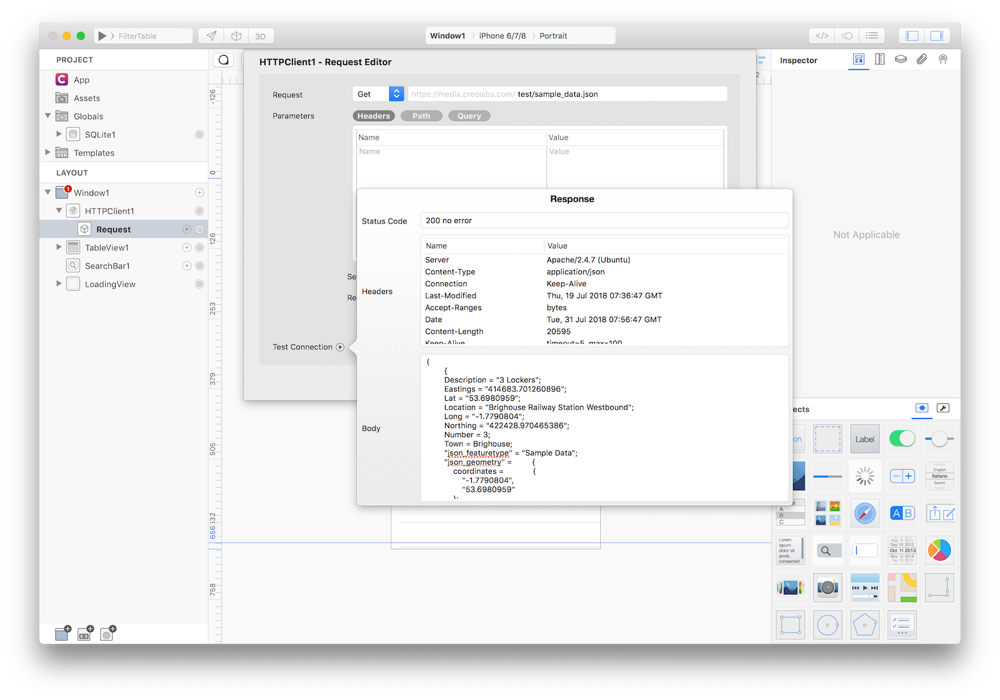
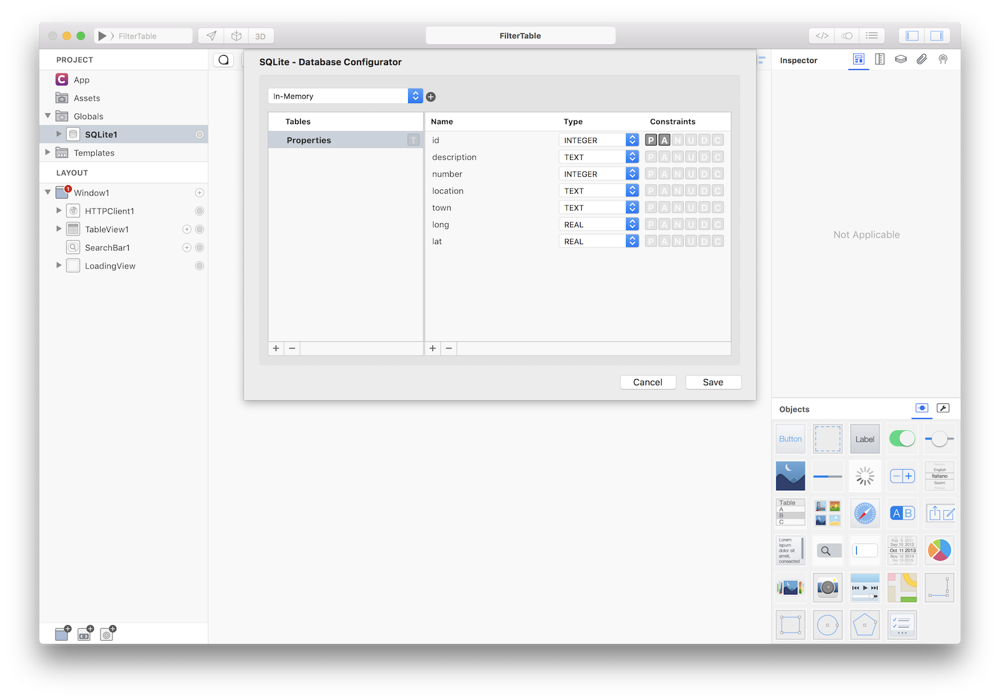
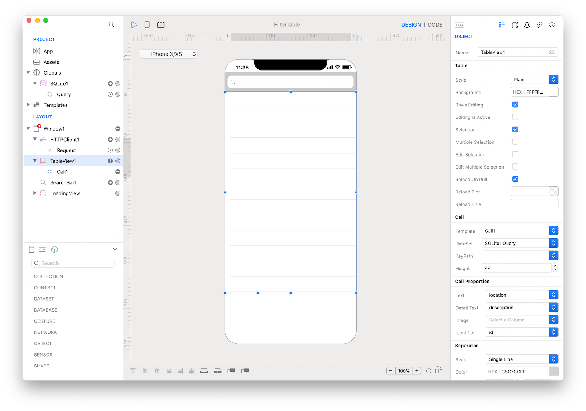

There is often the needs to download data from an HTTPRequest and then filter that data using some custom search criteria. Searching and filtering is a problem easily solvable by a sql database so the best approach is to use data download from the HTTP to fill an in-memory database and then use that database as a DataSet to be filtered.

For this example we'll use a test JSON file from [https://media.creolabs.com/test/sample_data.json](https://media.creolabs.com/test/sample_data.json) that contains data in the form (an array of maps):
```
[
	{
	Description = "3 Lockers";
	Eastings = "414683.701260896";
	Lat = "53.6980959";
	Location = "Brighouse Railway Station Westbound";
	Long = "-1.7790804";
	Northing = "422428.970465386";
	Number = 3;
	Town = Brighouse;
	"json_featuretype" = "Sample Data";
	"json_geometry" =         {
		coordinates =             (
			"-1.7790804",
			"53.6980959"
		);
		type = Point;
	};
	},
		{
		Description = "4 Stands";
		Eastings = "414729.492310424";
		Lat = "53.7010035";
		Location = "Brighouse Sainsbury's";
		Long = "-1.7783716";
		Northing = "422752.60949517";
		Number = 4;
		Town = Brighouse;
		"json_featuretype" = "Sample Data";
		"json_geometry" =         {
			coordinates =             (
				"-1.7783716",
				"53.7010035"
			);
			type = Point;
		};
	},
	...
]
```

In our example we setup an HTTPRequest and we can verify that data exists and it is in the format we expects.



We should create an in-memory SQLite database with all the fields we need:



A TableView should be created with the SQLite query set as its DataSet and with some properties bound to cell properties:



The core of this article is to show you how to transfer data from an HTTP request to an SQLite database. The requested code should be written in the DidFinish event of the HTTPClient1.Request object and it looks like:

```
var r = self.value;
// r is an array of maps
for (var data in r) {
	// each map can be accessed using the key we can see from the JSON file
	var description = data.Description;
	var number = data.Number;
	var location = data.Location;
	var town = data.Town;
	var long = data.Long;
	var lat = data.Lat;
	
	// build an sql insert statement and execute it in the in-memory database
	var sql = "INSERT INTO Properties (description, number, location, town, long, lat) VALUES ('\(description)', \(number), '\(location)', '\(town)', \(long), \(lat));";
	SQLite1.execute(sql);
}

// once finished tell the Table to reload and refresh
TableView1.reload(true);
```

As a bonus code in the attached example you can see how to present a simple "Loading data..." view and how to filter that data using input from a SearchBar.

**Project**
* [FilterTable.creoproject]({{github_raw_link}}/assets/filtertable.zip) (16KB)
