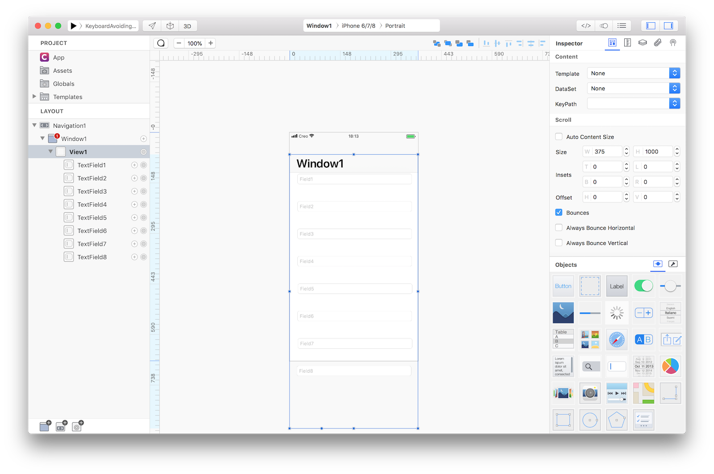
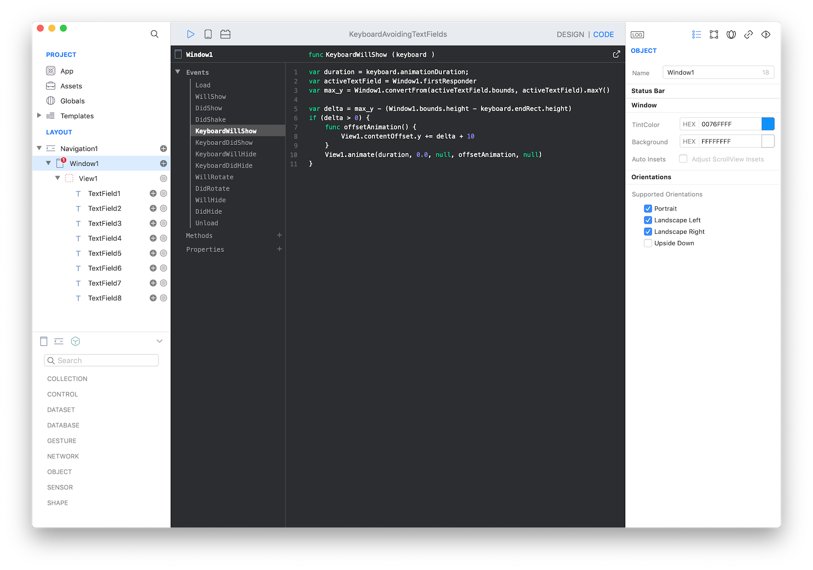
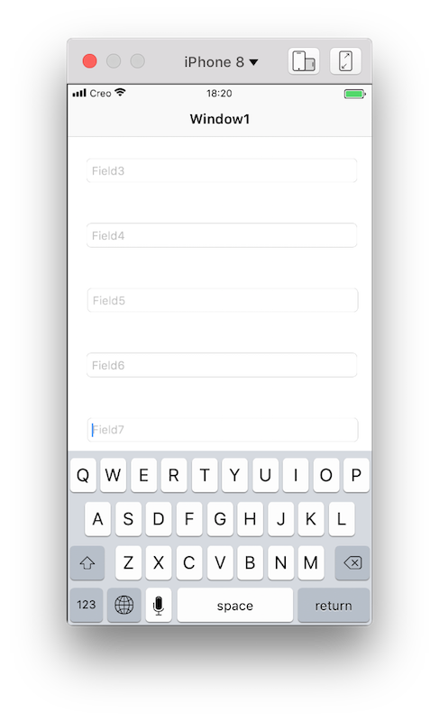

How to create a scrollable view with many TextFields that automatically scroll to avoid the active TextField to be covered by the Keyboard.

TextFields are added as subviews inside a View object (which is a view that allows the scrolling of its contained views). The height value in the size parameter of the `View1` must be big enough to contain all the TextFields.



The automatic scrolling action to keep the active TextField visible when the keyboard is presented is performed by the following code in the `KeyboardWillShow` event of the `Window1`:

```
var duration = keyboard.duration;
var activeTextField = Window1.firstResponder
var max_y = Window1.convertFrom(activeTextField.bounds, activeTextField).maxY()

var delta = max_y - (Window1.bounds.height - keyboard.endRect.height)
if (delta > 0) {
	var newOffset = View1.contentOffset
	newOffset.y += delta + 10;
	func offsetAnimation() {
		View1.contentOffset = newOffset
	}
	View1.animate(duration, 0.0, null, offsetAnimation, null)
}
```



If you run the project in the Simulator and click on the `TextField7`, the `View1` content is automatically scrolled enough to show the `TextField7` just above the keyboard.



**Project**
* [KeyboardAvoidingTextFields.creoproject]({{github_raw_link}}/assets/keyboard_avoiding_textfields.creoproject.zip) (389KB)
