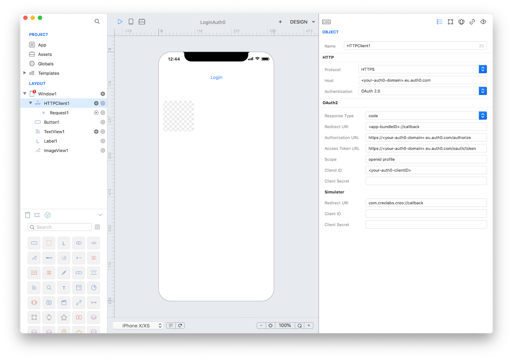
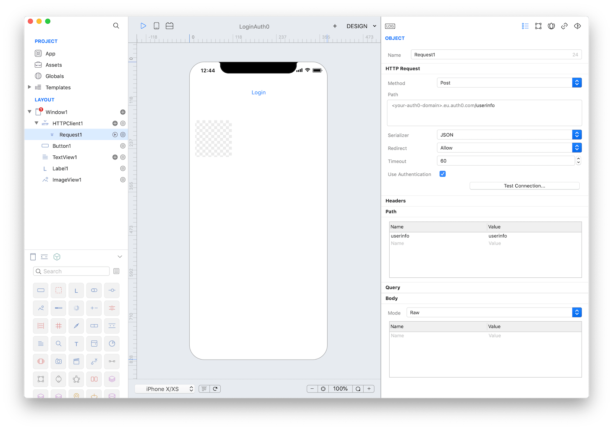
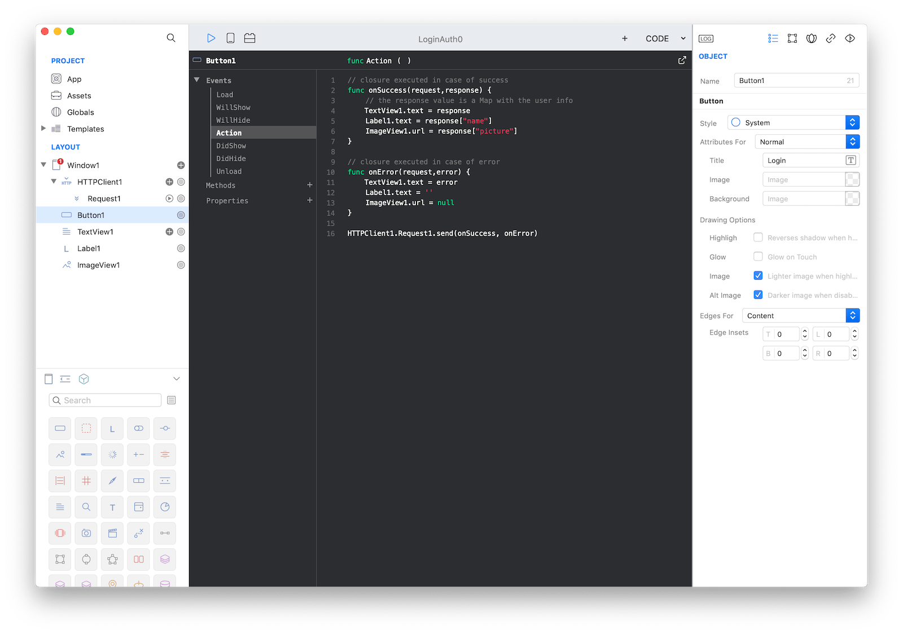

Add Login Using the [Auth0 API](https://auth0.com/docs/api/info).

You can use HTTPClient and HTTPRequest objects to interact with Auth0 API.
The HTTPClient class offers an easy interface to setup the [OAuth 2.0 Authorization Code Flow](https://auth0.com/docs/flows/guides/auth-code-pkce/add-login-auth-code-pkce) required by the Auth0 API.

First of all, you have to sign up to [Auth0](https://auth0.com/) and create an Application in [dashboard](https://manage.auth0.com/dashboard). The Settings page of the Application provides you the Domain and the Client ID values required to configure the OAuth2 authentication of the HTTPClient.

In our sample Creo project, we setup an HTTPClient with the following properties:
* **Host:** `<your-auth0-domain>.eu.auth0.com` (from the Auth0 Dashboard Settings)
* **Authentication:** `OAuth 2.0`

* **Redirect URI:** `<app-bundleID>://callback` (you have to add this URL in the Allowed Callback URLs parameter in the Auth0 Dashboard Settings)
* **Authorization URL:** `https://<your-auth0-domain>.eu.auth0.com/authorize`
* **Access Token URL:** `https://<your-auth0-domain>.eu.auth0.com/oauth/token`
* **Scope:** `openid profile`
* **Client ID:** `<your-auth0-clientID>` (from the Auth0 Dashboard Settings)
* **Redirect URI Simulator:** `com.creolabs.creo://callback` (you have to add this URL in the Allowed Callback URLs parameter in the Auth0 Dashboard Settings, this client ID is needed to test your App in Creo for Mac and CreoPlayer)



Then add an HTTPRequest to start the user authentication process and to eventually get the info of the logged user:
* **Path:** `userinfo`
* **Serializer:** `JSON`
* **Body:**
	* **Mode:** `Raw`



The following code is used in the `Action` event of the `Button1` send the `HTTPRequest`:

```
// closure executed in case of success
func onSuccess(request,response) {
	// the response value is a Map with the user info
    TextView1.text = response
	Label1.text = '\(response["name"])'
	ImageView1.url = response["picture"]
}

// closure executed in case of error
func onError(request,error) {
    TextView1.text = error
	Label1.text = ''
	ImageView1.url = null
}

HTTPClient1.Request1.send(onSuccess, onError)
```




Remember to [configure the bundleID as a custom custom scheme](https://docs.creolabs.com/technotes/open-url.html) to be able to
process the redirect URL for the built App.


**Project**
* [LoginAuth0.creoproject]({{github_raw_link}}/assets/LoginAuth0.creoproject.zip) (14KB)
