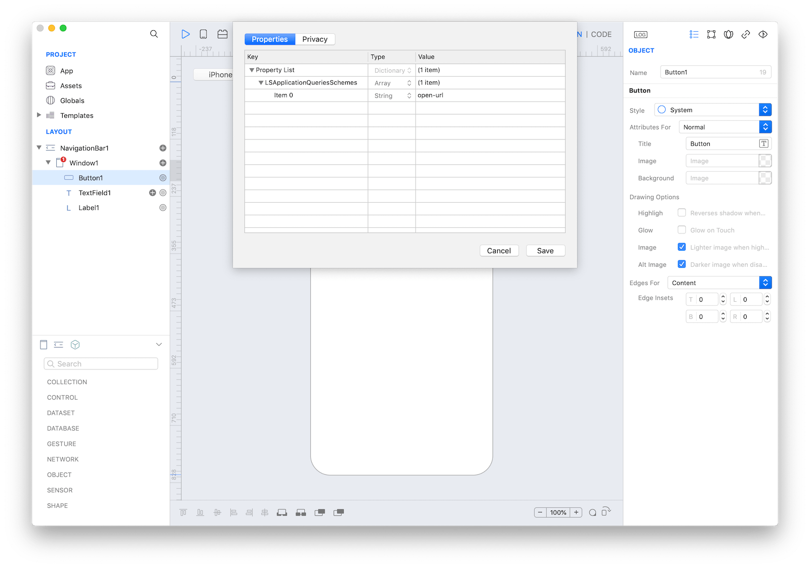
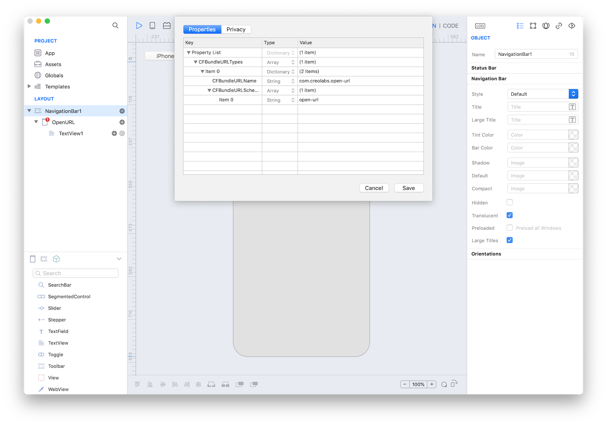

###Open an external App using a custom Url
```
var url = "app_scheme://message"
App.openURL(url)
```

The `canOpenURL(url)` method returns `true` if the _scheme_ of the _url_ parameter is listed in the `LSApplicationQueriesSchemes` value of the [Properties](https://docs.creolabs.com/creo/properties.html) list, `false` otherwise.
The `openURL(url)` method tries to open the _url_ even if the _scheme_ is not listed in the `LSApplicationQueriesSchemes` value.

####How to add schemes to LSApplicationQueriesSchemes
1. Open the Properties window from the menu Project.
2. Add an item to the root `Property List` dictionary, if not already existing, with name `LSApplicationQueriesSchemes` and type `Array`.
3. Add a string item for each _scheme_ that the app is able to test using the `canOpenURL(url)` method.



**Project**
* [open-url-opener.creoproject]({{github_raw_link}}/assets/open-url-opener.creoproject.zip) (12KB)

###Process custom Urls sent by external Apps
1. Select the App object inside the layout area
2. Write your custom code in the `OpenUrl(url, options)` event, for example:

```
if (url.contains("message1")) {
    // process the message1 case
    return true
}

if (url.contains("message2")) {
    // process the message2 case
    return true
}

return false
```

####How to configure custom schemes
1. Open the Properties window from the menu Project.
2. Add an item to the root `Property List` dictionary, if not already existing, with name `CFBundleURLTypes` and and type `Array`.
3. Add an dictionary item for each URL scheme supported by the app, this dictionary must contain the following key/value pair:
* `CFBundleURLName`: a `String` value that represents the abstract name for this URL type. This is the main way to refer to a particular type. The value must be unique.
* `CFBundleURLSchemes`: an `Array` of `String`s, each of which identifies a URL scheme handled by this type.



**Project**
* [open-url.creoproject]({{github_raw_link}}/assets/open-url.creoproject.zip) (10KB)
