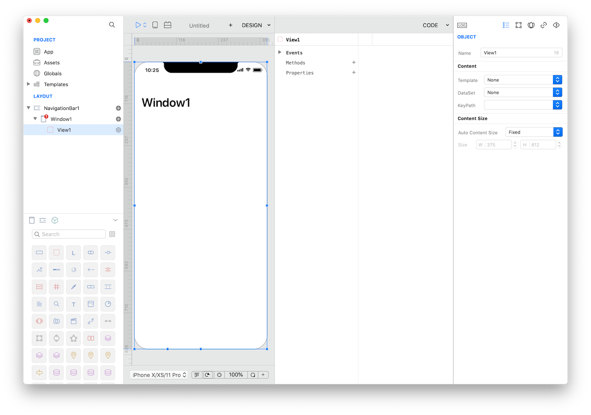

With this tech note we'll see how to add the pinch to zoom support to image views. ImageViews don’t support any type of zooming, so we'll use a scrollable View to make any ImageView support pinch to zoom.

First, drop a View (`View1`) in `Window1`, then drop an ImageView (`ImageView1`) into `View1`. Set the same size to `View1` and `ImageView1`.

Add an image to the `ImageView1` and set the resize mode property to `Aspect Fill`

Zooming is enabled if you returns a valid view in the `ViewForZooming` event of the enclosing View and if its `maximumZoomScale` property is greater than the minimumZoomScale (the default value for both properties is 1.0).

So, just add the following code to `View1`.
1. Event `Load`: `self.maximumZoomScale = 10.0`
2. Event `ViewForZooming`: `return ImageView1`
3. Optional: if you need to be notified of changes in the `zoomScale` property, just use the `DidZoom` event.

**Note**: The pinch to zoom feature is not currently supported in Creo Simulator but it works in iOS devices and in Apple iOS simulators.

**Project**
* [PinchToZoom.creoproject]({{github_raw_link}}/assets/pinch-to-zoom.creoproject.zip) (1.2MB)
