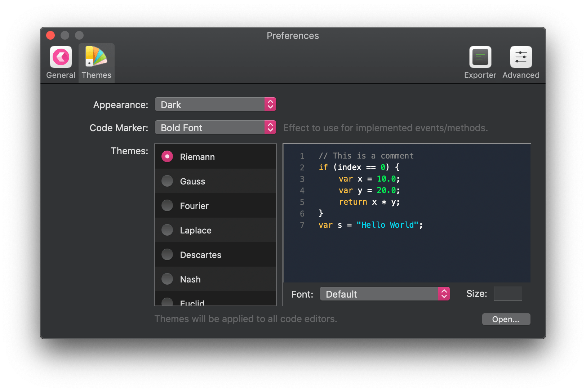
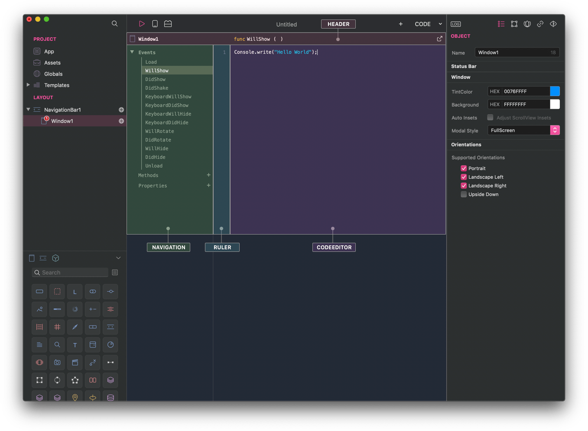

###Themes folder
A code editor theme is a JSON file with the extension `.creotheme` added to a special folder.
If you open Creo preferences in the Themes tab:


Under the Themes list there is now an `Open...` button that reveals in the Finder the Themes folder (located under `&tilde;/Library/Application Support/Creo/Themes/`) 


###Create a Theme file
A theme file is a JSON text file with the `.creotheme` extension.
If you open an existing theme it looks like:
```
{
	"HEADER_BORDER_COLOR": "#4B4B4B",
	"HEADER_BACKGROUND_COLOR": "#212224",
	"NAVIGATION_TEXTPLAIN_COLOR": "#888A8F",
	"NAVIGATION_TEXTBOLD_COLOR": "#FFFFFF",
	"NAVIGATION_SELECTION_COLOR": "#424244",
	"NAVIGATION_BACKGROUND_COLOR": "#212224",
	"RULER_BACKGROUND_COLOR": "#141414",
	"RULER_TEXTPLAIN_COLOR": "#55575B",
	"SCOPE_ALPHA": 0.8,
	"CODEEDITOR_BACKGROUND_COLOR":"#31333F",
	"CODEEDITOR_SELECTION_COLOR": "#68634D",
	"CODEEDITOR_PLAIN_COLOR": "#E0E3F5",
	"CODEEDITOR_IDENTIFIER_COLOR": "#FFFFFF",
	"CODEEDITOR_CURSOR_COLOR": "#FFFFFF",
	"CODEEDITOR_COMMENTS_COLOR": "#5E6382",
	"CODEEDITOR_STRINGS_COLOR": "#F8F4EC",
	"CODEEDITOR_NUMBERS_COLOR": "#FFFAFD",
	"CODEEDITOR_KEYWORDS_COLOR": "#00E475",
	"CODEEDITOR_MACROS_COLOR": "#AAAAAA",
	"CODEEDITOR_SPECIAL_COLOR": "#AAAAAA",
	"CODEEDITOR_CLASS_COLOR": "#FF00DF",
	"CODEEDITOR_FUNCTION_COLOR": "#FF00DF",
	"CODEEDITOR_VAR_COLOR": "#00E475",
	"CODEEDITOR_CONST_COLOR": "#00E475",
	"CODEEDITOR_ENUM_COLOR": "#005BF1",
	"CODEEDITOR_MODULES_COLOR": "#005BF1",
	"CODEEDITOR_ERROR_COLOR": "#888A8F",
	"CODEEDITOR_PLAIN_FONT": "Menlo-Regular",
	"CODEEDITOR_LINE_SPACING": 3.0
}

```


Each entry in the JSON file corresponds to a different part in the code editor as outlined in the following picture.



**Default templates**
For your convenience we packaged the standard Creo code editor themes.
* [creothemes.zip]({{github_raw_link}}/assets/themes.zip) (4KB)
