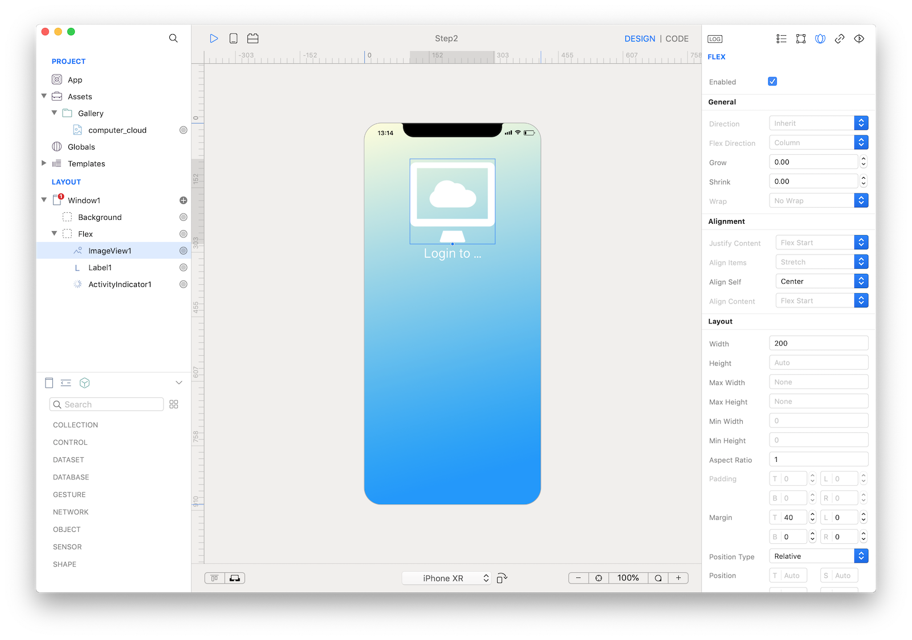
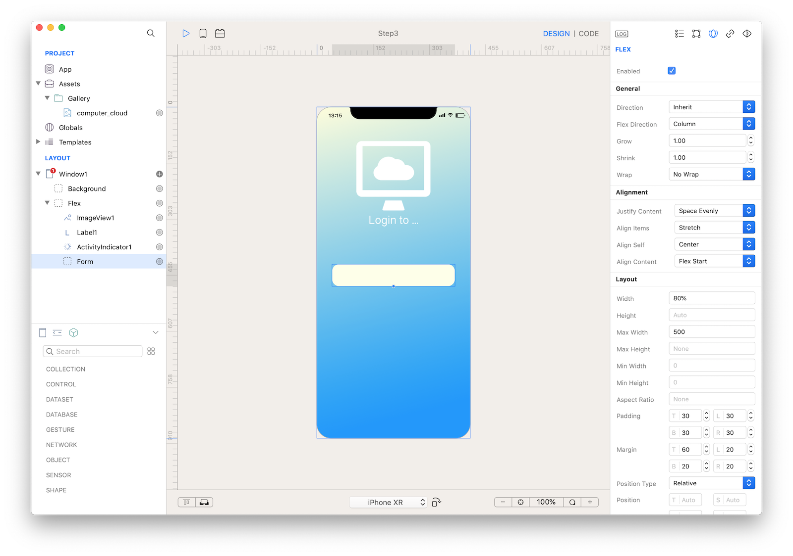
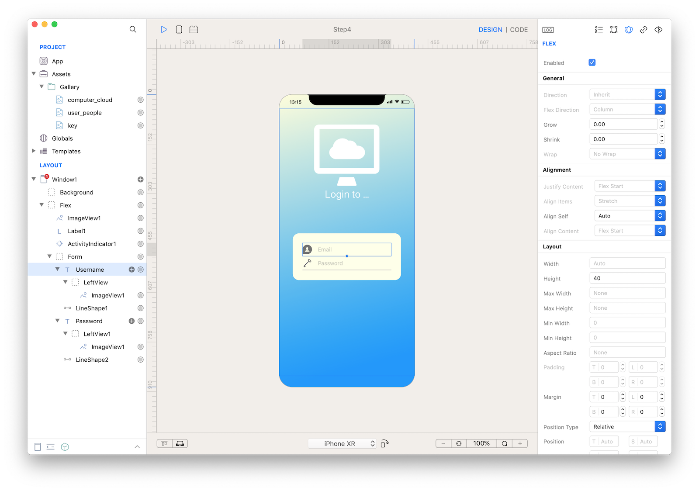
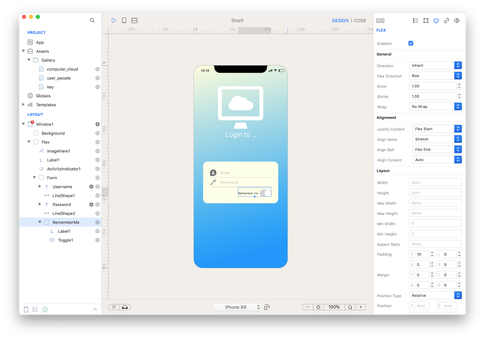
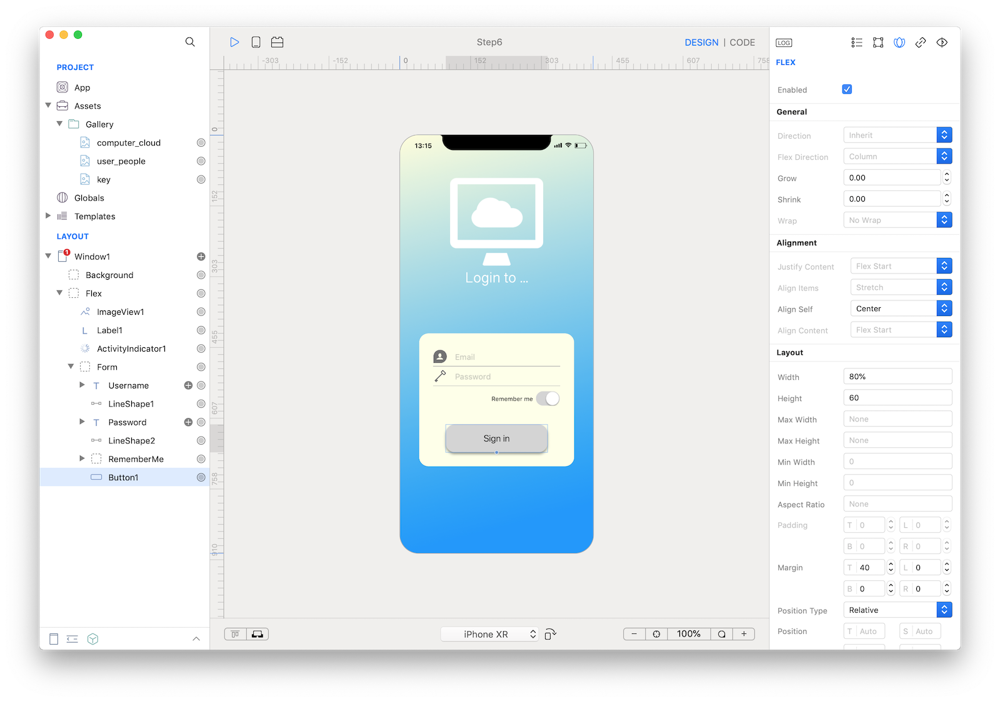
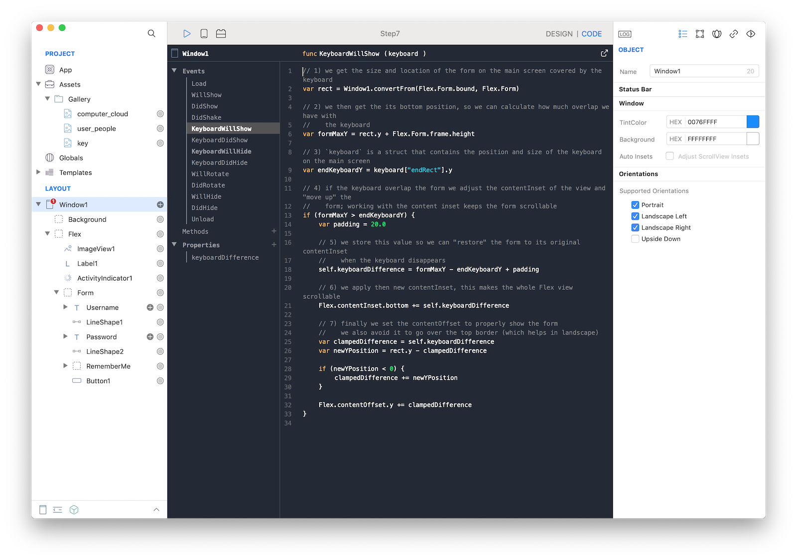
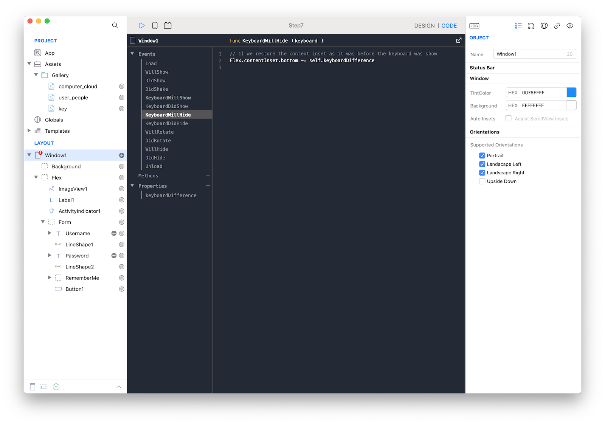
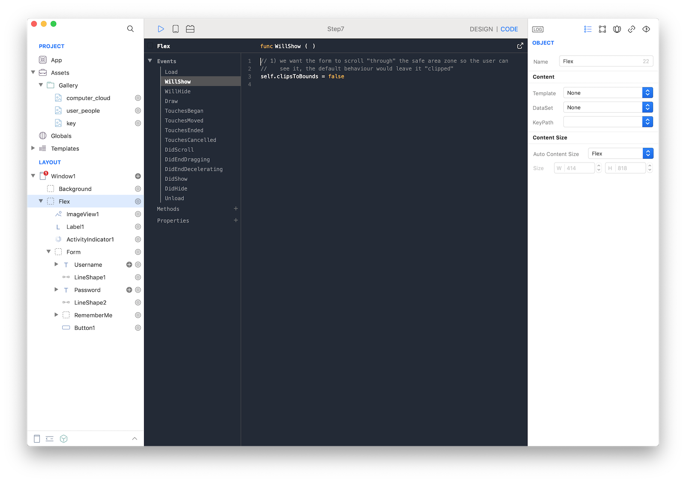

#### Concepts

Flex can be used to create complex views that do not simply adapt to the device screen size but also can automatically layout themself to properly respond to live size changes, for instance like when the virtual keyboard appears and disappears.

In this tutorial we see how a correct use of the `View` attribute **"Automatic Content Size = flex"** a simple login form adapts to different device (ie iPhone5 and iPad), orientations and eventually scrolls when the keyboard appears and disappears.

#### Classes

* [Window](../classes/Window.md)
* [View](../classes/View.md)
* [Flex](../classes/Flex.md)
* [Image](../classes/Image.md)
* [Label](../classes/Label.md)
* [TextField](../classes/TextField.md)
* [Toggle](../classes/Toggle.md)
* [Button](../classes/Button.md)
* [LineShape](../classes/LineShape.md)

#### Steps

++1++ Create a new empty Creo project and start by adding a `Window` with a fullscreen `View`. Use the Autosize Constraints inspector to enable all constratins. Rename to "Backround" and apply a gradient to its "Background color" property. This is our `Window` main static background and we wont need it for anything else.

++2++ Add another `View` that do not cover the safe area (status bar, top-notch and rounded corners); like the Background enable all the Autosize Constraints. Rename it to "Flex" and enable "Flex" from the `View` inspector, enable "Safe area" and set "Auto Content Size = Flex". It may be handy to use a device with non safe area requirements (ie iPhone 6/7/8) to apply and check the proper frame values.

**Note**:
This __Flex__ view is our main form container; "Auto Content Size = Flex" means that the dimension along the scrolling size (by default vertical via "Flex direction = row") is flexible and will scroll if there is not much space for the requested content, basically it happens when all its "Flex enabled" subviews require a layout bigger than the view frame itself. Please note, when the content fits the view frame then it does not scroll and acts like a normal "static" view.


++3++ Move back to a device with the top notch and test how the Flex view properly avoid the top-notch and the rounded corners. **TIPS**: if you want to know how to avoid the views clipping this solution will present then just scroll at the bottom of the tutorial for the solution.

++4++ Add 1 `ImageView`, 1 `Label` and 1 `ActivityIndicator` to the Flex view and enable "Flex" on both. Set the image and the text according to your own content and don't worry about the vertical size: the main concept of this tutorial is to let the content scrolls when it doesn't fit the current screen.

++5++ Set these attributes to ImageView1:

    - Keep Image Size: false
    - Rendering: tinted
    - Tint Color: white
    - Flex Align self: Center
    - Flex Width: 200
    - Flex Aspect Ratio: 1
    - Flex Margin Top: 40



++6++ Add 1 `View` to Flex and rename it to "Form". Enable "Flex".

++7++ Set these attributes to Flex:

    - Flex Justify Content: Space Evenly
    - Flex Align Items: Stertch
    - Flex Align Self: Center
    - Flex Align Content: Flex Start
    - Flex Width: 80%
    - Flex Max Width: 500
    - Flex Padding: 30 30 30 30
    - Flex Margin: 60 20 20 20



++8++ Add 1 `TextField` and 1 `LineShape` to Form and rename the TextField to "Username". Enable "Flex" on both.

++9++ Set the attributes to Username:

    - Flex Height: 40

++10++ Set the attributes to LineShape:

    - Flex Height: 2

++11++ Tap the Username (+) icon and add a Left View with an `ImageView`. Select an appropriate icon from the standard assets of Creo.

++12++ Repeat the past 4 points to add a Password field.



++13++ Add 1 `View` to Form and rename it to "RememberMe". Enable "Flex".

++14++ Set the attributes to RememberMe:

    - Flex, Flex Direction: Row
    - Flex Align Self: Flex End
    - Flex Padding Top: 10

++15++ Add 1 `Label` and 1 `Toggle` to RememberMe. Enable "Flex" on both of them.



++16++ Add 1 `Button` to Form. Enable "Flex".

++17++ Set the attributes to RememberMe:

    - Flex Align Self: Center
    - Flex Width: 80%
    - Flex Height: 60
    - Flex Margin Top: 40



++18++ Press RUN and check different devices and orientations, you should notice how the form scrolls when needed but it wont react to keyboard events. Let's do it.

++19++ Open the `Window` **CODE tab** and from the list of Properties add a new one:

```var keyboardDifference = null```

We need a variable to revert the contentSize when the keyboard disappears. We see this later.

++20++ Select `KeyboardWillShow` and paste this code:

```
// 1) we get the size and location of the form on the main screen covered by the keyboard
var rect = Window1.convertFrom(Flex.Form.bound, Flex.Form)

// 2) we then get the its bottom position, so we can calculate how much overlap we have with
//    the keyboard
var formMaxY = rect.y + Flex.Form.frame.height

// 3) `keyboard` is a struct that contains the position and size of the keyboard on the main screen
var endKeyboardY = keyboard["endRect"].y

// 4) if the keyboard overlap the form we adjust the contentInset of the view and "move up" the
//    form; working with the content inset keeps the form scrollable
if (formMaxY > endKeyboardY) {
	var padding = 20.0

	// 5) we store this value so we can "restore" the form to its original contentInset
	//    when the keyboard disappears
	self.keyboardDifference = formMaxY - endKeyboardY + padding

	// 6) we apply then new contentInset, this makes the whole Flex view scrollable
	Flex.contentInset.bottom += self.keyboardDifference

	// 7) finally we set the contentOffset to properly show the form
	//    we also avoid it to go over the top border (which helps in landscape)
	var clampedDifference = self.keyboardDifference
	var newYPosition = rect.y - clampedDifference

	if (newYPosition < 0) {
		clampedDifference += newYPosition
	}

	Flex.contentOffset.y += clampedDifference
}
```

To make the Flex form scrollable we increase its `contentSize` height of the amount of space required by the virtual keyboard.

A naive solution would be to just add the keyboard height but that, most of the time, is too much. As a proper solution we calculate and add the overlapping space of the keyboard with the form, plus a padding. This is enough to get the Flex form become scrollable and, therefore, the user can scroll to see the section hidden by the keyboard.

We also automatize this by configuring the `contentOffset` to reposition (via scrolling) the form at the top of the screen.



++21++ Select `keyboardWillHide` and to restore the `contentSize` to the previous value just paste this code:

```
// 1) we restore the content inset as it was before the keyboard was show
Flex.contentInset.bottom -= self.keyboardDifference
```



++22++ Flex clipping: you may have noticed the form getting clipped when it scrolls over the bounding of the safe area region. To avoid this, tap `WillShow` from the Flex code tab and paste this code:

```
// 1) we want the form to scroll "through" the safe area zone so the user can
//    see it, the default behaviour would leave it "clipped"
self.clipsToBounds = false
```



++23++ Press RUN and enjoy the FlexTutorial app!

You can now send the app to **[CreoPlayer](../creo/creoplayer.md)** or **[build it](../creo/build-your-app.md)** and then submit to the App Store.

#### Project

* [FlexFormTutorial.creoproect]({{github_raw_link}}/assets/FlexFormTutorial.creoproject.zip)
