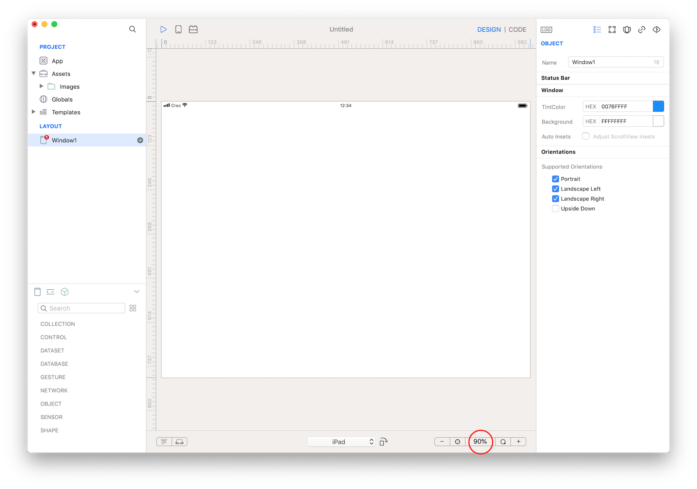
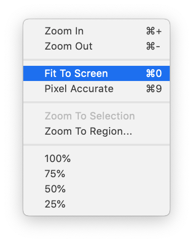
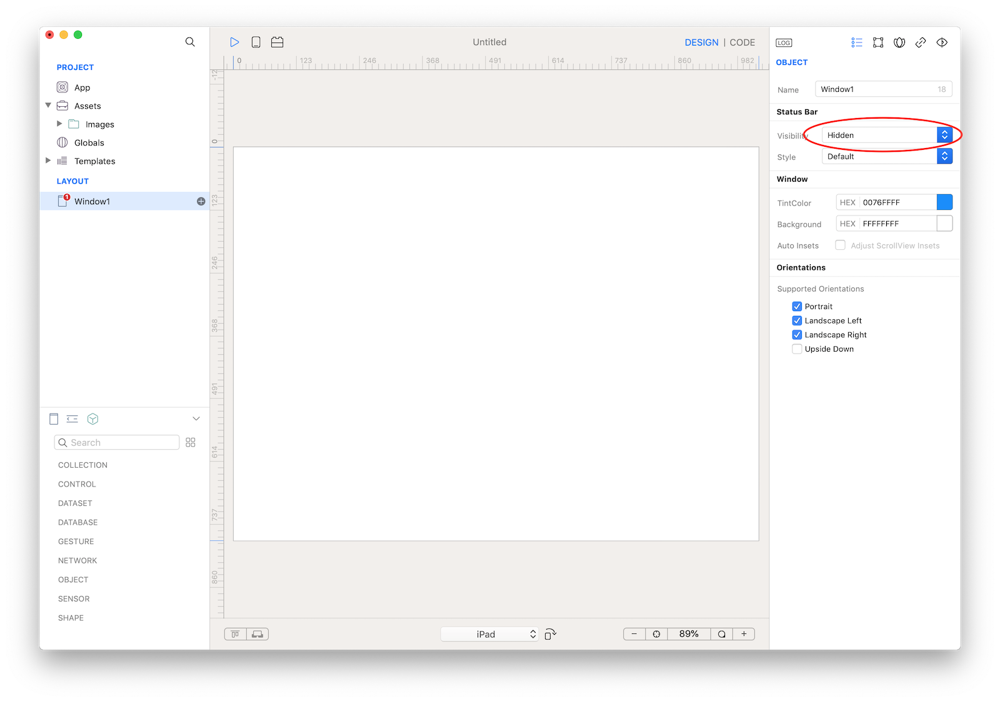
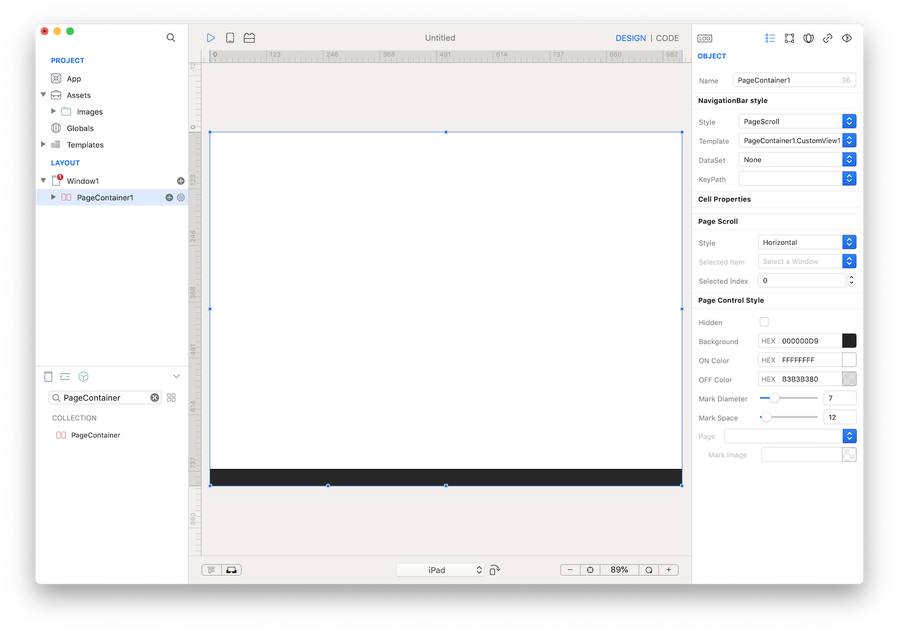
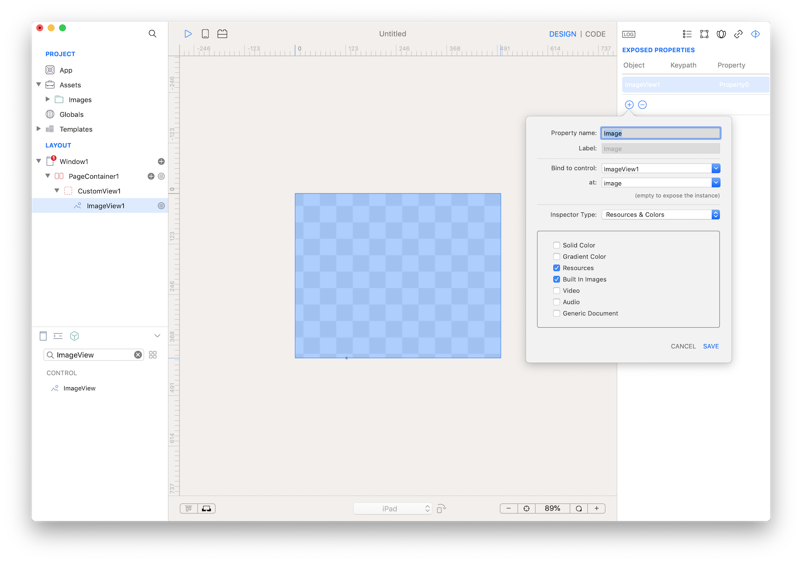
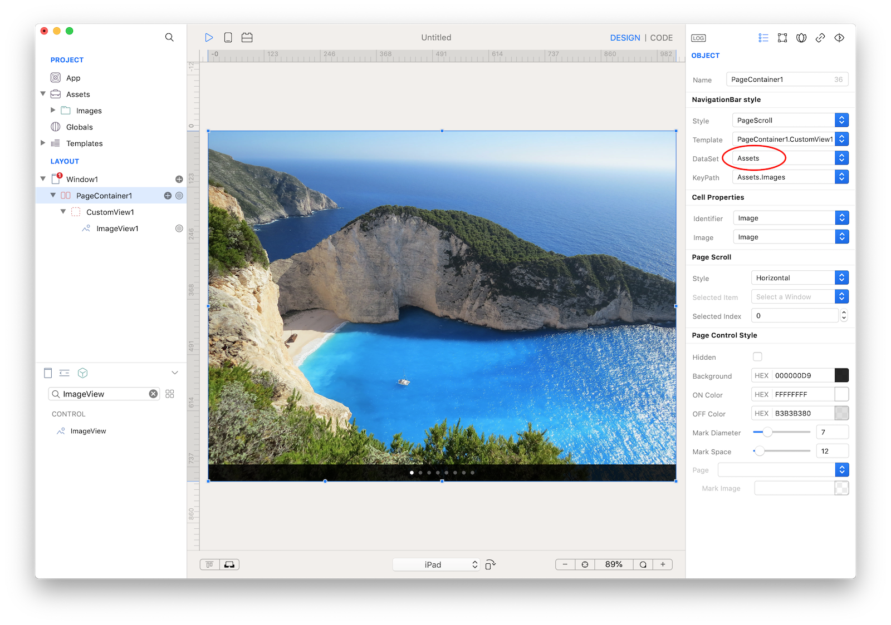

#### Concepts
The eBook tutorial will show you how to use the powerful PageContainer control bounds to an Images folder. This example will also show you how to build a single Window application for iPad and how to change orientation.

#### Classes
* [Page Container](../classes/PageContainer.md)
* [CustomView](../classes/CustomView.md)
* [ImageView](../classes/ImageView.md)

#### Assets
* [Images]({{github_raw_link}}/assets/ebook_assets.zip) - images credits to [freephotos.cc](https://freephotos.cc)

#### Steps
++1++ Create a new empty Creo project and start by dragging the Images folder into the Assets folder (then press Yes to the object conversion question).
<video class="creovideo" width="700" height="427" autoplay loop controls>
<source src="../documentation/docs/images/tutorials/ebook_images.m4v" type="video/mp4">
</video>

++2++ We do not need a NavigationBar in this example, so remove it:
<video class="creovideo" width="700" height="427" autoplay loop controls>
<source src="../documentation/docs/images/tutorials/ebook_delete.m4v" type="video/mp4">
</video>

++3++ Change device from iPhone X/XS to iPad

++4++ Change orientation from Portrait to Landscape Right:
<video class="creovideo" width="700" height="427" autoplay loop controls>
<source src="../documentation/docs/images/tutorials/ebook_select_ipad.m4v" type="video/mp4">
</video>

++5++ Set Zoom level to "Fit To Screen" (command 0 as shortcut):

++6++ Set Window1 Status Bar Visibility to "Hidden":

++7++ Drag a PageContainer control from Object into Window1 and resize it to fit Window1 size:

What is a PageContainer control? So far we manually created the Windows for our app, so we needed to know in advance how many Windows our app will use. Most of the time this is perfectly fine but sometimes it would be really helpful to have a way to automatically creates Windows based on a DataSet and this is exactly what a PageContainer does.

++8++ The PageContainer uses a template to define the presentation of the data from the DataSet. The template can be a CustomView from the global "Templates" folder or a CustomView subnode of the PageContainer. In this case we use the built-in CustomView subnode. Drag an ImageView1 into the CustomView1, resize it to fit CustomView1 size and set its Constraints as shown in the screenshot:

In Object Inspector set ImageView1 Mode to Aspect Fill

++9++ Expose the ImageView1.image property to the CustomView1 (as Image): select the Custom Property inspector (last tab of the inspector bar), drag the Binding knob anchor point of the ImageView1 (small circle in the bottom part of the ImageView1 selection frame) and drop it into the Custom Property inspector, set "Image" as the Property Name and choose the "image" value in the "Bind to Control at" keypath popup.

++10++ Configure the PageContainer to have CustomView1 as Template and Assets as DataSet. You'll end up with something like:

++11++ Press RUN and enjoy the eBook app!
<video class="creovideo" width="700" height="427" autoplay loop controls>
<source src="../documentation/docs/images/tutorials/ebook_finish.m4v" type="video/mp4">
</video>

You can now send the app to **[CreoPlayer](../creo/creoplayer.md)** or **[build it](../creo/build-your-app.md)** and then submit to the App Store.

#### Project
* [eBook.creoproject]({{github_raw_link}}/assets/ebook-14655.zip) (6.6MB)
