#### Concepts
The eBook tutorial will show you how to use the powerful PageContainer control bounds to an Images folder. This example will also show you how to build a single Window application for iPad and how to change orientation.

#### Classes
* [Page Container](../classes/PageContainer.md)
* [CustomView](../classes/CustomView.md)
* [ImageView](../classes/ImageView.md)
* [View](../classes/View.md)	
		
#### Assets
* [Images](../assets/ebook_assets.zip) - images credits to [freephotos.cc](https://freephotos.cc)

#### Steps
++1++ Create a new empty Creo project and start by dragging the Images folder into the Assets folder (then press Yes to the object conversion question).
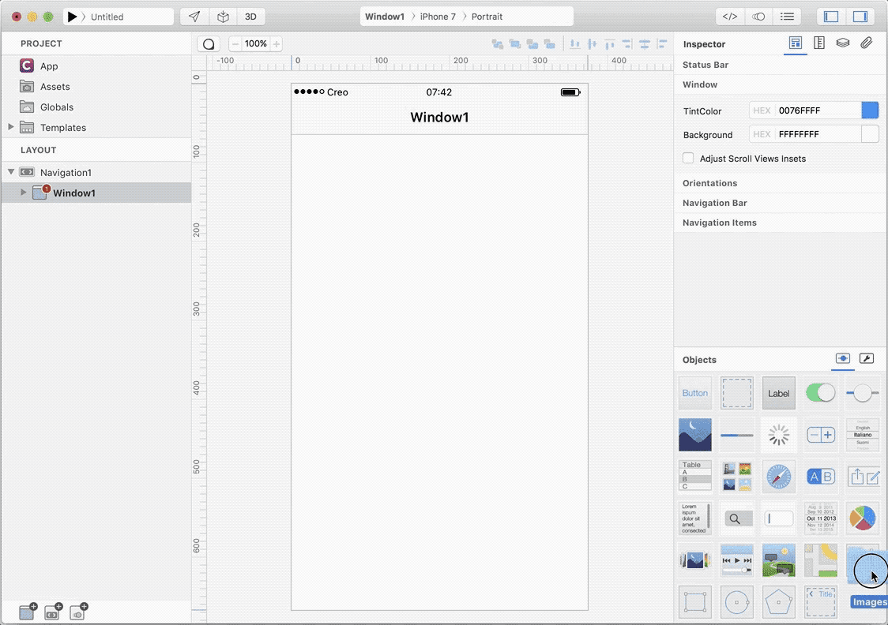

++2++ We do not need a Navigation in this example, so remove it:
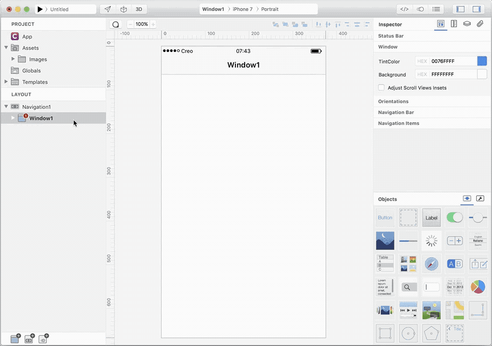

++3++ Change device from iPhone 7 to iPad:
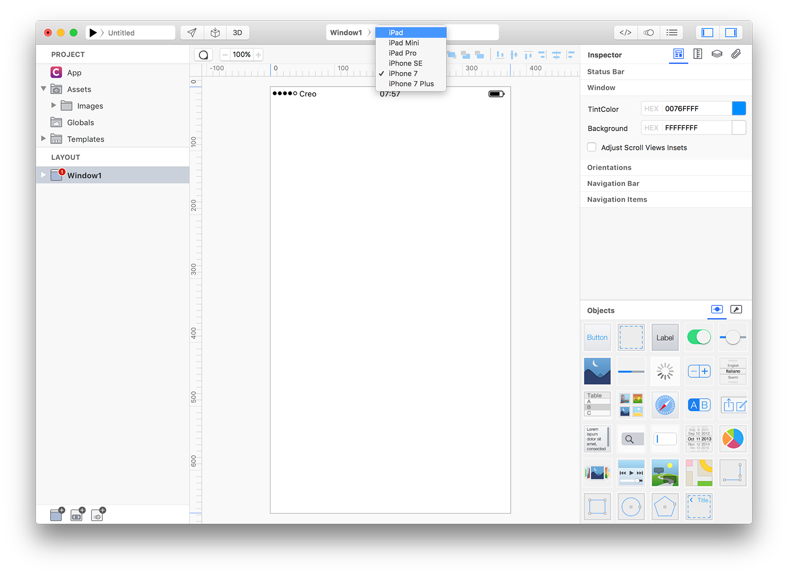

++4++ Change orientation from Portrait to Landscape Right:
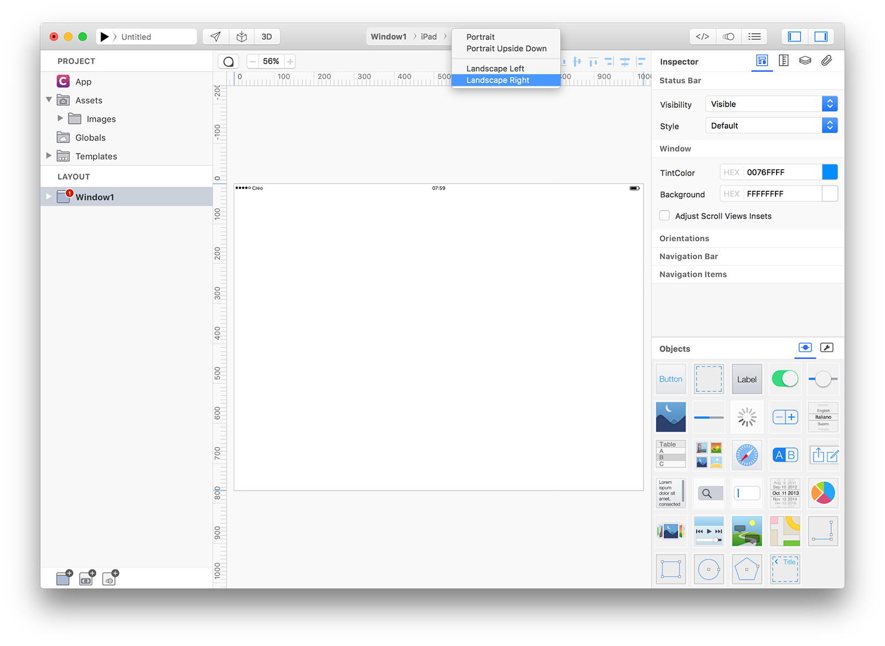

++5++ Set Zoom level to "Fit To Screen" (command 0 as shortcut):
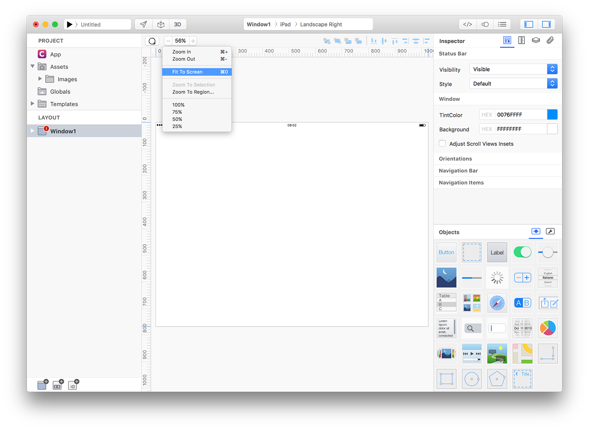

++6++ Set Window1 Status Bar Visibility to "Hidden":
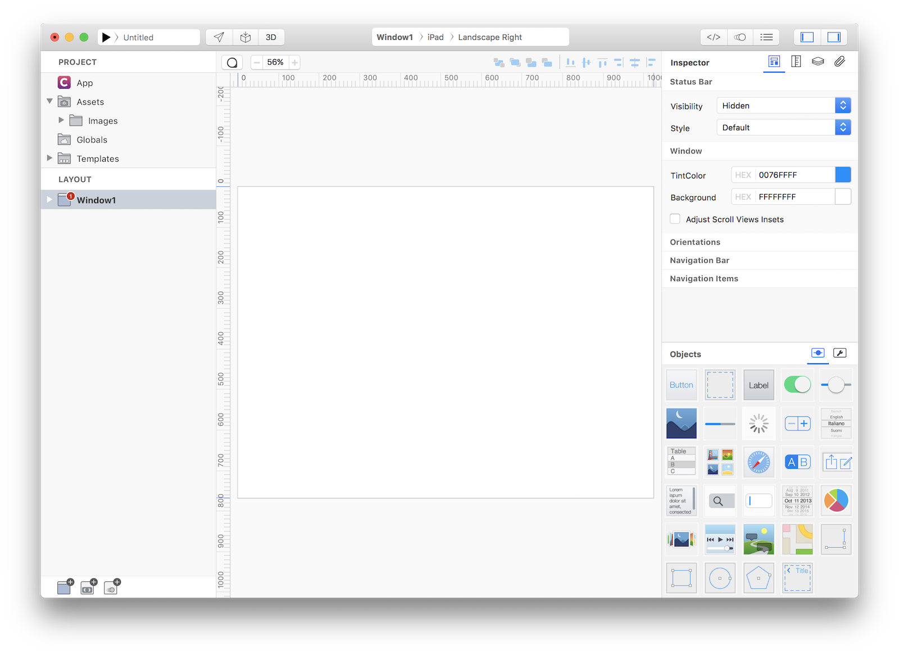

++7++ Drag a View from Objects to Templates in order to create a new CustomView1:
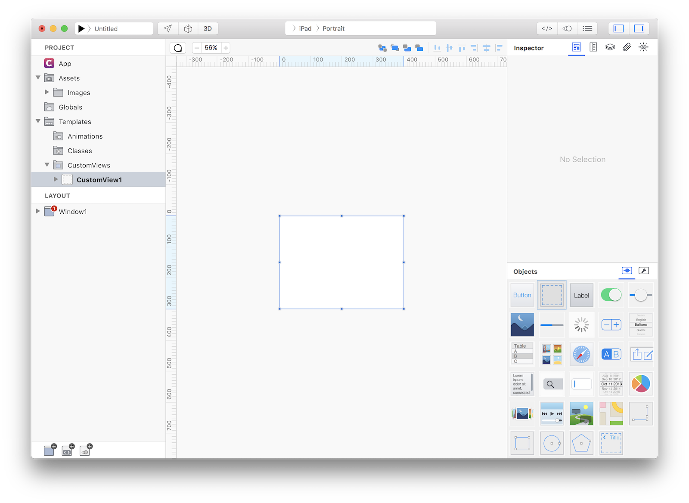

++8++ Drag an ImageView into the CustomView, resize it to fit CustomView1 size and set its Constraints as shown in the screenshot:
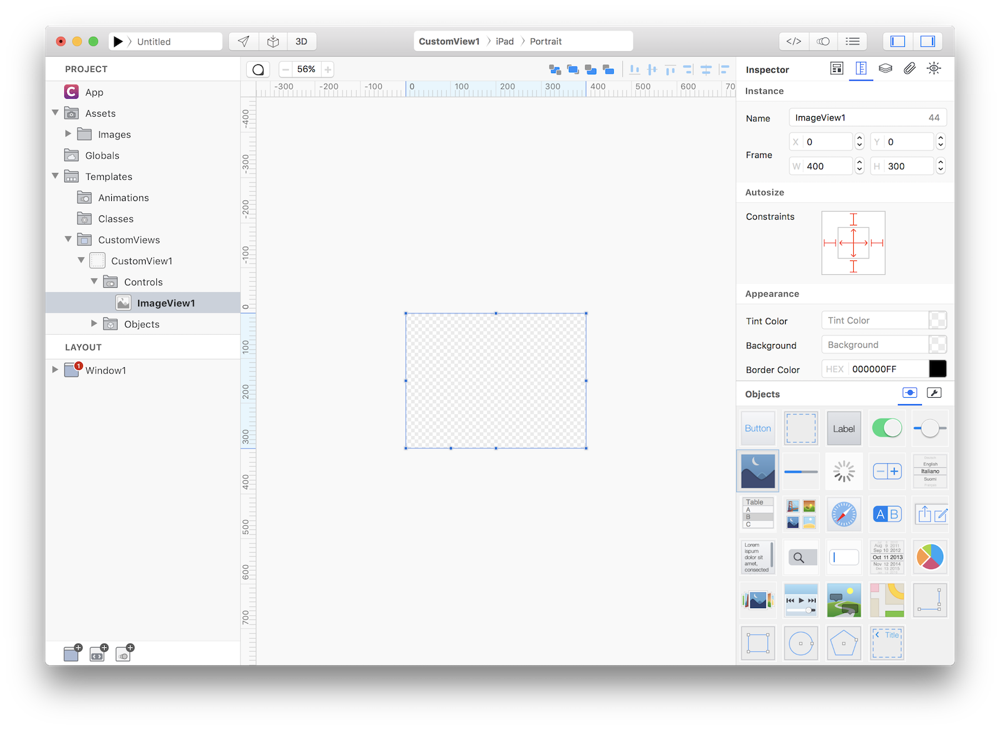
In Object Inspector set ImageView1 Mode to Aspect Fill

++9++ Expose the ImageView1.image property to the CustomView (as Image):
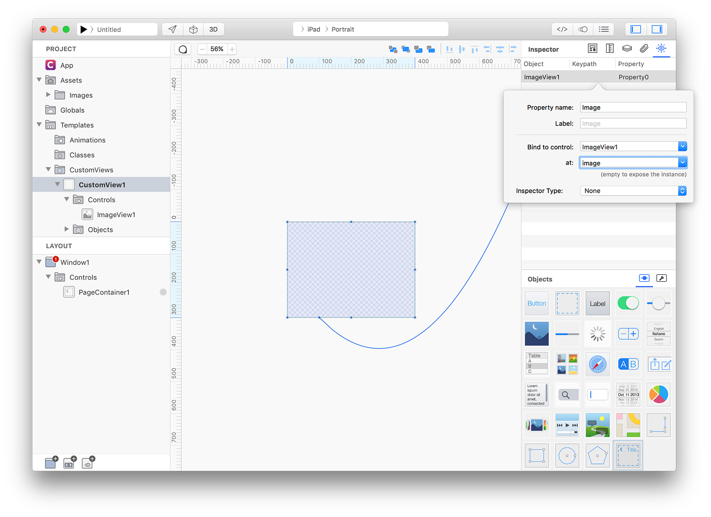

++10++ Drag a PageContainer control from Object into Window1 and resize it to fit Window1 size:
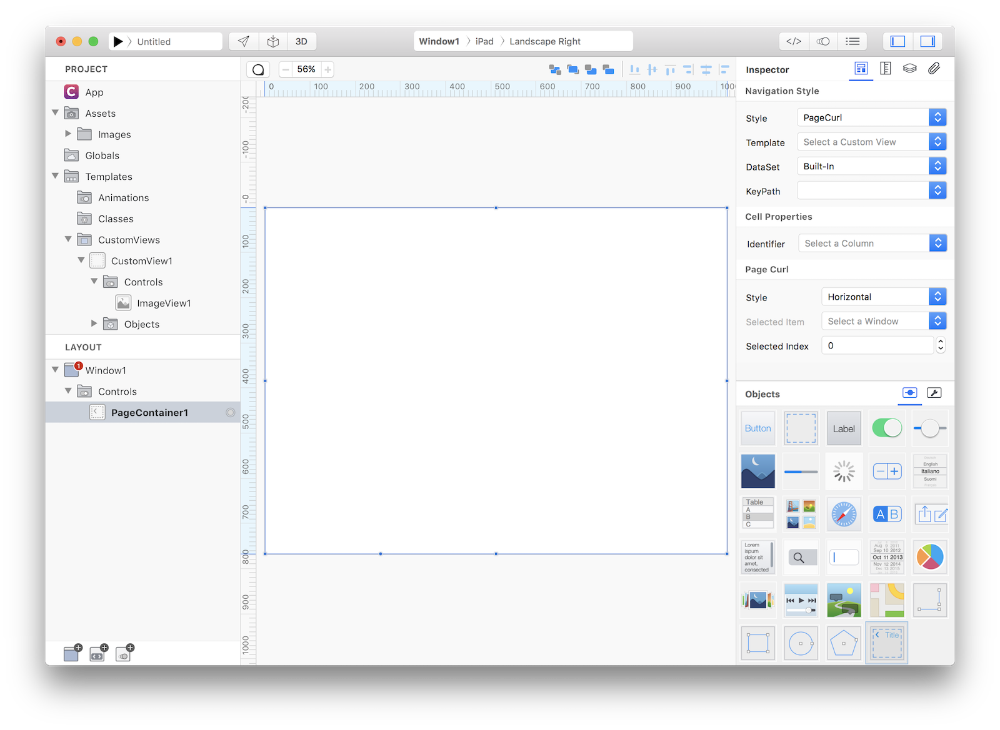
What is a ContainerControl? So far we manually created the Windows for our app, so we needed to know in advance how many Windows our app will use. Most of the time this is perfectly fine but sometimes it would be really helpful to have a way to automatically creates Windows based on a DataSet and this is exactly what a ContainerControl does.

++11++ Configure PageContainer to have CustomView1 as Template and Assets as DataSet. You'll end up with something like:
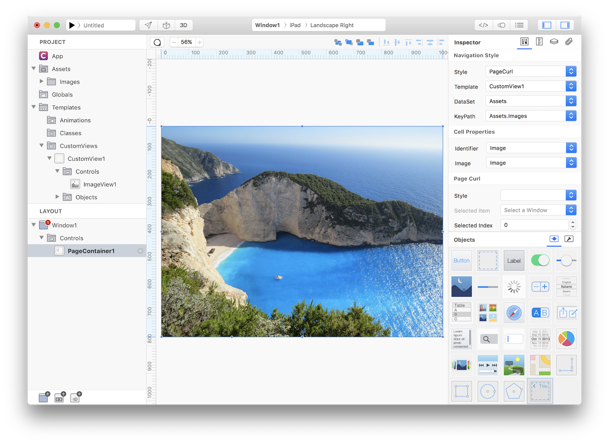

++12++ Press RUN and enjoy the eBook app!
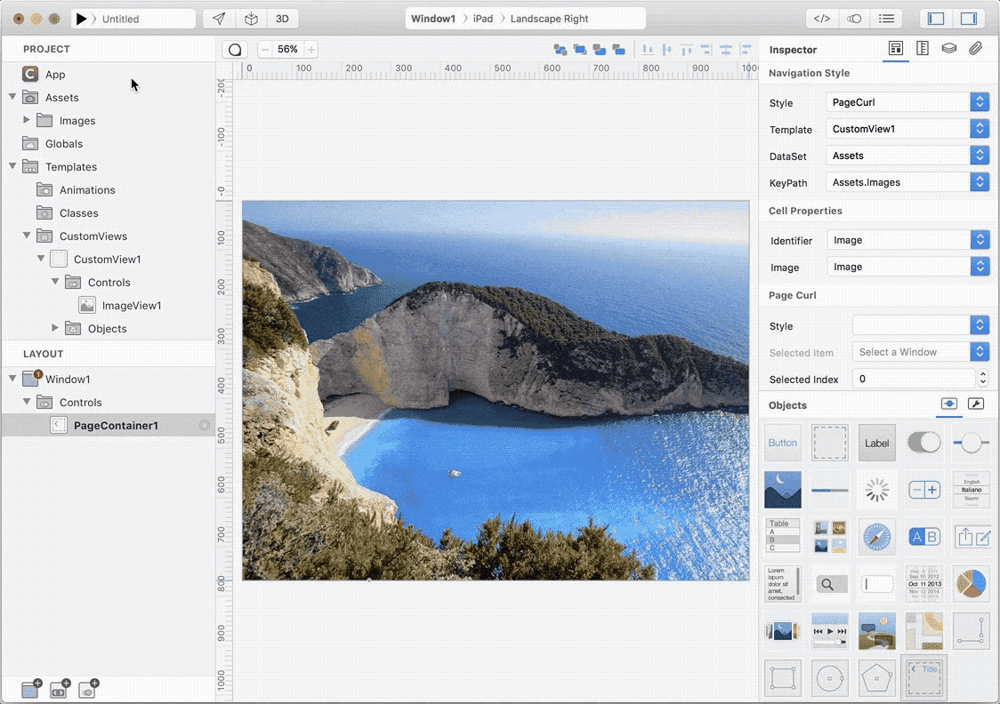

You can now send the app to **[CreoPlayer](../creo/creoplayer.md)** or **[build it](../creo/build-your-app.md)** and then submit to the App Store.

#### Project
* [eBook.creoproject]({{github_raw_link}}/assets/ebook.zip) (6.6MB)
