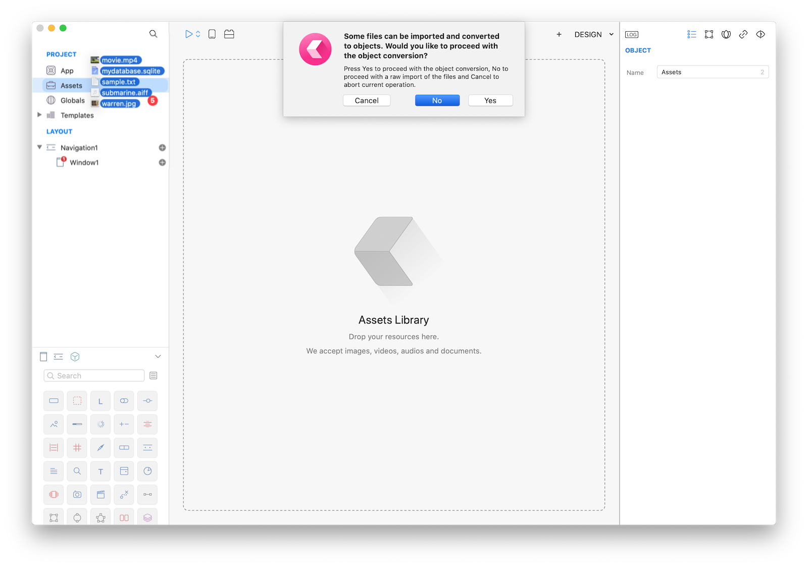
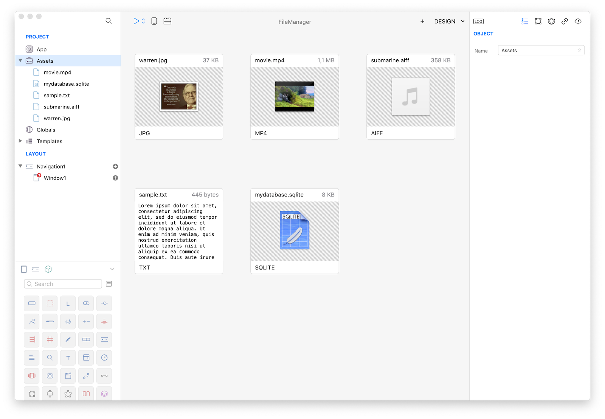
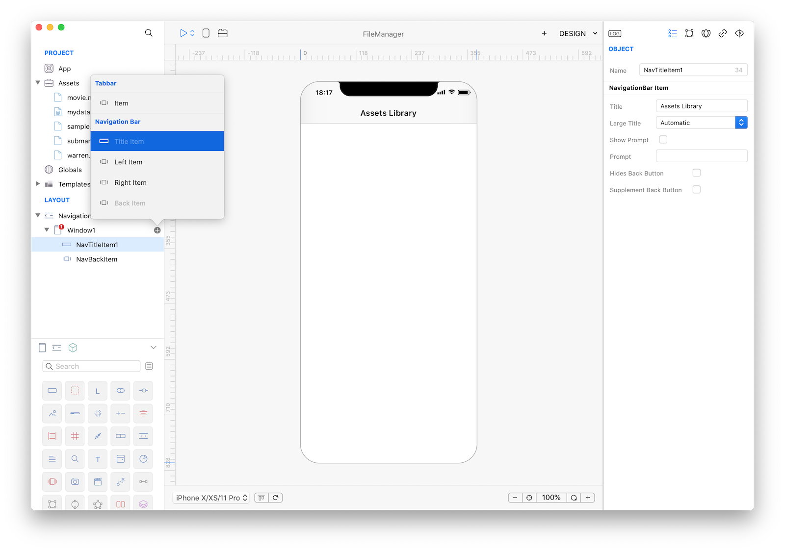
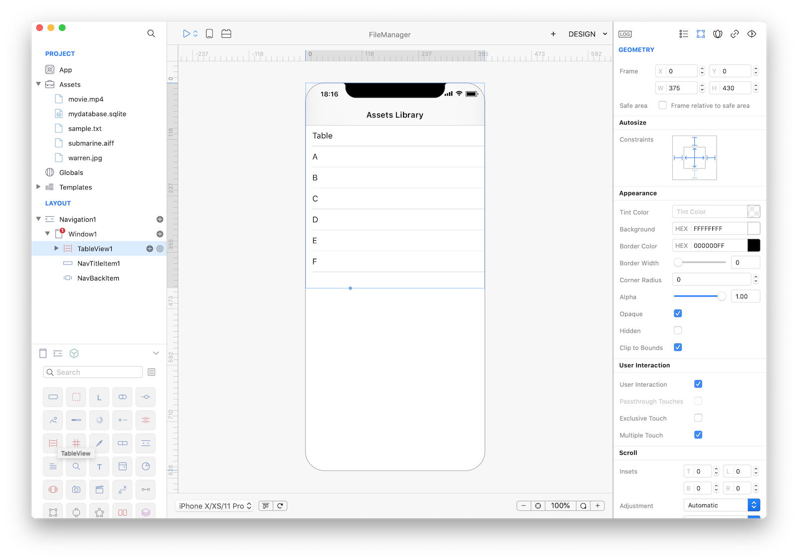
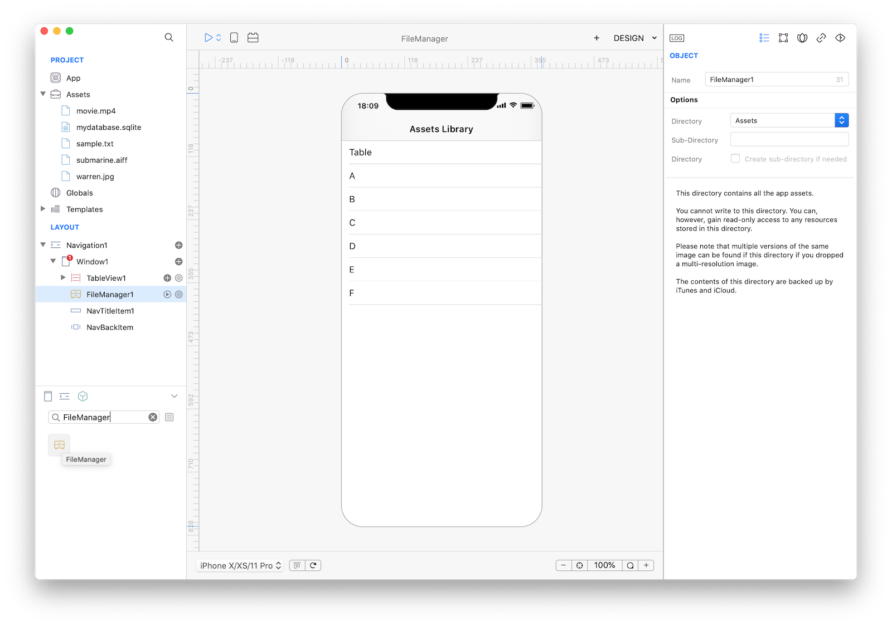
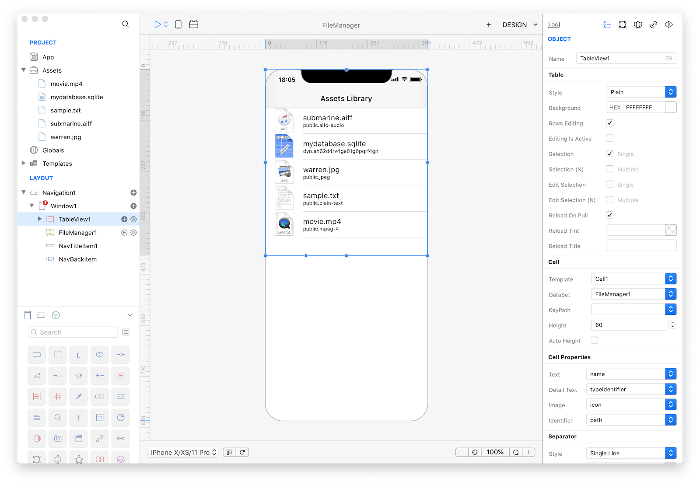
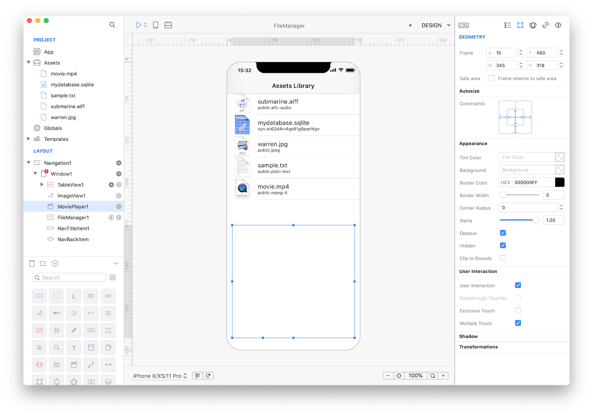
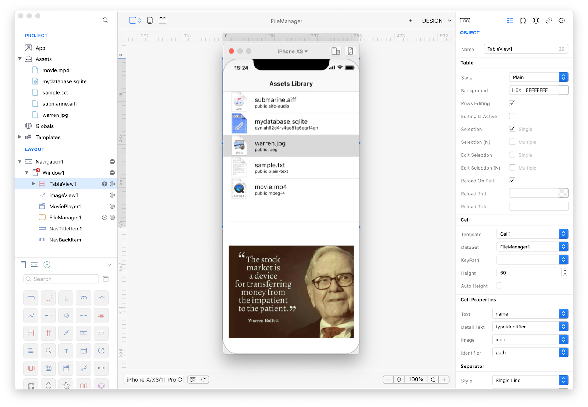

#### Concepts
Managing files and directories are very important tasks in a mobile application. Creo offers fully featured [FileManager](../classes/FileManager.md) and File classes and in this tutorial we'll use both in order to create a simple preview app for all the assets stored within the application itself. [FileManager](../classes/FileManager.md) will be used both as a [DataSet](../classes/DataSet.md) and programmatically via the code editor.

#### Classes
* [FileManager](../classes/FileManager.md)
* [ImageView](../classes/ImageView.md)
* [MoviePlayer](../classes/MoviePlayer.md)
* [TableView](../classes/TableView.md)
* [Alert](../classes/Alert.md)

#### Assets
* [Various resources]({{github_raw_link}}/assets/filemananger_assets.zip) like a jpeg image, a mp4 movie, a sqlite database, a text file and an aiff sound.

#### Steps
++1++ Drops the content of the assets folder you just download into the Assets folder and reply NO to the object conversion question:


Once imported your Assets folder should look like:


++2++ Add a new Title Item and a new Back Item to the Window1 to customize the title shown in the main Navigation1, for example set the title to "Assets Library":


++3++ Now drop a TableView into Window1 and set its Frame and Autoresizing mask properties as in the screenshot:


++4++ Drop a FileManager from the Others objects into Window1 and set its Directory to Assets:


++5++ Now set TableView1 properties the following:

| Object | Property | Value |
| ---------- | --------- | --------- |
| **TableView1** | DataSet | FileManager1 |
| **Cell** | Height | 60 |
| **Cell** | Text | name |
| **Cell** | Detail Text | typeIdentifier |
| **Cell** | Image | icon |
| **Cell** | Identifier | path |



++6++ If you press Run you'll see that the TaleView will be automatically filled by the content of the Assets folder. What we would like to achieve is to offer some kind of preview for the user selected file.
Drop an ImageView and a MoviePlayer into Window1 and set the Hidden property to both and the frame to be {15, 460, 345, 318}.


++7++
Let's start some coding now. Select TableView1, open the Code Editor and in the DidSelectCell event write the following code:
```
var path = cell.identifier;
var extension = FileManager1.extension(path);
var name = FileManager1.name(path);

ImageView1.hidden = true;
MoviePlayer1.hidden = true;

var s = "N/A";
if (extension == "sqlite") {
	var f = File.open(path);
	s = f.readStringOfLength(13);
}

if (extension == "txt") {
	var f = File.open(path);
	s = f.readStringOfLength(50);
}

if (extension == "aiff") {
	var sound = Sound.open(path);
	s = "sound";
	sound.play();
}

if (extension == "mp4") {
	MoviePlayer1.hidden = false;
	s = "movie";
	MoviePlayer1.contentPath = path;
}

if ((extension == "jpg") || (extension == "png")) {
	ImageView1.hidden = false;
	var image = Image.open(path);
	s = "image";
	ImageView1.image = image;
}

var alert = Alert(name, s);
alert.show();
```

This code preview the selected assets based on its extension. In case of an image it display it inside an ImageView. A movie is played inside the MoviePlayer. A sound is also played and a text file is displayed into an Alert. In case of a binary file (a sqlite database in this case), the first 13 bytes are read and displayed.
Please note that icons preview will differ between MacOS and a real iOS device.

++8++ That's all you need in order to have a fully functional Assets browser app. Press RUN and enjoy the app!


You can now send the app to **[CreoPlayer](../creo/creoplayer.md)** or **[build it](../creo/build-your-app.md)** and then submit to the App Store.

#### Project
* [FileManager.creoproject]({{github_raw_link}}/assets/file-manager.zip) (1.4MB)
