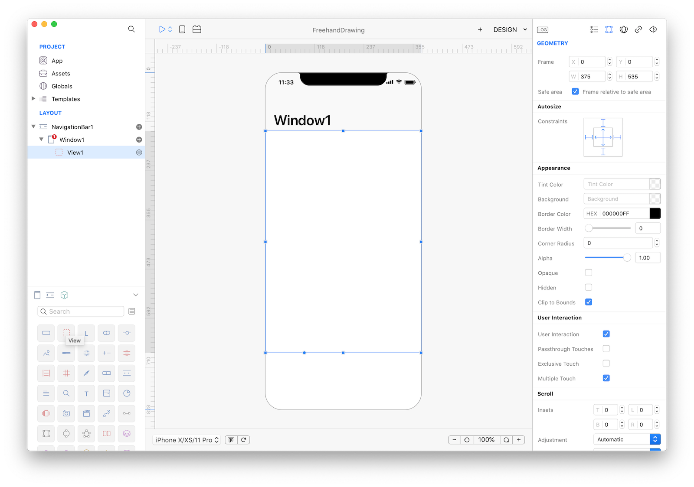
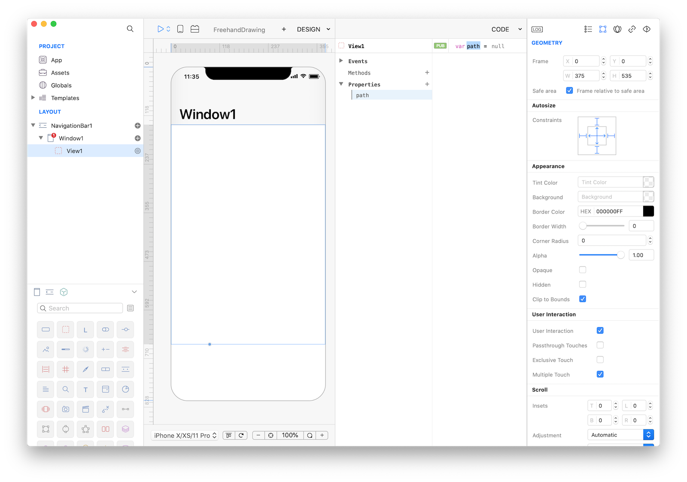
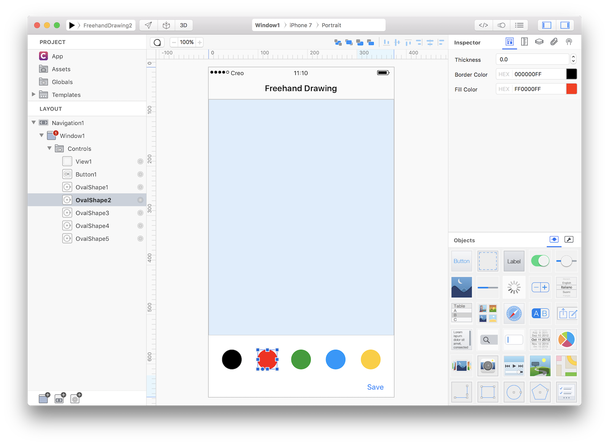
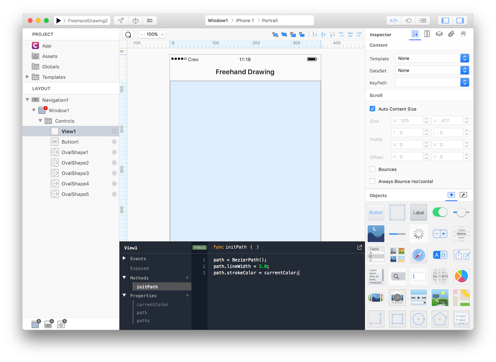

#### Concepts
This tutorial will teach you how to implement a drawing algorithm for smooth, freehand drawing on iOS devices using the Draw and Touches event of a View control . Code has been ported from [https://code.tutsplus.com/tutorials/smooth-freehand-drawing-on-ios--mobile-13164](https://code.tutsplus.com/tutorials/smooth-freehand-drawing-on-ios--mobile-13164).

#### Classes
* [OvalShape](../classes/OvalShape.md)
* [BezierPath](../classes/BezierPath.md)
* [View](../classes/View.md)
* [Button](../classes/Button.md)
* [CameraRoll](../classes/CameraRoll.md)

#### Assets
* None

#### Steps
++1++ Create a new empty Creo project and drop a View object into the Design Board and configure the following properties:

| Property | Value |
| --------- | --------- |
| Frame | (0, 0, 375, 535) |
| Safe Area | True |
| Autoresizing | flexible width and height, fixed margins |
| Autoresizing | flexible width and height, fixed margins |



++2++ In order to be able to freehand drawing into a View we need to keep track of where the user touches inside that view and convert that gestures into points of a BezierPath object. Lets start by adding a path property to View1:


++3++ It is now time to write some Gravity code and in 13 lines you'll get your drawing app. Write the following code to View1's events:
```
// EVENT Load
path = BezierPath();	// initialize a BezierPath object
path.lineWidth = 2.0;	// set initial line width
path.strokeColor = Color.gray;	// set initial color

// EVENT TouchesBegan
var touch = touches[0];	// capture first touch
var p = touch.locationInView(self); // convert touch coordinates locals to View1
path.moveToPoint(p); // it is a touch began event to just move to that point

// EVENT TouchesMoved
var touch = touches[0];	// capture first touch
var p = touch.locationInView(self);	// convert touch coordinates locals to View1
path.addLineToPoint(p);	// add that point to the BezierPath
self.refresh(); // force View1 to call the Draw event

// EVENT TouchesEnded
self.TouchedMoved(touches, touchInside);

// EVENT TouchesCancelled
self.TouchedEnded(touches);

// EVENT Draw
path.stroke();	// stroke resulted path
```

++4++ That's all you need in order to have a fully functional freehand drawing app. Press RUN and enjoy the app!
<video class="creovideo" width="700" height="427" autoplay loop controls>
<source src="../documentation/docs/images/tutorials/freehand-drawing-2-3.m4v" type="video/mp4">
</video>
You can now send the app to **[CreoPlayer](../creo/creoplayer.md)** or **[build it](../creo/build-your-app.md)** and then submit to the App Store.

#### Project
* [FreehandDrawing1.creoproject]({{github_raw_link}}/assets/FreehandDrawing1.zip) (11KB)


#### Enhancements
We could further enhance this simple project with nice features like color selection and final result saving in CameraRoll. Code changes are minimals, we just need to define an array to keep track of all the BezierPath objects that the user can create.

++5++ Start by dropping another View object (`View2`) that will act as a container for the color-picking buttons. We'll use flex to adjust the position of the buttons for different device sizes and orientations, so check the Enabled property in the Flex inspector.
Then add some OvalShape objects into the `View2`, enable Flex for each OvalShape and set the fillColor property to some color you like more. **Make sure to check the "User Interaction" flag** (and to uncheck the Multiple Touch option) for each OvalShape in the Touch Inspector.
Note that we also added a Button with the Title set to Save:


The configuration of the properties in the Flex Inspector is:
| Object | Property | Value |
| --------- | --------- | --------- |
| View2 | Enabled | True |
| View2 | Flex Direction | Row |
| View2 | Justify Content | Space Between |
| View2 | Align Items | Center |
| View2 | Padding | T: 0, B: 0, L: 30, R: 30 |
| OvalShapes | Enabled | True |
| OvalShapes | Width | 40 |
| OvalShapes | Height | 40 |


++6++ We need to add some new properties to View1, a currentColor property to keep track of user selected color and a paths property that will collect all the BezierPath objects that the user created. We also need a new initPath method which will be responsible to initialize a new BezierPath object each time the user begins a touch:


++7++ It is now time to add some Gravity code, so write the following code to View1's events:
```
// EVENT Load
paths = []; // initialize array of paths
currentColor = Color.black; // set an initial color to use

// EVENT TouchesBegan
initPath(); // initialize a new BezierPath object each time a touch began
var touch = touches[0];	// capture first touch
var p = touch.locationInView(self); // convert touch coordinates locals to View1
path.moveToPoint(p); // it is a touch began event to just move to that point

// EVENT TouchesMoved (no code changes here)
var touch = touches[0];	// capture first touch
var p = touch.locationInView(self);	// convert touch coordinates locals to View1
path.addLineToPoint(p);	// add that point to the BezierPath
self.refresh(); // force View1 to call the Draw event

// EVENT TouchesEnded
paths.push(path); // when touch ended add resulting BezierPath object to the array
self.TouchedMoved(touches, touchInside);

// EVENT TouchesCancelled
self.TouchedEnded(touches);

// EVENT Draw
for (var p in paths) {
	p.stroke(); // stroke saved paths found in the array
}
path.stroke();	// stroke current path

// FUNC initPath
path = BezierPath();	// initialize a BezierPath object
path.lineWidth = 2.0;	// set initial line width
path.strokeColor = currentColor;	// set initial color based on user selection
```

We also need to add some code to the OvalShape(s) objects in order to updated currently selected color. Just add this line of code to each OvalShape TouchesBegan event:
```
View1.currentColor = self.fillColor; // set current color to be used in path.stroke()
```

Finally if we want to save current drawing into the CameraRoll, add the following code to the Action event of the Save button:
```
var image = View1.image();	// get View1 raster image representation
CameraRoll.saveImage(image); // save image to CameraRoll
```

++8++ That's all you need in order to have a fully functional advanced freehand drawing app. Press RUN and enjoy the app!
<video class="creovideo" width="700" height="427" autoplay loop controls>
<source src="../documentation/docs/images/tutorials/freehand-drawing-2-6.m4v" type="video/mp4">
</video>

You can now send the app to **[CreoPlayer](../creo/creoplayer.md)** or **[build it](../creo/build-your-app.md)** and then submit to the App Store.

#### Project
* [FreehandDrawing2.creoproject]({{github_raw_link}}/assets/FreehandDrawing2.zip) (17KB)
