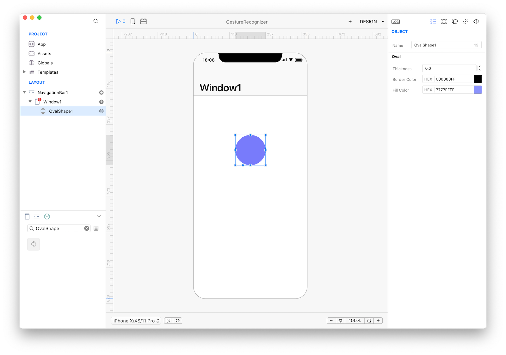
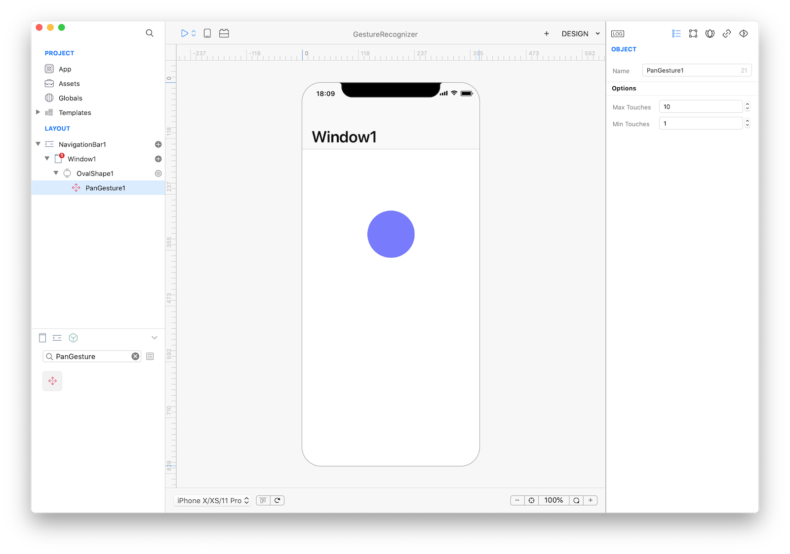
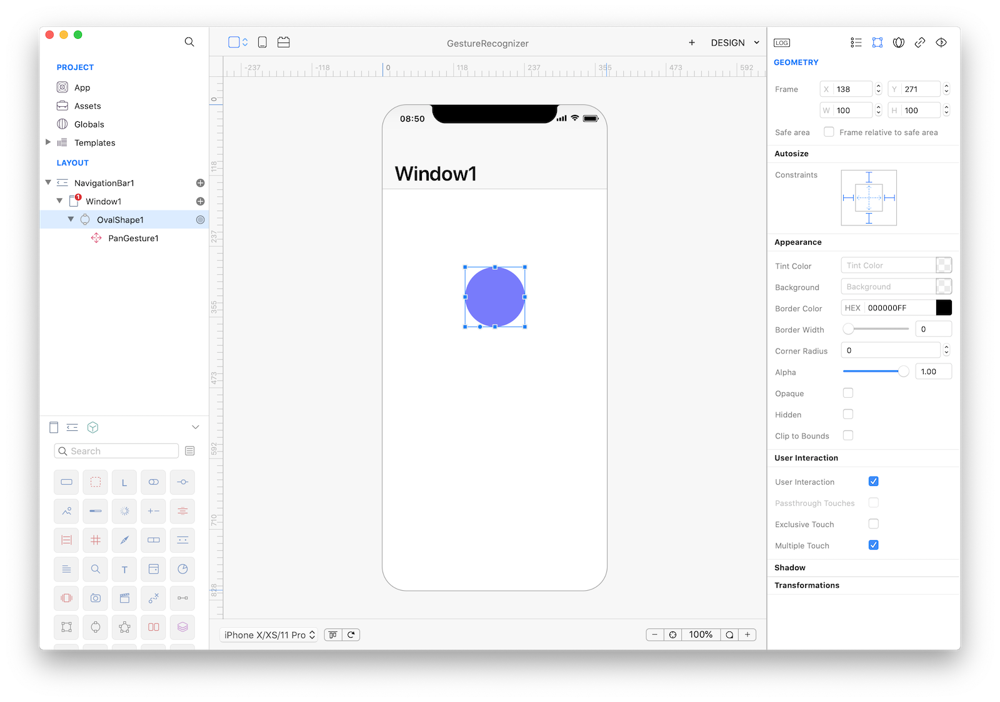
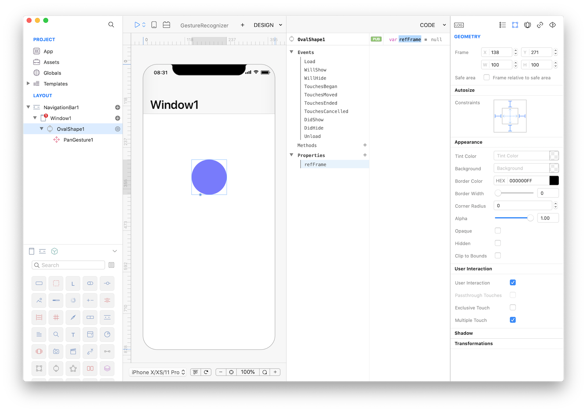
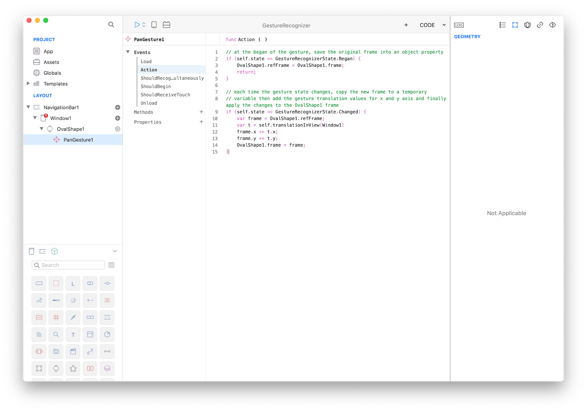

#### Concepts
A gesture-recognizer object decouples the logic for recognizing a sequence of touches (or other input) and acting on that recognition. When one of these objects recognizes a common gesture or, in some cases, a change in the gesture, it sends an action message to each designated target object.

#### Classes
* [OvalShape](../classes/OvalShape.md)
* [PanGesture](../classes/PanGesture.md)

#### Assets
* None

#### Steps
++1++ Create a new empty Creo project and drop a OvalShape object into the Design Board. Then change its thickness to 0.0 and set a fill color you like:


++2++ Drop a PanGesture object from the Gestures objects inside the OvalShape1 object:


++3++ Now select your OvalShape1 object and go to the Gesture inspector panel. Check the "User Interaction" flag:


++4++ We now have PanGesture1 bound to the OvalShape1 object, so lets configure the gesture now. We need a property to store a temporary value so the first thing to do is to add a public refFrame property to the OvalShape1 object. Just select it, open the Code Editor and add that property:


++5++ Now select the PanGesture1 object and in its Action even write the following code:

```
// at the began of the gesture, save the original frame into an object property
if (self.state == GestureRecognizerState.Began) {
    OvalShape1.refFrame = OvalShape1.frame;
    return;
}

// each time the gesture state changes, copy the new frame to a temporary
// variable then add the gesture translation values for x and y axis and finally apply the changes to the OvalShape1 frame
if (self.state == GestureRecognizerState.Changed) {
    var frame = OvalShape1.refFrame;
    var t = self.translationInView(Window1)
    frame.x += t.x;
    frame.y += t.y;
    OvalShape1.frame = frame;
}
```


++6++ That's all you need in order to have a fully functional Assets browser app. Press RUN and enjoy the app!
<video class="creovideo" width="700" height="427" autoplay loop controls>
<source src="../documentation/docs/images/tutorials/gesture-recognizer-2-6.m4v" type="video/mp4">
</video>


You can now send the app to **[CreoPlayer](../creo/creoplayer.md)** or **[build it](../creo/build-your-app.md)** and then submit to the App Store.

#### Project
* [GestureRecognizer.creoproject]({{github_raw_link}}/assets/gesturerecognizer.zip) (10KB)
