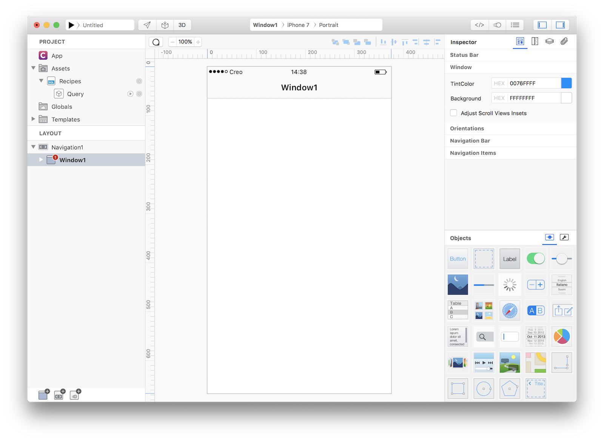
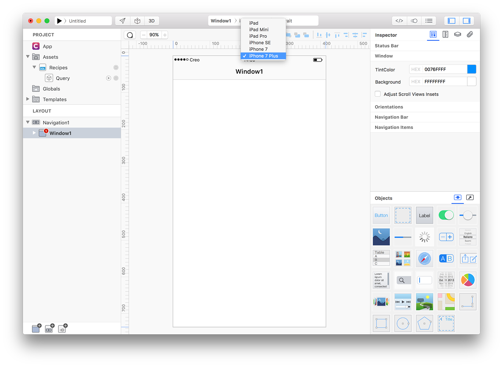
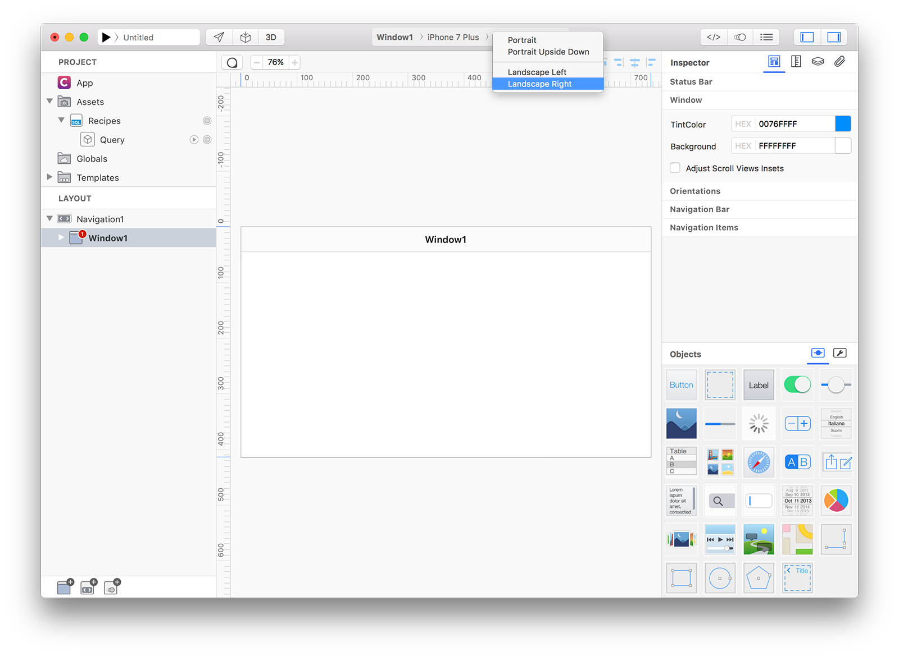
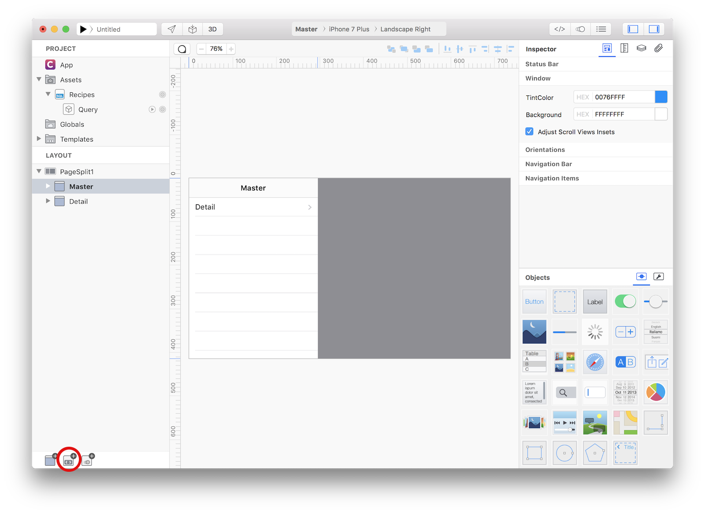
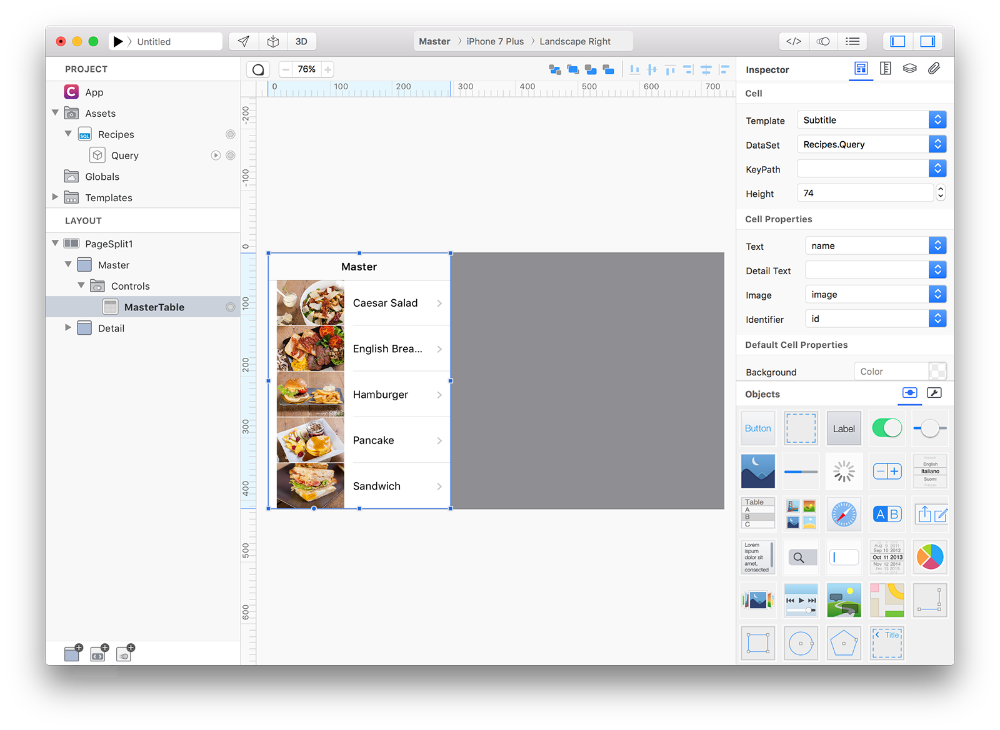
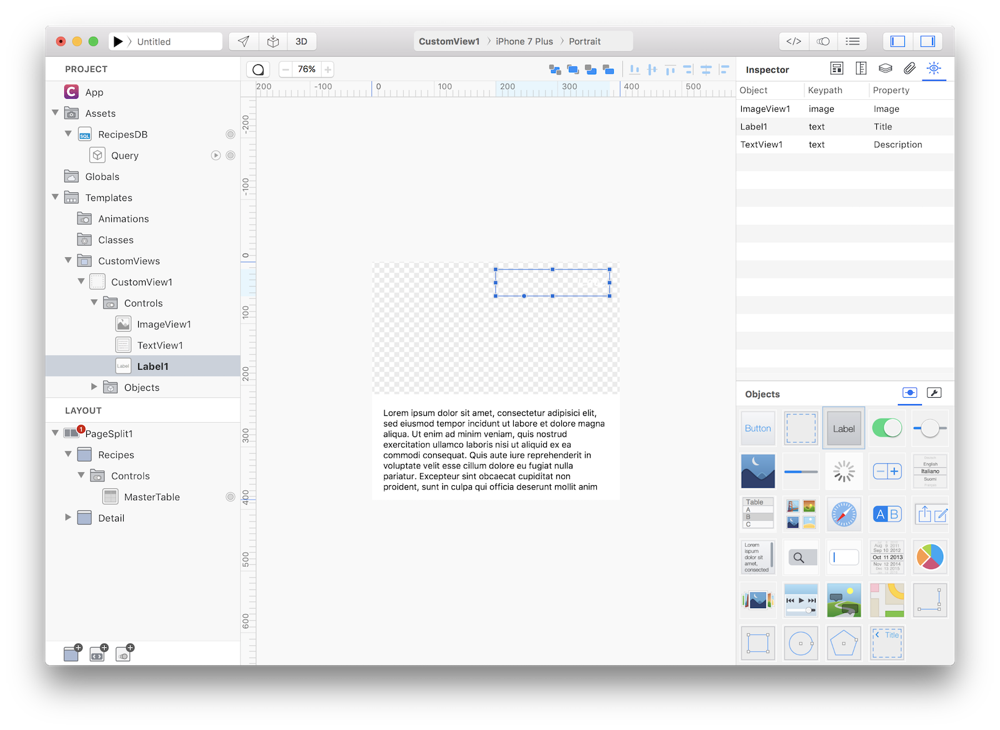
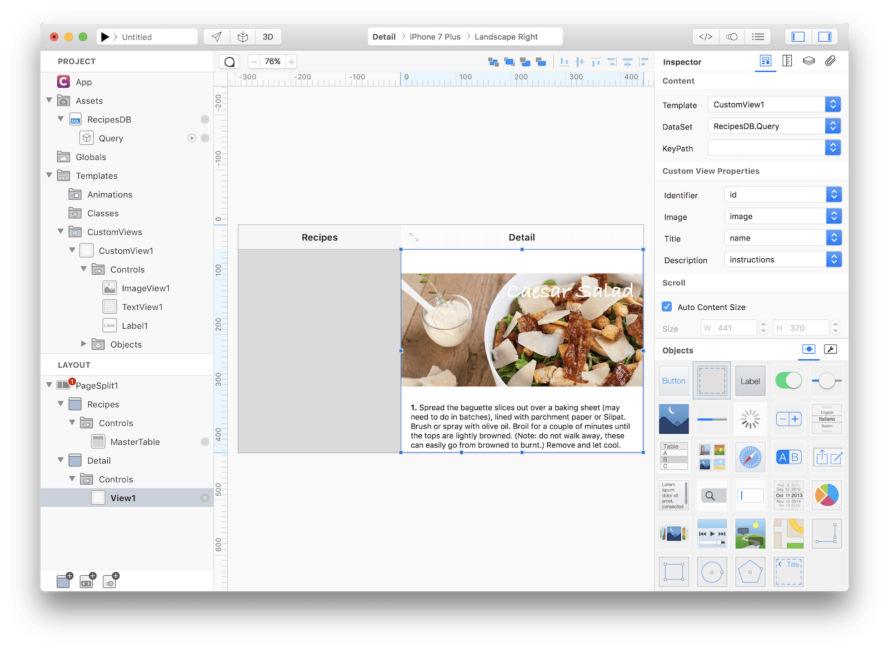
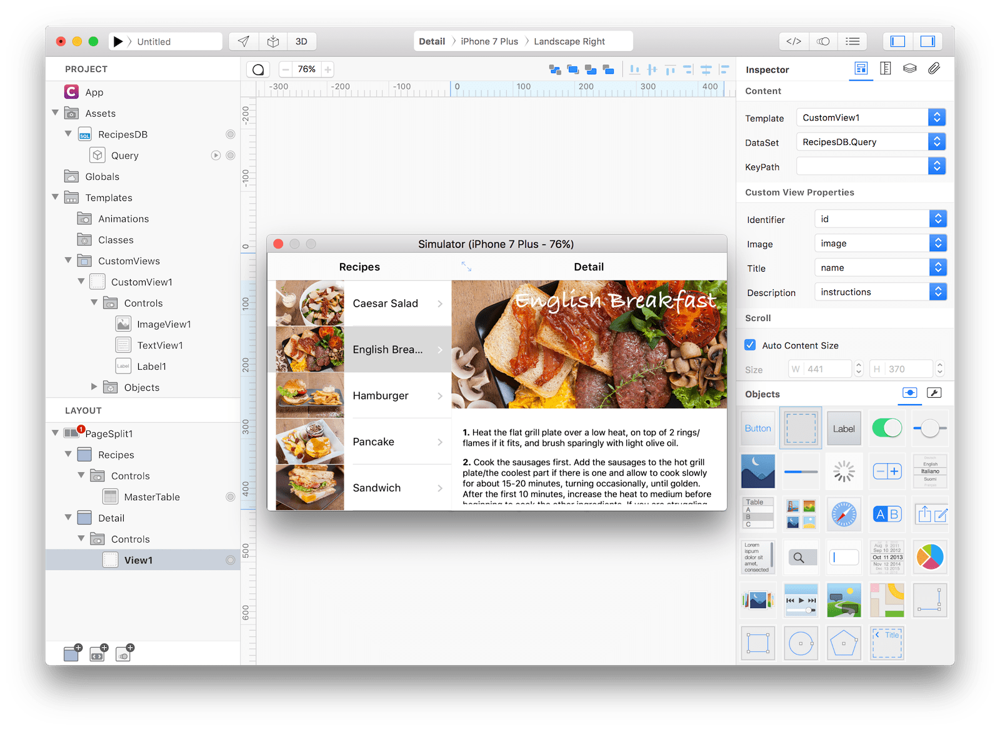
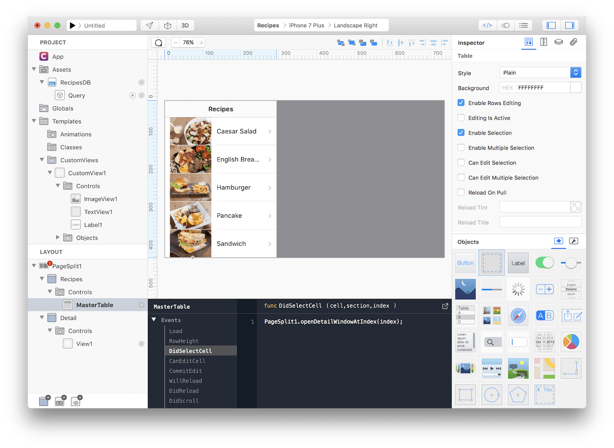

#### Concepts
This tutorial assumes that you already followed the [LetsCookNav](lets-cook-nav.html) tutorial and so it will skip some details. Assets used in this tutorial are the same as the LetsCookNav ones. The purpose of this example is to introduce the PageSplit navigation control.

#### Classes
* [PageSplit](../classes/PageSplit.md)
* [SQLite Database](../classes/SQLiteDatabase.md)
* [SQLite RecordSet](../classes/SQLiteRecordSet.md)
* [CustomView](../classes/CustomView.md)
* [TableView](../classes/TableView.md)
* [ImageView](../classes/ImageView.md)
* [TextView](../classes/TextView.md)
* [View](../classes/View.md)

#### Assets
* [Recipes SQLite database]({{github_raw_link}}/assets/letscooknav_assets.zip) - images credits to [Lorenzo Bocchi](https://www.lorenzobocchi.com)
* [PNG Launch Image]({{github_raw_link}}/assets/letscooknav_assets.zip) - credits to [Lorenzo Bocchi](https://www.lorenzobocchi.com)
* [PNG Icon]({{github_raw_link}}/assets/letscooknav_assets.zip) - credits to [Jenya Tkach](https://dribbble.com/shots/338811-Cook)

#### Steps
++1++ Create a new empty Creo project, start by dragging the Recipes.sqlite database into the Assets folder (then press Yes to the object conversion question) and then create a new query (as the one created in the <a href="lets-cook-nav.html">LetsCookNav</a> tutorial).

++2++ PageSplit looks better on bigger devices, so switch to iPhone 7 Plus:

++3++ Change orientation from Portrait to Landscape Right:

++4++ Delete Navigation1 (and Window1) from the Layout panel and create a new PageSplit navigation:

++5++ The first Window inside a PageSplit is considered a Master window. Creo automatically adds a TableView to the Master Window. Select the TableView and set its DataSet to Recipes.Query (please note that cell height and others cell related properties has been changed):

++6++ Rename Master Window in Layout panel to Recipes (notice that Title changes in the Design Board) and rename the sqlite database from Recipes to RecipesDB (otherwise you'll receive a compilation error because you cannot have two objects with the same name in the same scope).

++7++ Create a new CustomView with 3 controls (an ImageView, a Label and a TextView). **[LetsCookNav](lets-cook-nav.html)** tutorial will show you in details how to create a CustomView and how to expose its properties:

++8++ Drop a View from the Objects panel to the Details Window and set its Template, DataSet and Custom View Properties as in the screenshot:

++9++ Press RUN and enjoy the LetsCookSplit app!

**How can everything work without any code?**
If you try the runtime mode you'll see that each time you select a recipe in the Master window, the right recipe is correctly displayed in the Details window without any information passed between the two Windows.
The trick here is to connect the MasterTable in the Master window and the View1 in the Details window to the same query and then seek the query to the right position.
A query is like a table where each row is numbered from 0 to the total number of row minus 1. A quick way to display the content of a given record is just to set its index inside the query. The code is automatically added for you in Creo and you can find (and modify) it in the MasterTable.
What happens here is that the Details window is opened and the index of the View bounds to a DataSet is set to the index passed as parameter. Using the index property a View can show the right data from a DataSet that contains multiple rows. 

		
You can now send the app to **[CreoPlayer](../creo/creoplayer.md)** or **[build it](../creo/build-your-app.md)** and then submit to the App Store.

#### Project
* [LetsCookSplit.creoproject]({{github_raw_link}}/assets/letscooksplit.zip) (12MB)
