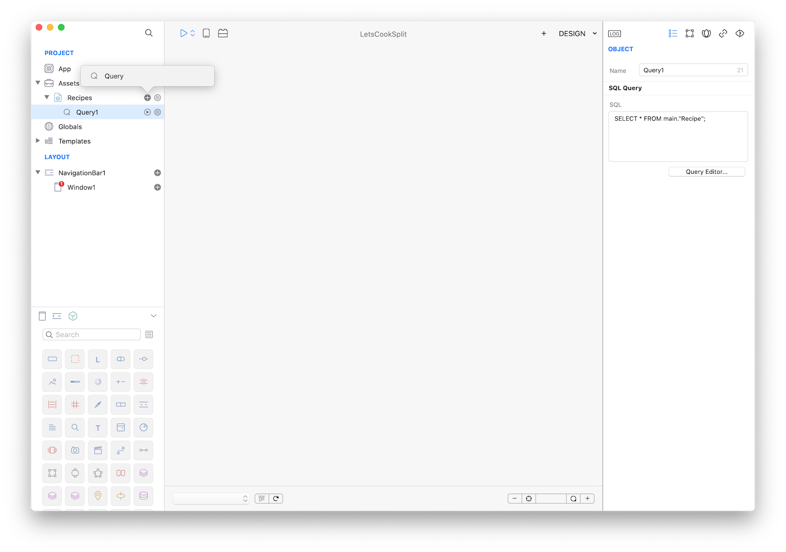

#### Concepts
This tutorial assumes that you already followed the [LetsCookNav](lets-cook-nav.html) tutorial and so it will skip some details. Assets used in this tutorial are the same as the LetsCookNav ones. The purpose of this example is to introduce the PageSplit navigation control.

#### Classes
* [PageSplit](../classes/PageSplit.md)
* [SQLite Database](../classes/SQLiteDatabase.md)
* [SQLite RecordSet](../classes/SQLiteRecordSet.md)
* [TableView](../classes/TableView.md)
* [ImageView](../classes/ImageView.md)
* [TextView](../classes/TextView.md)

#### Assets
* [Recipes SQLite database]({{github_raw_link}}/assets/letscooknav_assets.zip) - images credits to [Lorenzo Bocchi](https://www.lorenzobocchi.com)
* [PNG Launch Image]({{github_raw_link}}/assets/letscooknav_assets.zip) - credits to [Lorenzo Bocchi](https://www.lorenzobocchi.com)
* [PNG Icon]({{github_raw_link}}/assets/letscooknav_assets.zip) - credits to [Jenya Tkach](https://dribbble.com/shots/338811-Cook)

#### Steps
++1++ Create a new empty Creo project, start by dragging the Recipes.sqlite database into the Assets folder (then press Yes to the object conversion question) and then create a new query (as the one created in the <a href="lets-cook-nav.html">LetsCookNav</a> tutorial).

<video class="creovideo" width="700" height="427" autoplay loop controls>
<source src="../documentation/docs/images/tutorials/lets-cook-split-2-1.m4v" type="video/mp4">
</video>



++2++ PageSplit looks better on bigger devices, so switch to iPad Pro 9.7":


++3++ Change orientation from Portrait to Landscape Right:


++4++ Delete Navigation1 (and Window1) from the Layout panel and create a new PageSplit navigation:


++5++ The first Window inside a PageSplit is considered a Master window. Creo automatically adds a TableView to the Master Window. Select the TableView and set its DataSet to Recipes.Query (please note that cell height and others cell related properties has been changed):


++6++ Add a NavTitleItem to the Master Window and set the title property to "Recipes" (notice that Title changes in the Design Board).


++7++ Add 5 controls (an ImageView, three Label and a TextView) and set their frames and autoresizing masks as desired:


++8++ Code
Add some Gravity code to load the content of the controls in the Detail Window. First, add a property named `index` to the Detail Window. Then add a method named `update` to the same Window and use the following code:
```
Recipes.Query1.moveTo(index)

var image:Image = Recipes.Query1.image;
ImageView1.image = image;

var name:String = Recipes.Query1.name;
NameLabel.text = name;
Detail.title = name;

var time:String = Recipes.Query1.preparation_time;
TimeLabel.text = "Time: \(time) mins";

var n:String = Recipes.Query1.difficulty;
DifficultyLabel.text = "★".repeat(n);

var desc = Recipes.Query1.instructions;
TextView1.text = desc;
```


Invoke the `update` method in the `WillShow` event of the Detail Window with the following code:
```
if (Recipes.Query1.rowCount > 0) self.update()
```

Also in the `DidFinish` event of the Recipes.Query1 query with the following code:
```
Detail.update()
```

And finally in the `DidSelectCell` event of the MasterTable:
```
Detail.index = index
if (PageSplit1.collapsed) Detail.open()
else Detail.update()
```


++9++ Press RUN and enjoy the LetsCookSplit app!


You can now send the app to **[CreoPlayer](../creo/creoplayer.md)** or **[build it](../creo/build-your-app.md)** and then submit to the App Store.

#### Project
* [LetsCookSplit.creoproject]({{github_raw_link}}/assets/letscooksplit.zip) (2.8MB)
