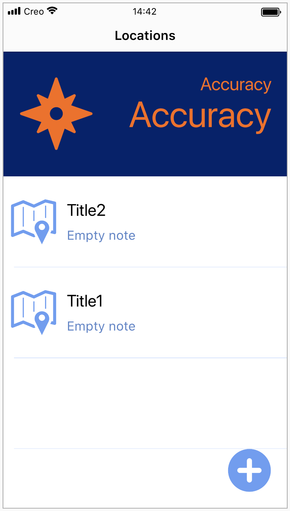
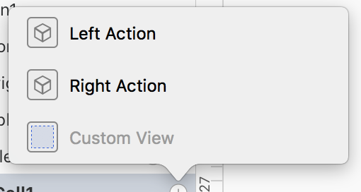
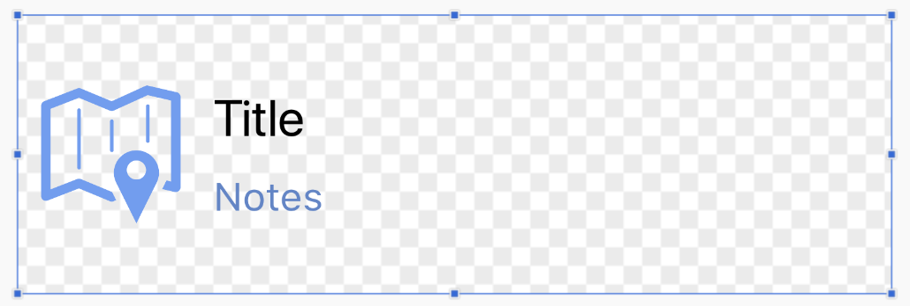
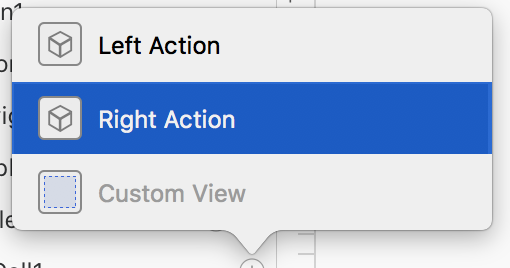
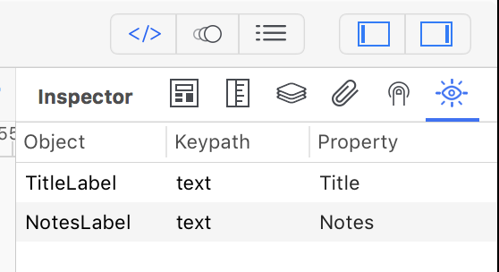
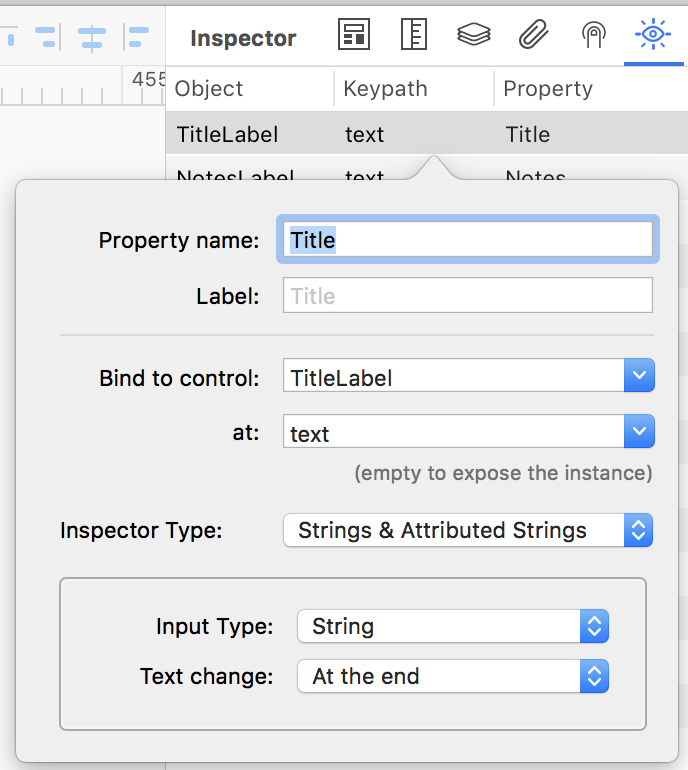
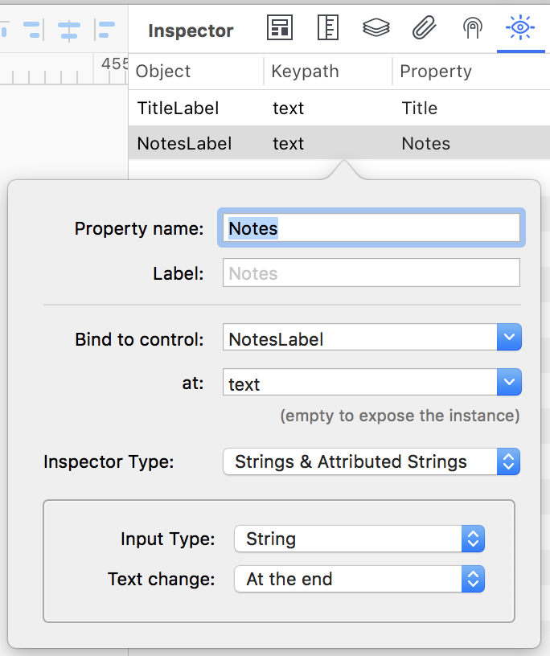
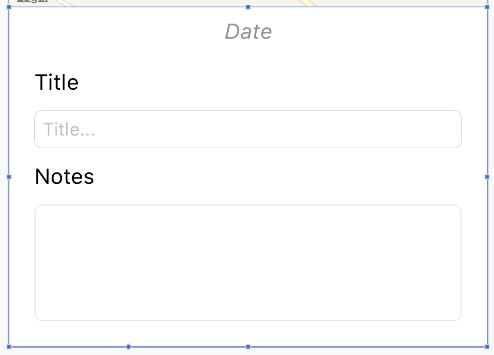
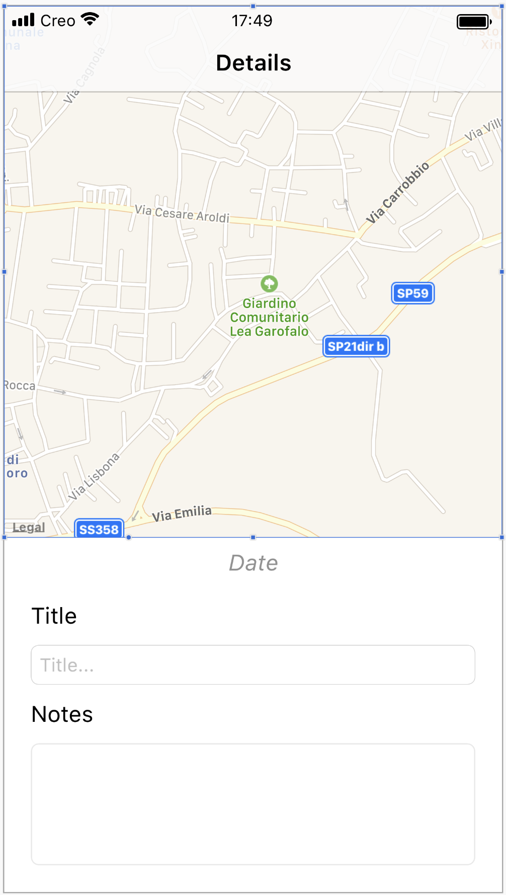

#### Concepts
The Parking Car tutorial will show you how to navigate between two windows (using a Navigation Bar), integrate the GPS object, load and save data into a SQLite database. A first window will show a list of locations inside a TableView and a second window will show the details of the location item selected in the TableView. The second window also allow to edit the location item and save changes to the database.

#### Classes
* [Window](../classes/Window.md)
* [MapView](../classes/MapView.md)
* [ImageView](../classes/ImageView.md)
* [TableView](../classes/TableView.md)
* [TextField](../classes/TextField.md)
* [TextView](../classes/TextView.md)
* [SQLite Database](../classes/SQLiteDatabase.md)
* [SQLite RecordSet](../classes/SQLiteRecordSet.md)
* [GPS](../classes/GPS.md)
* [View](../classes/View.md)	
		
#### Assets
* None


#### Steps
++1++ Create a new empty Creo project and start by dragging the Database.sqlite database into the Assets folder (then press Yes to the object conversion question).

++2++ Create a new database query object by using the contextual menu over the Database sqlite database. In the Query Editor just drag the Location table into the SQL edit field and the sql query will be automatically created for you (you can also manually enter it). You can optionally press the Run button to test the result of your query (data in the instructions column is in Markdown format). The SQL query looks like:
```SELECT * FROM "Location" ORDER BY "Date”;```

++3++ From the Objects inspector panel drag a Class object into the Globals folder and rename it to LocationInfo name. From the Code Editor add new properties named date, latitude, longitude, notes and title

++4++ From the Objects inspector panel drag a GPS object into the Globals folder and rename it to GPS1 name. From the Code Editor insert into the NewValue event the code below: 
```
var accuracy = "" + Int(value.location.horizontalAccuracy) + " meters"
LocationsWindow.Display.AccuracyValueLabel.text = accuracy
```

++5++ From the Objects inspector panel drag a Class object into the Globals folder and rename it to DataSource name. From the Code Editor add new methods named addLocation, locationCount, locationWithID, removeLocationWithID, updateLocation

++6++ From the Objects inspector panel drag a Window control into the Layout area over the Navigation1 and rename it to LocationsWindow name

++7++ From the Code Editor insert into the Load event of the LocationsWindow the code below:
```
GPS1.run()
```

++8++ From the Code Editor insert into the WillShow event of the LocationsWindow the code below:
```
// hide the TableView1 selection
var selectedRow = TableView1.selectedRow
if (selectedRow != null) {
	TableView1.deselectRow(selectedRow, true)
}
```

++9++ From the Objects inspector drag a View and name it Display into the LocationsWindow

++10++ From the Objects inspector drag an ImageView and 2 Labels naming respectively it ImageView1, AccuracyLabel and AccuracyValueLabel into the Display view. Select and layout every controls like the image below:


++11++ From the Objects inspector drag a TableView, Button and View naming respectively TableView1, AddButton and Display into the LocationsWindow from the Layout panel. Select and layout every controls like the image below:


++12++ Select the AddButton control and from the Code Editor inside the Action event insert the following code:
```
var dataSource = DataSource()
var locationInfo = LocationInfo()
locationInfo.date = Date()
locationInfo.title = "Title" + (dataSource.locationCount() + 1)
locationInfo.notes = "Empty note"
locationInfo.latitude = GPS1.value.location.coordinate.latitude
locationInfo.longitude = GPS1.value.location.coordinate.longitude
dataSource.addLocation(locationInfo)
TableView1.reload(true)
```

++13++ Select the TableView1 control and from the Code Editor inside the DidSelectCell event insert the following code: 
```
DetailWindow.locationID = cell.identifier
Navigation1.openWindow(DetailWindow, true)
```

++14++ Select the TableView1, expand the item in order to view the inner Cell1 object, select the Cell1 object and click on the right + button and select the Custom View menu item like the image below:


++15++ From the Objects inspector drag an ImageView and two Labels naming respectively ImageView1, TitleLabel and NotesLabel. Select and layout every controls like the image below:


++16++ Select the TableView1, expand the item in order to view the inner Cell1 object, select the Cell1 object and click on the right + button and select the Right Action menu item like the image below:


++17++ Select the RightAction1 object and from the Code Editor inside the Action event insert the following code: 
```
var dataSource = DataSource()
dataSource.removeLocationWithID(cell.identifier)
TableView1.reload(true)
```

++18++ Select the CustomView1 object and from the Binding panel inside the Inspector panel add 2 items like the figures below:




++19++ From the Objects inspector panel drag a Window control into the Layout area over the Navigation1 and rename it to DetailWindow name

++20++ From the Objects inspector panel drag a View control into the Layout area over the DetailWindow and rename it to Container name

++21++ From the Objects inspector drag a 2 Labels, a TextField, a Label and a TextView and naming respectively DateLabel, TitleLabel, TitleTextField, NotesLabel and NotesTextView and drop over the previously created Container view. Select and layout every controls like the image below:


++22++ From the Objects inspector panel drag a MapView control into the Layout area over the DetailWindow. Select and layout every controls like the image below:


++23++ Select the DetailWindow object and from the Code Editor insert into the WillShow event the code below:
```
var dataSource = DataSource()
locationInfo = dataSource.locationWithID(locationID)

// display data
Container.DateLabel.text = locationInfo.date
Container.TitleTextField.text = locationInfo.title
Container.NotesTextView.text = locationInfo.notes
Container.MapView1.latitude = locationInfo.latitude
Container.MapView1.longitude = locationInfo.longitude
```

++24++ Select the DetailWindow object and from the Code Editor insert into the KeyboardWillShow event the code below:
```
Container.animate(0.3, 0, AnimationOption.CurveEaseInOut, {
	Container.frame.y = Screen.bounds.height - Container.frame.height - keyboard.endRect.height}, null)
```

++25++ Select the DetailWindow object and from the Code Editor insert into the KeyboardWillHide event the code below:
```
Container.animate(0.3, 0, AnimationOption.CurveEaseInOut, {
	Container.frame.y = Screen.bounds.height - Container.frame.height}, null)
```

++26++ Select the DetailWindow object and from the Code Editor insert into the WillHide event the code below:
```
var dataSource = DataSource()

locationInfo.title = Container.TitleTextField.text
locationInfo.notes = Container.NotesTextView.text

dataSource.updateLocation(locationInfo, locationID)
LocationsWindow.TableView1.reload(true)
Keyboard.hide()
```

++27++ Select the DetailWindow object and from the Code Editor add a new property named locationID

++28++ Select the DetailWindow object and from the Code Editor add a new property named locationInfo

You can now send the app to **[CreoPlayer](../creo/creoplayer.md)** or **[build it](../creo/build-your-app.md)** and then submit to the App Store.

#### Project
* [ParkingCar.creoproject](../assets/parkingcar.zip) (125KB)
