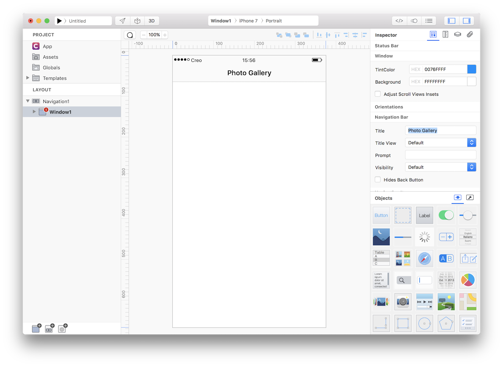
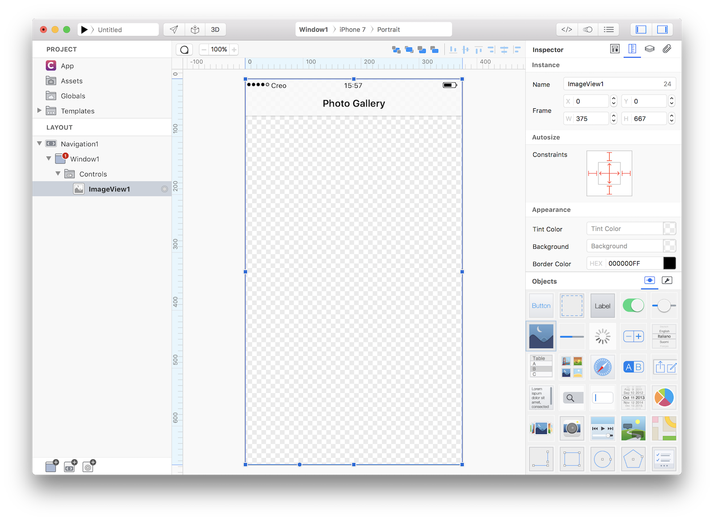
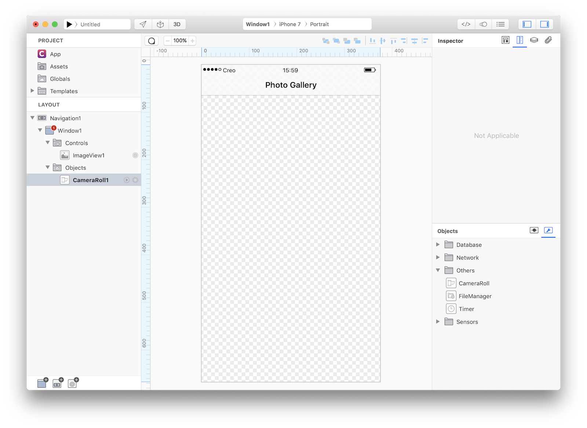
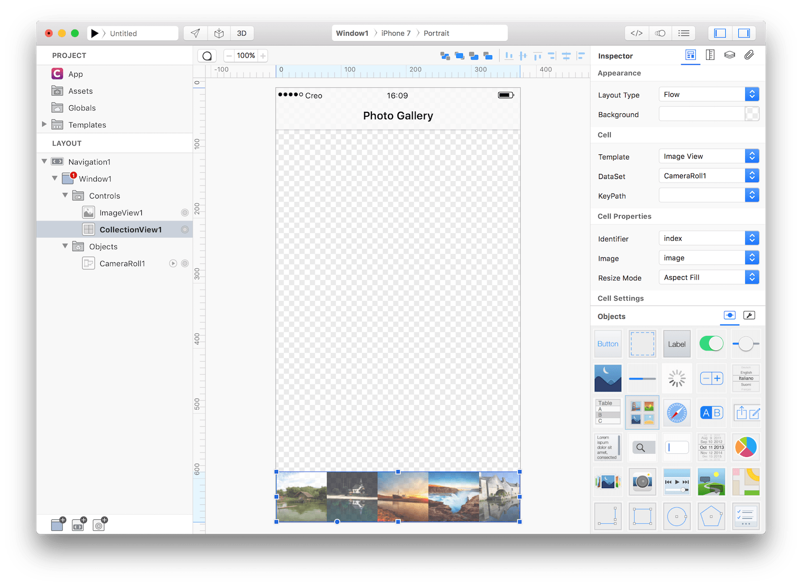
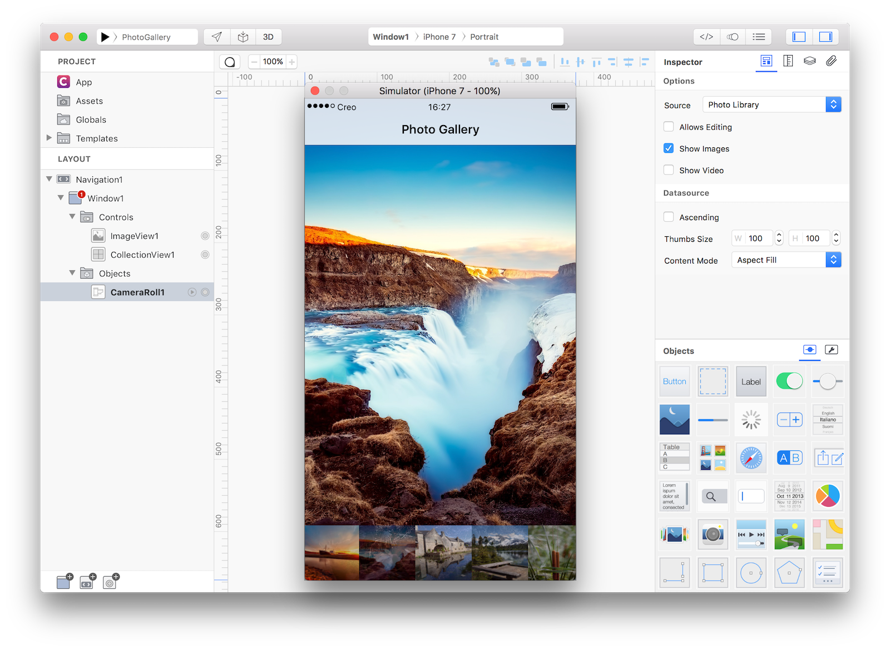

#### Concepts
<li>So far in the tutorials we have used DataSet from a variety of sources. From a Database in the **[LetsCook](lets-cook-nav.md)** tutorial, to a REST service in the **[Spotify](spotify.md)** tutorial and from an images folder in the **[eBook](ebook.md)** example. In this example we'll show use how easily a CameraRoll can be used as a DataSet.

#### Classes
* [CameraRoll](../classes/CameraRoll.md)
* [ImageView](../classes/ImageView.md)
* [CollectionView](../classes/CollectionView.md)

#### Assets
* None

#### Notes
CameraRoll on Mac is simulated serving images through a directory (default to Pictures). To change the directory just select Preferences from the Creo menu:

For this example we used some royalty free images from [https://pixabay.com](https://pixabay.com).

#### Steps
++1++ Create a new empty Creo project and expose Window1 as "Photo Gallery" in the main Navigation1:


++2++ Now drop an ImageView into Window1 and make it as big as the Window. Set its Autoresizing mask as in the screenshot:


++3++ Drop a CameraRoll from the Others objects into Window1:


++4++ Drop a CollectionView control to Window1 as set the following properties:

| Object | Property | Value |
| ---------- | --------- | --------- |
| **CollectionView1** | Layout Type | Flow |
| **CollectionView1** | DataSet | CameraRoll1 |
| **CollectionView1** | Resize Mode* | Aspect Fill |
| **CollectionView1** | Direction | Horizontal |
| **CollectionView1** | Min Line Space | 0.0 |
| **CollectionView1** | Frame | (0, 589, 375, 78) |
| **CollectionView1** | Constraints | All set excepts height and top |
| **CollectionView1** | Alpha | 0.7 |



++5++ If you press Run you'll see that you can scroll the Collection but nothing more happens. What we would like to achieve is to load a bigger preview each time a picture is selected from the CollectionView. So let's start some coding. Select CollectionView1, open the Code Editor and in the DidSelectCell event write the following code:
```
CameraRoll1.openAsset(index);
```

This code tells the CameraRoll to **asynchronously** open the asset at the specified index. Nothing is returned from this method and we must use our CameraRoll1 object in order to be notified when a new image is available.
Select CameraRoll1, open the Code Editor and in the NewImage event write the following code:
```
ImageView1.image = image;
```

++6++ That's all you need in order to have a fully functional PhotoGallery app. Press RUN and enjoy the app!


++7++ If you want to have a default image opened when the app launches then just add the following code into Window1 DidShow event:
```
CameraRoll1.openAsset(0);
```

You can now send the app to **[CreoPlayer](../creo/creoplayer.md)** or **[build it](../creo/build-your-app.md)** and then submit to the App Store.

#### Project
* [PhotoGallery.creoproject](../assets/photogallery.zip) (12KB)
