#### IMPORTANT
Starting from 29th May 2017 Spotify changes authentications for the API we used in this example. We update the tutorial and we added support for OAuth2 authentication. The official statement can be read on the **[Spotify Developer](https://developer.spotify.com/news-stories/2017/01/27/removing-unauthenticated-calls-to-the-web-api/)** news section.

#### Concepts
The Spotify tutorial will show you how to use the powerful HTTPClient class to perform REST queries to a service like Spotify. It also shows you how to interact with a REST service to perform queries based on user's input. More information about Spotify REST API can be found in the **[Spotify Web API Developer](https://developer.spotify.com/web-api/")** official documentation.

#### Classes
* [HTTPClient](../classes/HTTPClient.md)
* [TableView](../classes/TableView.md)
* [TextField](../classes/TextField.md)
* [Button](../classes/Button.md)

#### Assets
* None

#### Steps
++1++ Create a new empty Creo project and start by dragging a TableView from Objects to Window1. In TableView1 Cell Inspector section set Height to 90 and Template to Subtitle (in this example we will not create a CustomView object but we'll use a built-in one, a Subtitle template gives an Image, a Title and a Subtitle field):
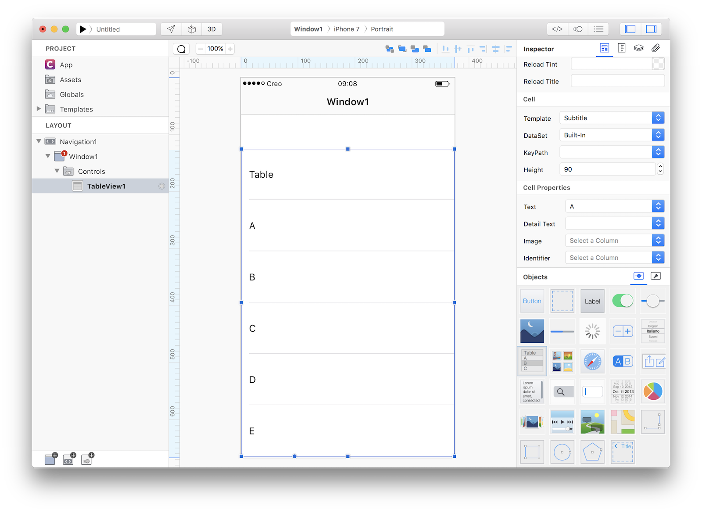

++2++ Now drag an HTTPClient class from Objects (Network group) to Window1:
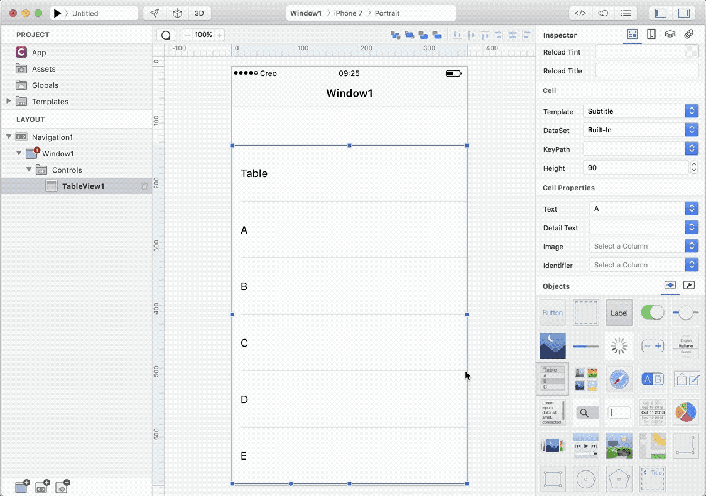

++3++ According to the official Spotify documentation the REST API endpoint is the url: https://api.spotify.com, so enter it in the HTTPClient configuration panel:
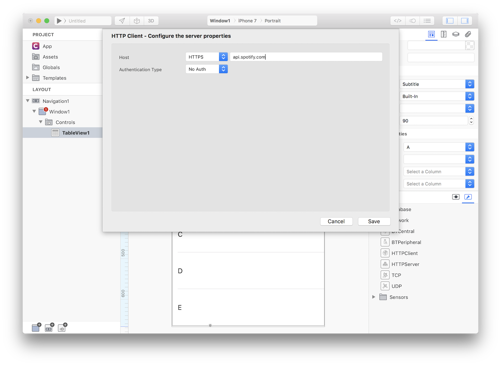
Rename the object HTTPClient1 in the Layout section with a more appropriate Spotify name.

++4++ Starting from 29th May 2017 Spotify changes authentications for the API we used in this example so we need to add support for OAuth2. Start by connecting to **[https://developer.spotify.com](https://developer.spotify.com)** (create a new account if needed) and then create a new App:
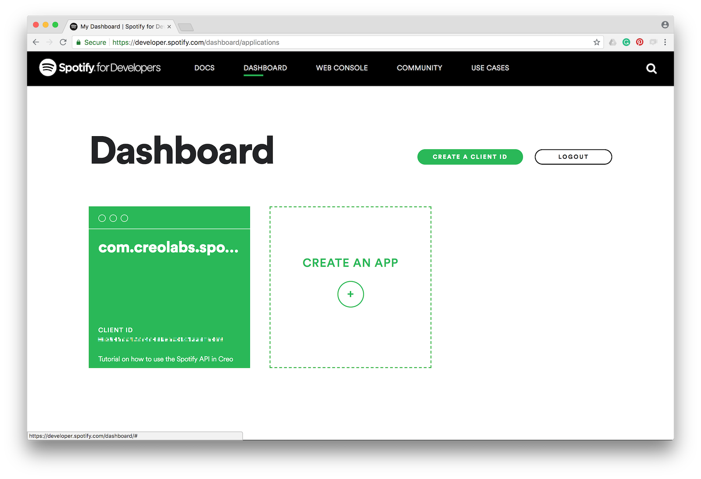

++5++ Setup Redirect URIs and Bundle IDs and you'll receive a Client ID and a Client Secret. Two different Redirect URI are needed: one custom Redirect URI specific for your App (in this example: "com.creolabs.spotifydemo://oauth2Callback") that is used when the App runs in a real device and the Creo default redirect URI "com.creolabs.creo://oauth2Callback" used to be able to test the App in the Creo simulator within the Mac IDE and in the CreoPlayer.
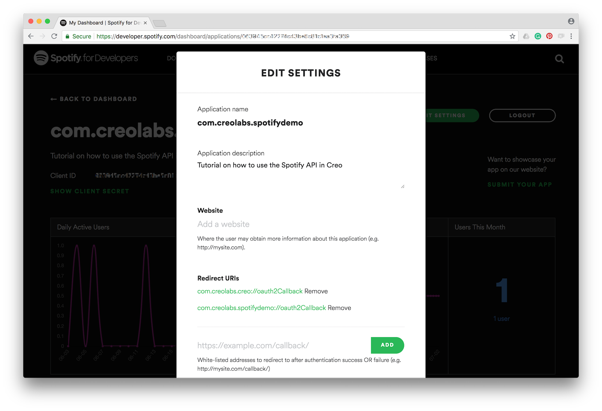

++6++ To allow your app to be launched using an URL (in this case the custom Redirect URI), you’ll need to add a few entries to the App property list. To do that, open the Properties panel from the "Main Menu" -> "Project" -> "Properties...", add an Array with name "CFBundleURLTypes"if not existing, add a Dictionary in this array, add an array named "CFBundleURLSchemes" in the Dictionary and finally add a string with the scheme part of the custom Redirect URI (i.e. "com.creolabs.spotifydemo"):
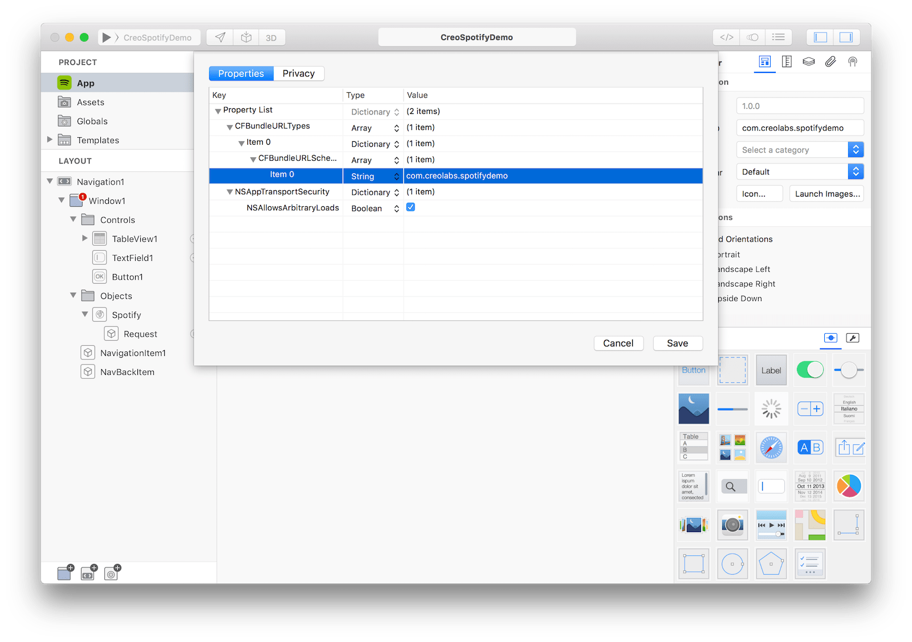

++7++ Double click on the HTTPClient object and modify its settings according to the data entered into the Spotify Developer panel:
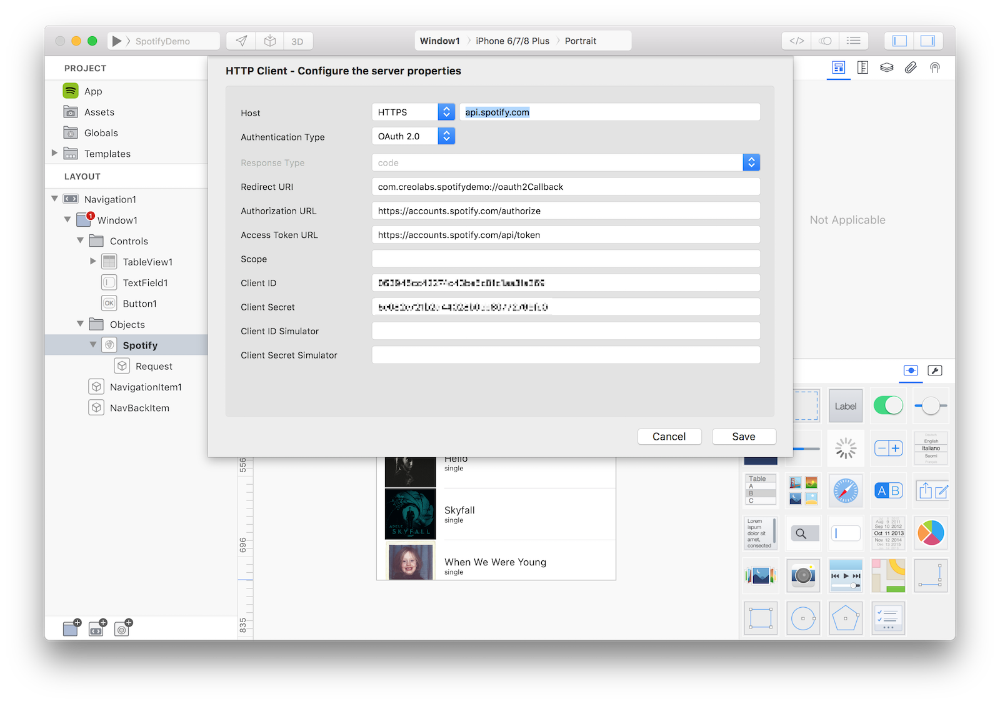

++8++ Once you set the main endpoint you can start creating your HTTPRequest objects (only one in this example). Right click on the Spotify object and select "New Request". The HTTPRequest panel will show:
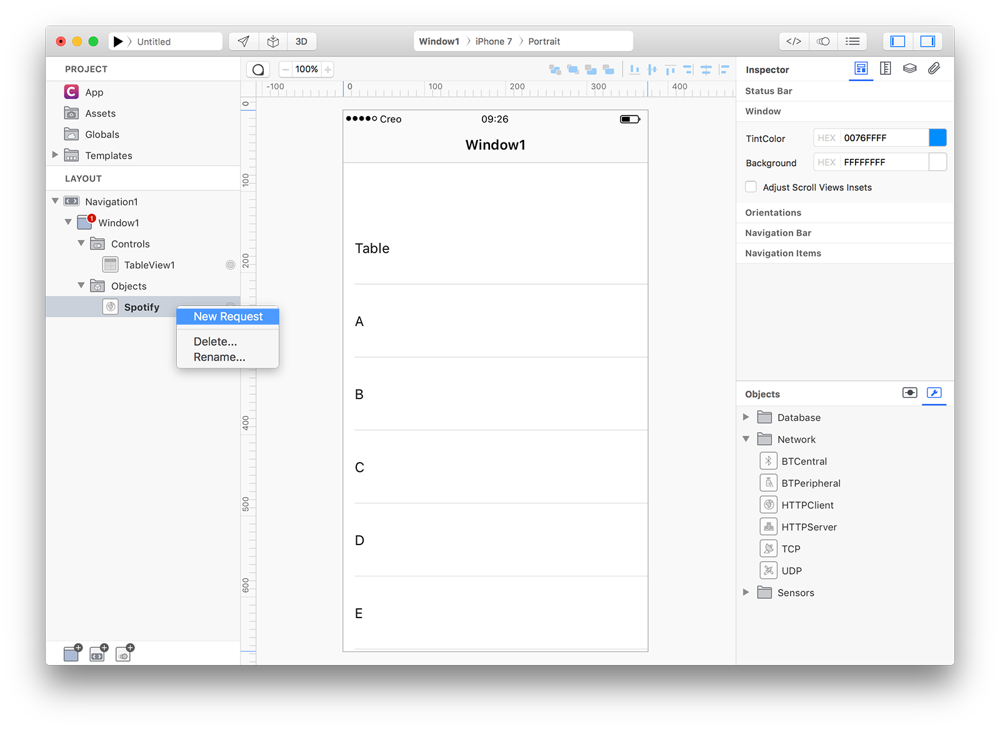

++9++ We want to create an app that lets you search for albums based on artist's name. So the right Spotify API to use seems the **[Search Item](https://developer.spotify.com/web-api/search-item/)** API. It expects two parameters, a mandatory type parameter (that can be album, artist, playlist or track) and a q parameter (the search keyword). To test our HTTPRequest enter the query **v1/search/?q=adele&type=album** in the Request field. You can notice under the Query section that Creo automatically parsed that query and creates dynamically properties that we'll use later.
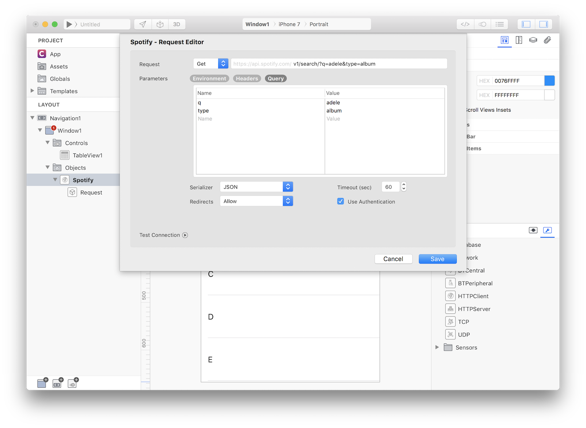

++10++ Like a Database query, this panel offers you a convenient way to test your request using the Test Connection button:
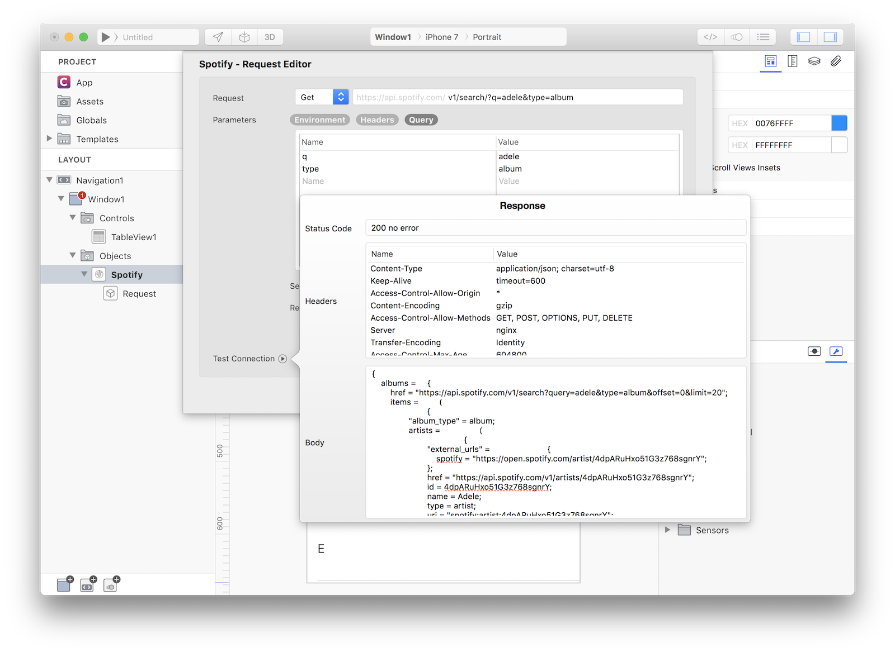

++11++ It is now time to connect TableView1 with the newly created DataSet. So select TableView1 and in the Inspector set the following Cell properties:

| Object | Property | Value |
| ---------- | --------- | --------- |
| **Cell** | DataSet | Spotify.Request |
| **Cell** | KeyPath | albums.items |
| **Cell** | Text | name |
| **Cell** | Detail Text | albums_type |
| **Cell** | Image | images.[0].url |

and lets the magic happens...
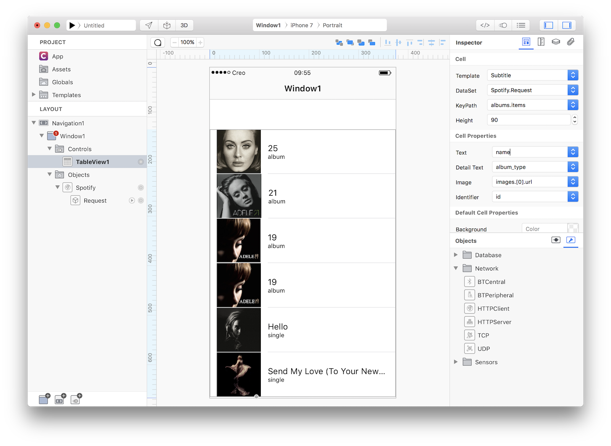

Creo is able to extract JSON query data while in design mode and display all of them inside your custom views. It is now time to add a way to query Spotify. 

++12++ Drag a TextField and a Button from Object to Window1 and set Button1 title to Search. Window1 now looks like:
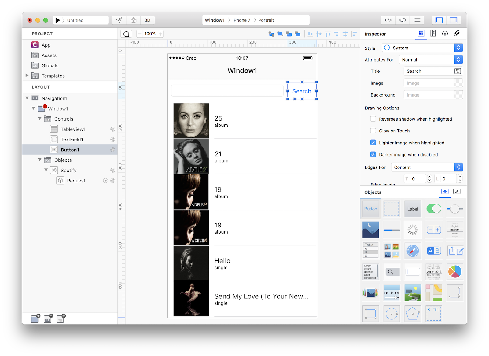

++13++ When the user touches the Search button we would like to run a new HTTPRequest with the newly entered text and display the result into TableView1. So, select Button1 and open the Code Editor. Then select the Action event and enter the following code:
```
Keyboard.hide();
Spotify.Request.q = TextField1.text;
Spotify.Request.run();
```

This very short code performs some importants steps:
1. Hide the Keyboard because each time the user enters text into a TextField the Keyboard appears automatically
2. Do you remember that Creo automatically created the q dynamic property based on the HTTPRequest? It is a very powerful shortcut because it allows you to modify its value (default to Adele) with the text the user just entered without the needs to rewrite the entire HTTP request.
3. The HTTPRequest object has a run method that automatically refresh all connected objects (in this case TableView1).

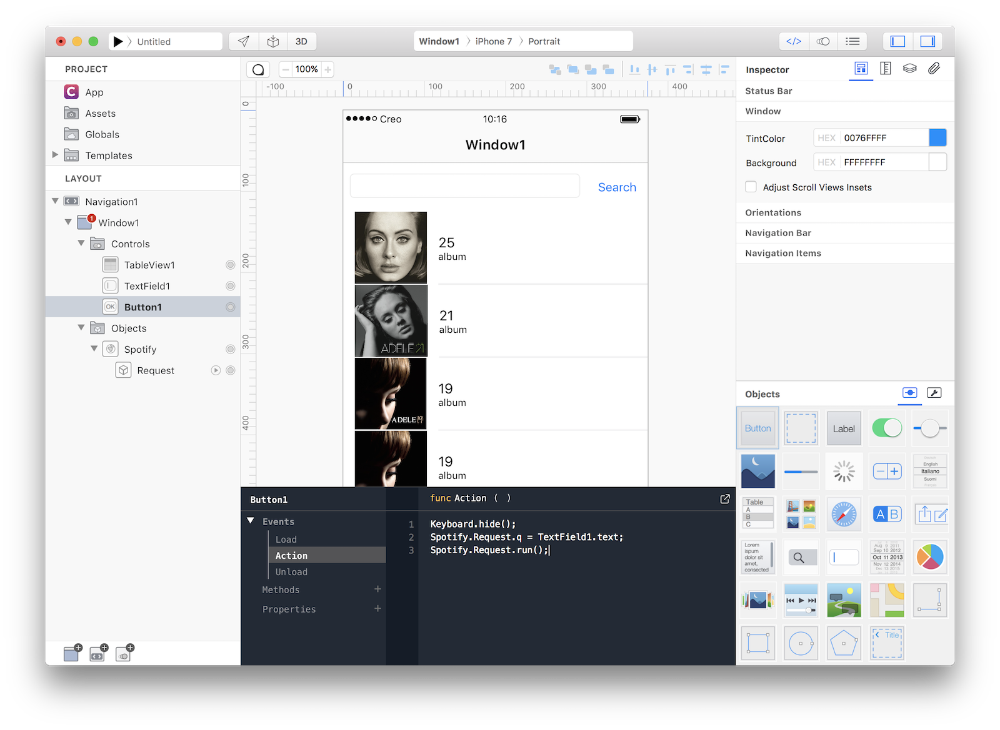

++14++ Press RUN and enjoy the Spotify app!
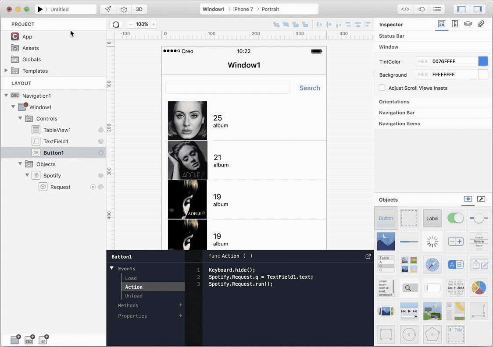

You can now send the app to **[CreoPlayer](../creo/creoplayer.md)** or **[build it](../creo/build-your-app.md)** and then submit to the App Store.

#### Project
Please note that in the downloadable project there is **no support for Auth2 authentication** (we cannot share the Client ID and the Client Secret, so you need to follow steps 4, 5 and 6 in order to obtain a fully functional project).
* [Spotify.creoproject]({{github_raw_link}}/assets/spotify.zip) (78KB)

