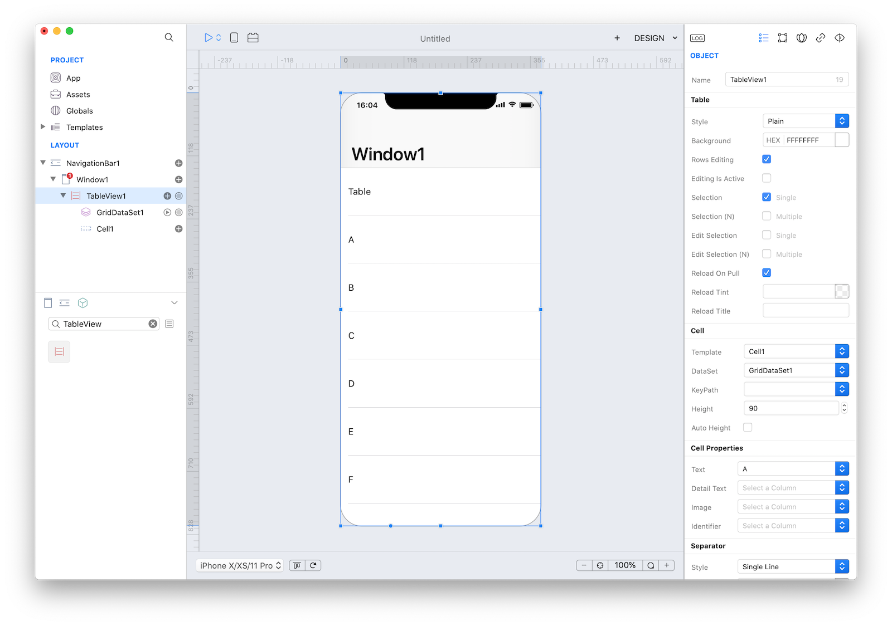
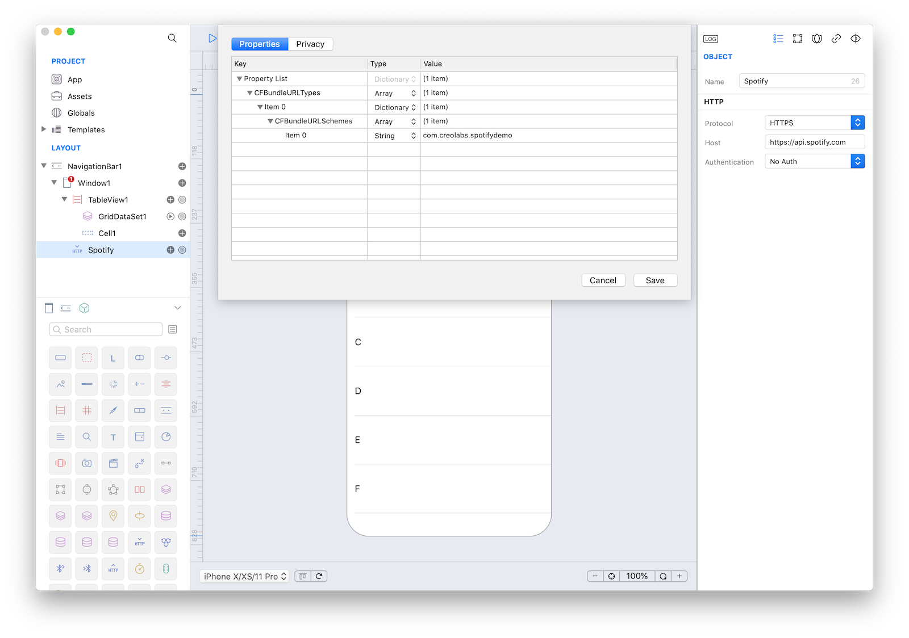
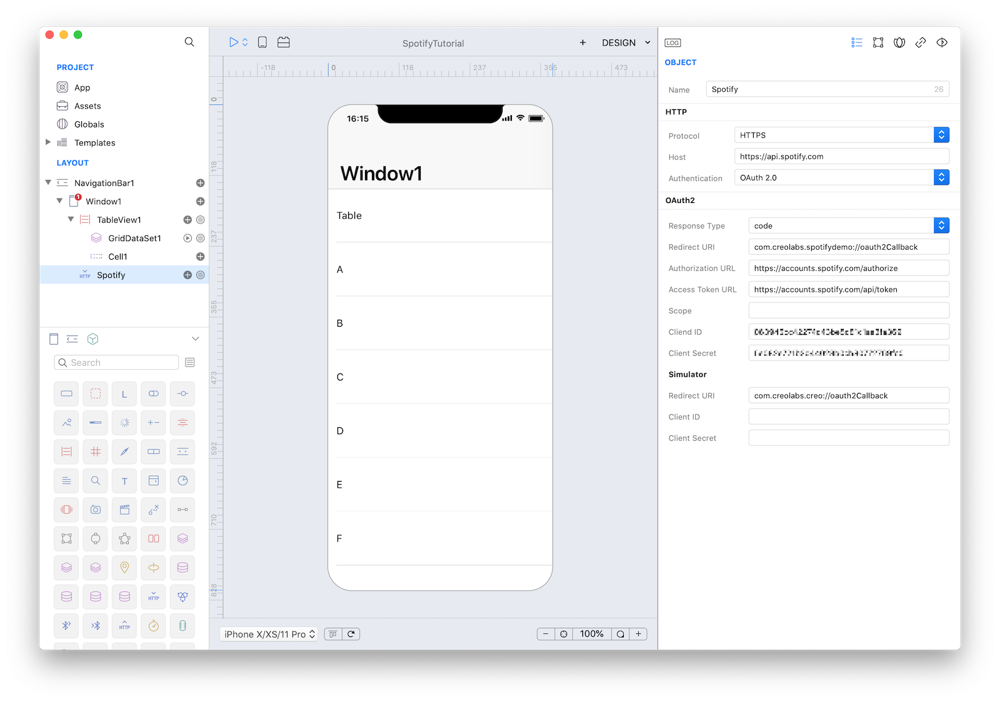
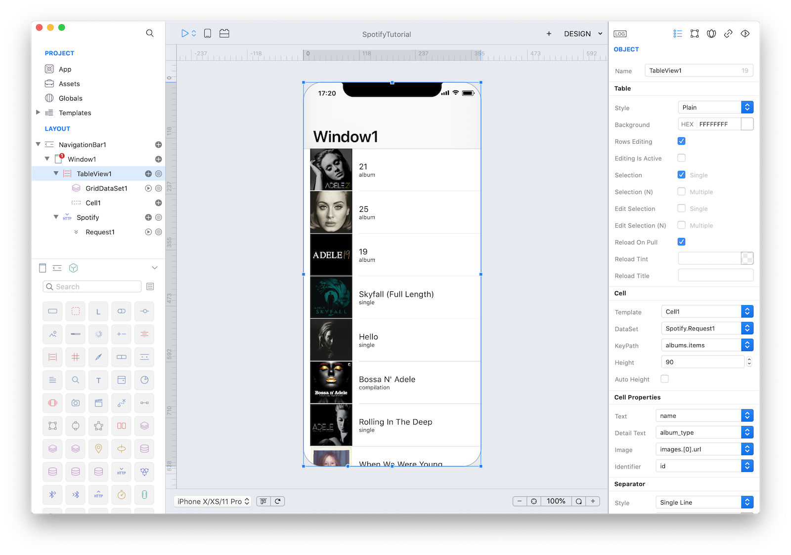
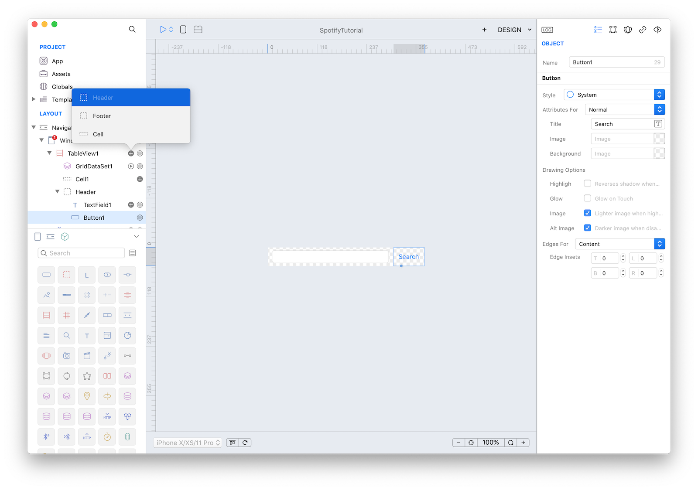
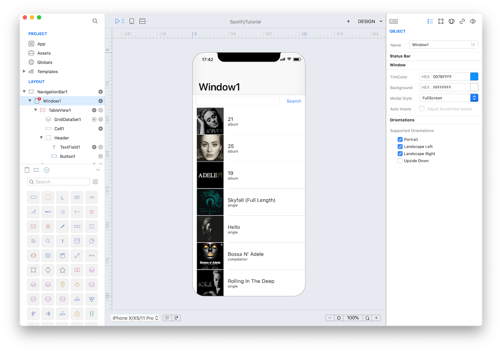

On 29th May 2017 Spotify updated authentication specifications for their API. We updated the tutorial and added support for OAuth2 authentication.
 **[Official Statement](https://developer.spotify.com/news-stories/2017/01/27/removing-unauthenticated-calls-to-the-web-api/)**.

## Concepts
The Spotify tutorial will use the powerful HTTPClient class to perform REST queries to the Spotify API. You will learn how to interact with a REST service to perform queries based on user's input.

 **[Spotify Web API Developer](https://developer.spotify.com/web-api/)** official documentation.

#### Classes
* [HTTPClient](../classes/HTTPClient.md)
* [TableView](../classes/TableView.md)
* [TextField](../classes/TextField.md)
* [Button](../classes/Button.md)

#### Assets
* None

#### Steps
++1++ Create a new empty Creo project and start by dragging a TableView from Objects to Window1.
Set the TableView's Propertiy `Height` to '90'.

You can also create your own custom view template. But for this example we will not do that. The Subtitle template of the TableViewCell gives an Image, a Title and a Subtitle field.



++2++ Now drag an HTTPClient class from Objects (Network group) to Window1:


++3++ Spotify's docs state that its REST API endpoint is 'api.spotify.com'. Enter that in the HTTPClient config panel.

It's good practice to rename the object HTTPClient1 in the Layout section with a more appropriate name.

++4++ Then we must make an **[OAUTH 2](https://developer.spotify.com)** connection to the Spotify API. Once you've logged in (create a new account if needed), create a new App:


++5++ Setup Redirect URIs and Bundle IDs and you'll receive a Client ID and a Client Secret. Two different Redirect URI are needed: one custom Redirect URI specific for your App (in this example: "com.creolabs.spotifydemo://oauth2Callback") that is used when the App runs in a real device and the Creo default redirect URI "com.creolabs.creo://oauth2Callback" used to be able to test the App in the Creo simulator within the Mac IDE and in the CreoPlayer.


++6++ To allow your app to be launched using a URL (in this case the custom Redirect URI), you’ll need to add a few entries to the App property list. To do that, open the Properties panel from the "Main Menu" -> "Project" -> "Properties...", add an Array with name "CFBundleURLTypes"if not existing, add a Dictionary in this array, add an array named "CFBundleURLSchemes" in the Dictionary and finally add a string with the scheme part of the custom Redirect URI (i.e. "com.creolabs.spotifydemo"):


++7++ Select the Spotify HTTPClient object and modify its settings according to the data entered into the Spotify Developer panel:


++8++ Once you set the main endpoint you can start creating your HTTPRequest objects (only one in this example). Click on the + button near Spotify HTTPClient object and select "Request".

We want to create an app that lets you search for albums based on artist's name. So the right Spotify API to use seems to be the **[Search Item](https://developer.spotify.com/web-api/search-item/)** API. It requires two parameters, a mandatory type parameter (that can be album, artist, playlist or track) and a q parameter (the search keyword). To test our HTTPRequest enter the query **v1/search/?q=adele&type=album** in the Request field. You can notice under the Query section that Creo automatically parsed that query and creates dynamically properties that we'll use later.
Also set the following properties:
* Method: 'Get'
* Use Authentication: 'True'


++9++ It is now time to connect TableView1 with the newly created DataSet. So select TableView1 and in the Inspector set the following Cell properties:

| Object | Property | Value |
| ---------- | --------- | --------- |
| **Cell** | DataSet | Spotify.Request1 |
| **Cell** | KeyPath | albums.items |
| **Cell** | Text | name |
| **Cell** | Detail Text | albums_type |
| **Cell** | Image | images.[0].url |

and let the magic happen...


If the HTTPRequest is executed for the first time, the OAuth handshake is performed with and you the authentication/authorization webpage is presented in the default web browser of the Mac. When you complete the authorization, the callback URL is sent back to Creo and the credentials are stored in the keychain. These credentials will be automatically used for the following executions until the expiration date.


++10++  Creo is able to extract JSON query data while in design mode and display it inside your custom view. Let's add a way to query Spotify.

Add an 'Header' subnode to the TableView by pressing the + button near TableView1. Drag a TextField and a Button from Object to the 'Header' CustomView and set Button1 title to Search.


Window1 now looks like:


++11++ When the user touches the Search button we would like to run a new HTTPRequest with the newly entered text and display the result into TableView1. So, select Button1 and open the Code Editor. Then select the Action event and enter the following code:
```
Keyboard.hide();
Window1.Spotify.Request1.q = TextField1.text;
Window1.Spotify.Request1.run();
```

This code accomplishes three things:
1. *Keyboard.hide()* - Hide the keyboard after user has finished entering text.
2. *Window1.Spotify.Request1.q = TextField1.text;* - Set the parameter of **q** to match user input.
3. *Window1.Spotify.Request1.run();* - Run the Spotify.Request method.


++13++ Press RUN and enjoy the Spotify app!


You can now preview the app on your **[CreoPlayer](../creo/creoplayer.md)** or **[build it](../creo/build-your-app.md)** for the App Store.

#### Project
In the downloadable project you must create and enter your own **OAUTH2 Authentication Info** since OAUTH2 Client IDs & Secrets are login information for the API and cannot be shared.
* [Spotify.creoproject]({{github_raw_link}}/assets/spotify2.zip) (25KB)
